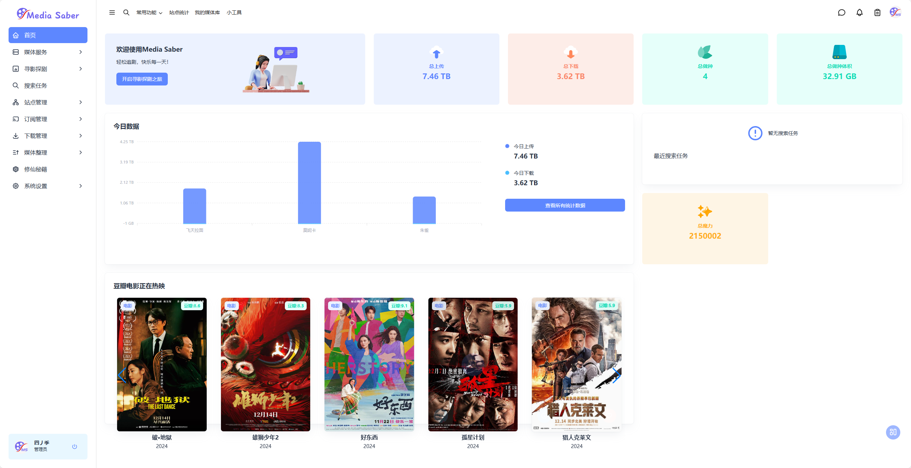

# 引言

首先欢迎大家来使用 Media Saber！如果有兴趣的话，也非常欢迎大家来一起开发和维护 Media Saber~

## 项目背景

### 一款适合自己人用的媒体管理工具

前端：Angular
移动客户端：Flutter
后端：GO

由多位热心Pter共同努力，立足于开发自用，完全自主开发，做一款全新、高效、稳定、快速、方便好用、功能强大的媒体管理工具！

鉴于NT MP等项目的不稳定性，本项目为私密项目，仅开发组自用和受邀用户小范围使用。

欢迎更多有能力的用户参与进来。有相关开发能力的朋友，可以优先受邀加入！

:::danger
- 如果发现大量外传，将停止公共镜像
- 如果大家发现问题，可以反馈我，但是我不一定及时修复
- 再次重申：**请勿外传，请勿外传，请勿外传**
:::

## Media Saber 项目

### 项目发展

1.0 原作者停止维护后，基于NasTool，多个热心的peter努力下，重新让它继续走下去。

2.0  项目独立发展，项目更名为Media Saber 简称MSaber，意为媒体军刀。

3.0 由于NT代码历史包袱太过繁重，维护难度大,python性能较低等原因，为了提升项目体验和发展，MS进行了全面重新开发，采用 Angular + GO 开发。

### 常用链接

- Docker：<https://hub.docker.com/r/xylplm/media-saber>
- wiki 仓库：<https://github.com/xylplm/media-saber-wiki>，鼓励大家进去 pr，并完善文档！

### 开始之前

- [**《常见问题》**：了解安装使用过程中经常遇到的问题，快速解决常见异常](/guide/start/problem/)
- [**《文件整理》**：了解文件整理方式及优缺点，提前确定适合自己的整理方式](/docs/other/glossary/#转移方式)
- [**《安装之前》**：了解镜像信息及注意事项，准备开始部署容器](/guide/install/start/)

:::center

:::

