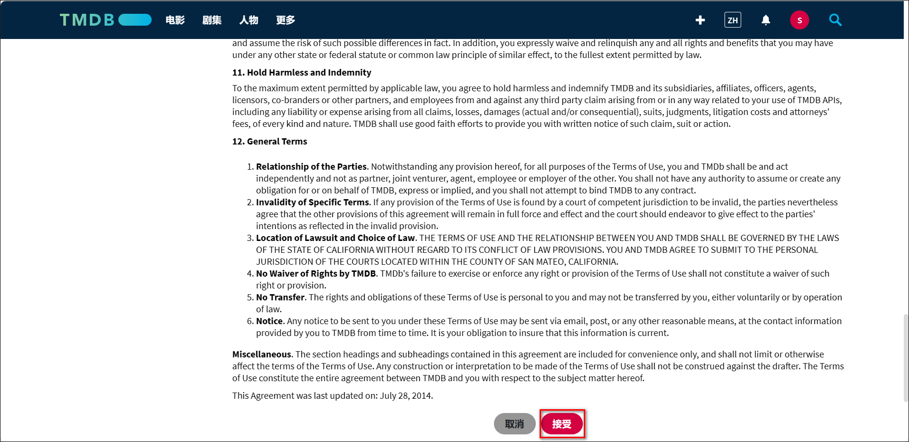

### 申请 TMDB API

Media Saber 需要使用 TMDB 提供的元数据接口服务，首次使用前请按以下步骤申请 API Key。

---

#### 1. 注册 TMDB 账号

访问 [TMDB 官网](https://www.themoviedb.org/)，点击右上角 **加入 TMDB**

填写相关信息完成注册：

注册成功后，系统会发送一封验证邮件，点击 **ACTIVATE MY ACCOUNT** 激活账户：

---

#### 2. 登录 TMDB

使用注册信息登录：

点击右上角头像，进入 **帐户设置**：

左侧点击 **API**，进入 API 页面，点击 **请求 API 密钥** 下方的 `click here` 链接：

---

#### 3. 创建 API Key

选择用途为 **Developer（开发者）**：

协议页面滑到底部，勾选接受条款：

填写申请信息：

- **名称**：自定义名称，如 `Media Saber`
- **应用 URL**：可填写你的局域网 IP 或绿联地址，如 `http://192.168.x.x`
- **用途描述**：建议填写英文（可翻译）

示例用途（英文）：  
`Meet personalized needs, enrich website interfaces and functions.`

---

#### 4. 获取 API Key

提交后即可看到你的 API Key（V3 auth）。复制保存，后续在 Media Saber 初始化配置中填写。

:::tip
如页面未立即显示 API Key，可刷新页面或重新进入“API”菜单。
:::
