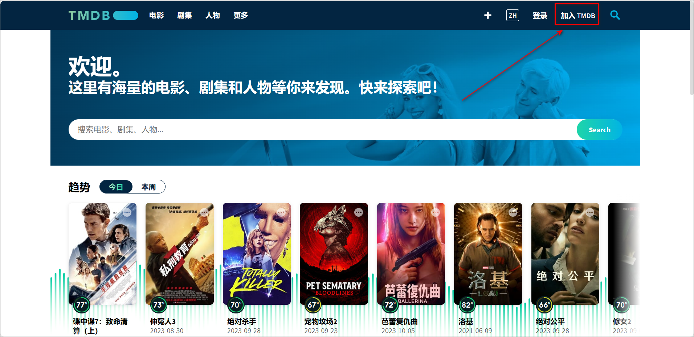
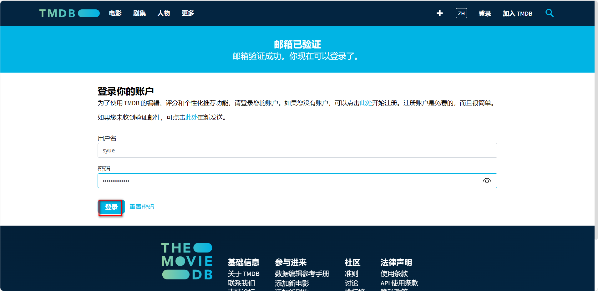
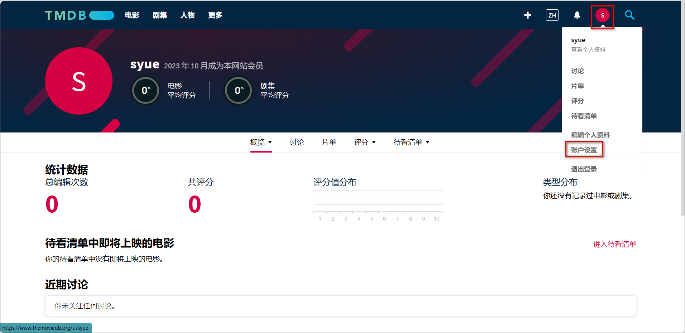

## 申请TMDB API

1. 点击进入 [TMDB官网](https://www.themoviedb.org/)，点击 `加入TMDB`

2. 按照要求输入相关信息完成注册

3. 注册完成以后会收到封验证邮件，点击 `ACTIVATE MY ACCOUNT` 激活账户

4. 登录 TMDB

5. 点击右上角的 `头像-帐户设置`

6. 点击左侧的 API，然后点击请求 API 秘钥下面的 `click here`

7. 点击 `Developer（开发者）`

8. 协议滑动到最后选择接受

9. 名称自定义，应用 URL 填写绿联 IP，应用简介按照写 API 用途（最好填写英语，百度翻译即可）然后点击提交

应用简介参考（填写英文部分）：满足个性定制化需求，丰富网站接口以及功能（`Meet personalized needs, enrich website interfaces and functions`）

10. 这样我们就获取到了 TMDB 的 API 密钥，复制下来保存，后面我们会用到

