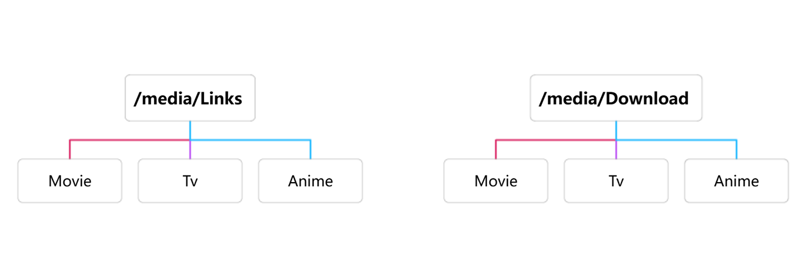

:::danger
- 为了项目的安全性，请一定要注意：**请勿外传！请勿外传！请勿外传！请勿外传！请勿外传！**
- 项目运行需要自行添加 **激活密钥**，这里不说明是什么
:::

:::warning
- Media-saber 使用 Redis 作为数据库，需要单独安装，推荐使用 `docker.io/redis:7.0.14-alpine`。
- 更新可参考 [dc 一键更新](/guide/update_version/dc/) 里的 `使用 - 更新` 部分内容。
:::

## 各品牌安装方式

极空间、绿联、群晖用户如何安装，可直接切换目录或者点击下方链接到对应品牌专区介绍！

- [极空间 NAS 如何安装](/guide/install/zspase/)
- [绿联 NAS 如何安装](/guide/install/ugreen/)
- [群晖 NAS 如何安装](/guide/install/synology/)
- [UNRAID 如何安装](/guide/install/unraid/)
- [UGOS Pro 如何安装](/guide/install/ugospro/)

---

## 镜像信息

- 镜像名称：`xylplm/media-saber`
- 镜像地址：<https://hub.docker.com/r/xylplm/media-saber>

---

## Docker CLI 方式安装

```shell
docker run -d \
--name media-saber-go \
--privileged \
--network bridge-network \
-p 3000:3000 \
-v /volume1/docker/media-saber/config:/app/config \
-v /Volume1/movie:/movie \
-e MS_REDIS_HOST=ip:6379 \
-e MS_REDIS_PASS= \
-e MS_PORT=3000 \
-e MS_SITE_CONFIG_DIR=/app/config/site_configs \
-e MS_LOG_MODE=file \
-e MS_PGSQL_LOG_MODE=prod \
-e MS_LOG_KEEP_DAYS=14 \
-e MS_AUTH_EMAIL=name@sample.com \
-e MS_AUTH_SLOGAN=大佬牛逼 \
--restart always \
xylplm/media-saber:go-dev
```
## Docker Compose 方式安装

```shell
version: "3"
services:
  msgo:
    image: xylplm/media-saber:go-dev
    container_name: media-saber-go
    privileged: true
    volumes:
      - /volume1/docker/media-saber/config:/app/config # 配置文件目录映射
      - /Volume1/movie:/movie # 媒体文件目录映射
    environment:
      - MS_REDIS_HOST=ip:port # redis ip:端口
      - MS_REDIS_PASS=
      - MS_PORT=3000
      - MS_SITE_CONFIG_DIR=/app/config/site_configs
      - MS_LOG_MODE=file # console
      - MS_PGSQL_LOG_MODE=prod # 数据库日志 options=dev|test|prod|silent
      - MS_LOG_KEEP_DAYS=14 # 日志保留天数，只有在文件模式才会生效
      - MS_AUTH_EMAIL=name@sample.com # 认证邮箱
      - MS_AUTH_SLOGAN=大佬牛逼 # 认证口令
    ports:
      - "3000:3000"  # 映射容器内的3000端口到主机的3000端口
    restart: always
    networks:
      - bridge-network

networks:
  bridge-network:
    driver: bridge  # 使用 bridge 网络驱动
```
保存后，执行以下命令启动：
```shell
docker-compose up -d
```
## 目录映射说明（必须阅读）

注意：同一存储空间的目录应直接映射根目录到容器中，不同映射目录在系统层会被认为是跨盘，从而无法进行硬链接。新同学建议认真学习一下：Linux中的硬链接与软链接：原理、应用与最佳实践

❌ 错误的映射方式：
```shell
/media/links:/mnt/links
/media/Download:/mnt/Download
```
<div align="center"></div>
✅ 正确的映射方式：
```shell
/media:/media
```
<div align="center"></div>