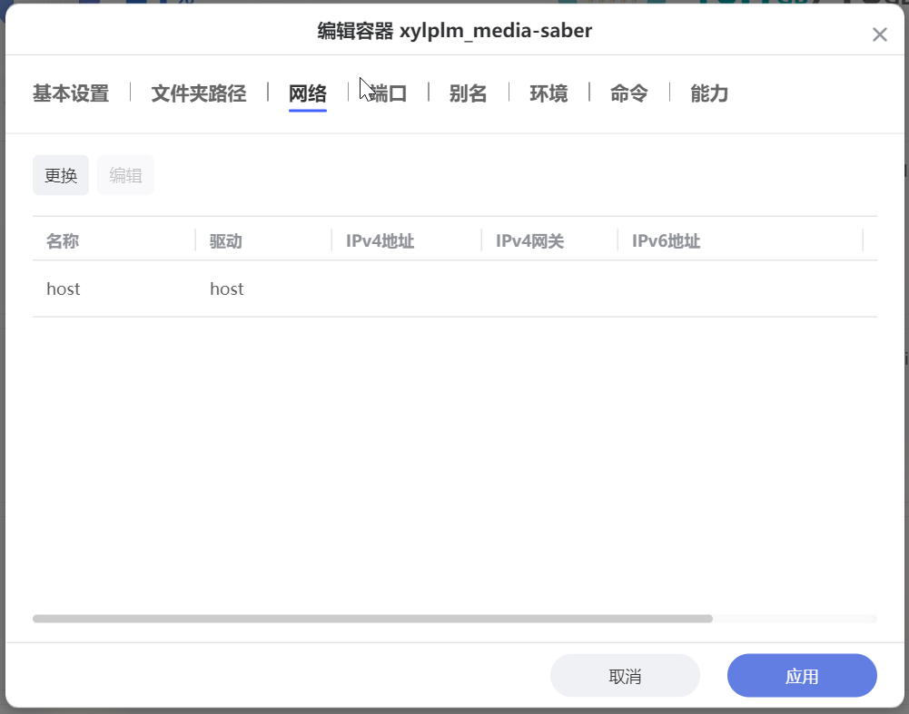

## 1. 镜像下载

打开 docker 在 `镜像 - 仓库` 中搜索：

- xylplm/media-saber，选择 `latest-beta` 版本镜像下载
- linuxserver/qbittorrent，选择 `latest` 版本或 **按具体要求选择特定版本镜像** 下载


如果下载缓慢，请使用自定义拉取按钮，分别输入：

```shell
docker pull dockerproxy.com/xylplm/media-saber:latest-beta
docker pull dockerproxy.com/linuxserver/qbittorrent:latest  `# 镜像 tag 可按需修改`
```


## 2. 容器部署

### 1. Media Saber 容器

双击镜像，把 `/高速存储/docker/msaber` 挂载为 `/config`，把 `/我的文件` 整个挂载为 `/media`。


网络选 hosts 模式（端口 `3000` 不用再填）



环境增加 `MEDIA_SABER_AUTH_EMAIL` 和 `MEDIA_SABER_AUTH_SLOGAN`，这是进群登记过的信息。


### 2. qBittorrent 容器

把 `/高速存储/docker/qbit` 装载给挂载为 `/config`，把 `/我的文件` 整个挂载为 `/media`。


:::tip
如果你想指定下载盘位，可以使用极空间真实路径功能，单独给 qb 加个 `/我的文件/下载`（盘位 N），挂载为 `/media/下载`。

有人可能不知道这里面的意义，就是你下载到 `/media/下载` 的文件只会进入盘位 N，但是 Media Saber 却能将其硬链接到 zdr 中任意文件夹，不用担心跨盘问题。
:::

网络选 hosts 模式（端口取决于环境），例如环境 `WEBUI_PORT` 为 `30001`，`PUID` 为 `0`，`PGID` 为 `0`。


