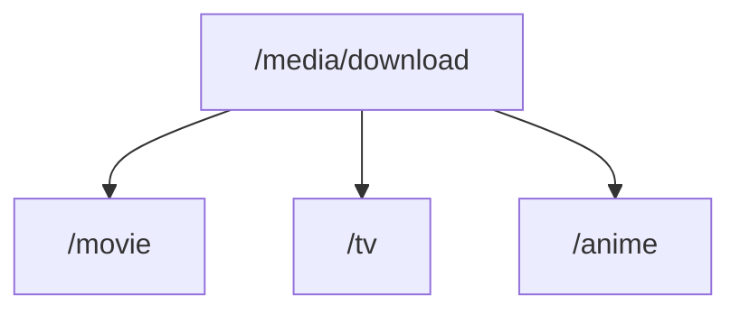
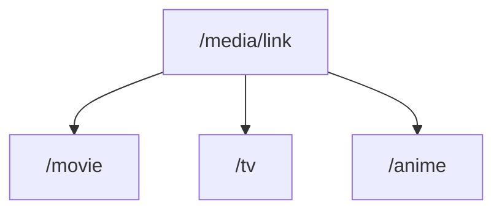
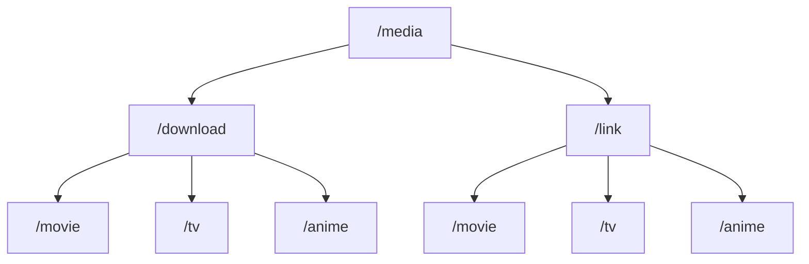
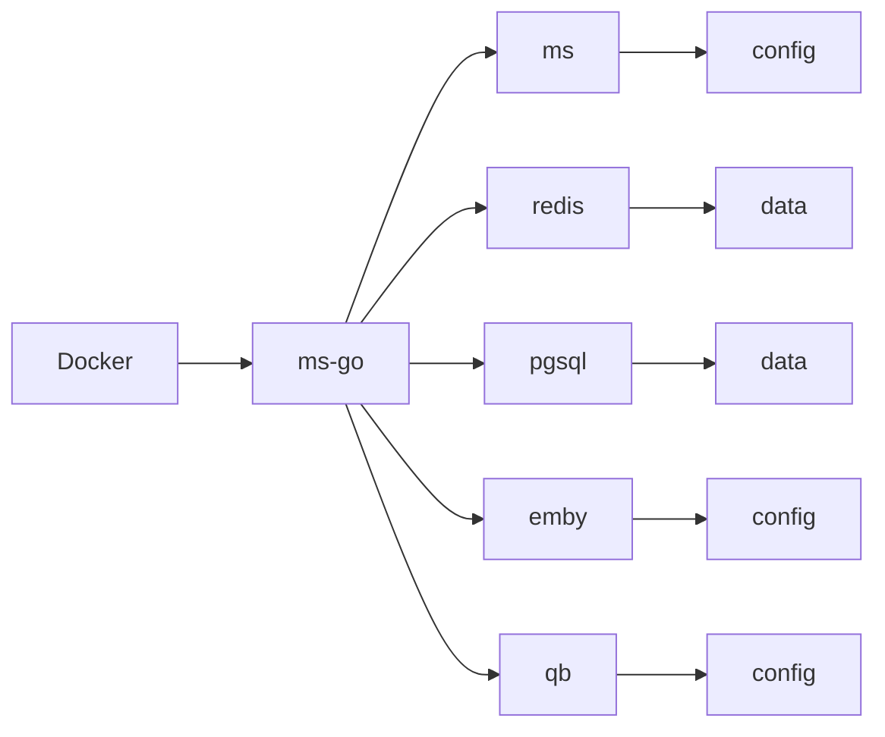
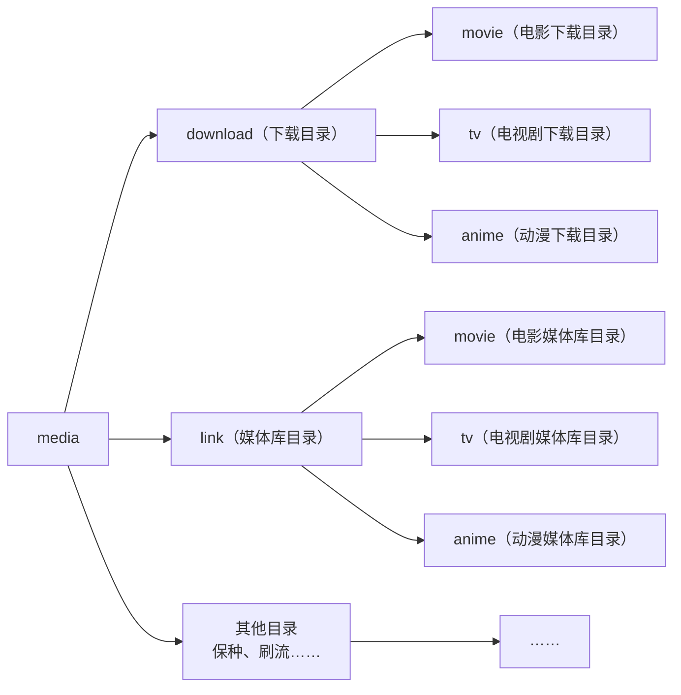
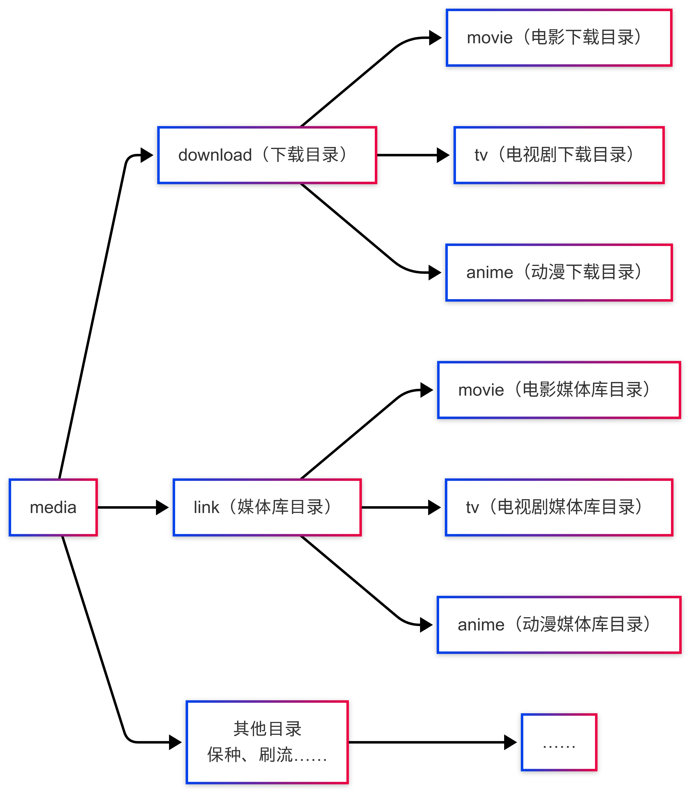
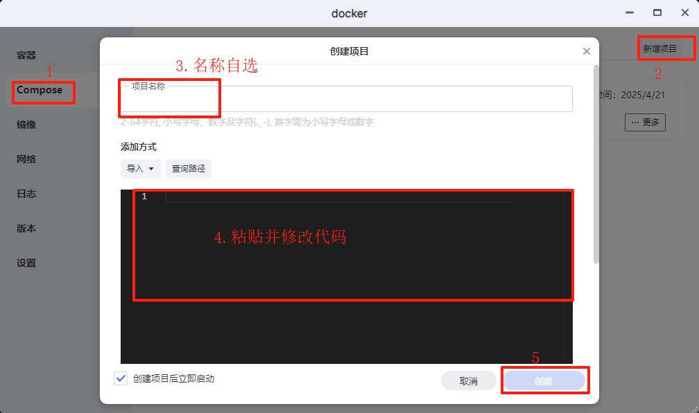

## 一 部署之前需要了解的-目录映射

> [!IMPORTANT]
>
> 新手在目录映射经常会犯错，对于刚接触 Docker 或者 Media Saber 的，建议仔细阅读这一部分。
>

由于 Docker 容器是**独立运行**的，并不能直接访问 Nas 上的文件，Nas 也不能直接访问 Docker 容器里的内容，所以要实现容器与 Nas 的文件互访，就要进行**容器映射**。

为了便于理解，先来看一个映射案例：

```
/docker/emby/config:/config
```

冒号左边为 Nas 上的路径，冒号右边为容器内的路径，也就是把 Nas 上的 `/docker/emby/config` 这个目录映射到了容器内的 `/config` 目录里，让我们可以便捷地在 Nas 的目录里管理容器内的 config 配置文件。反过来，如果我们在 Nas 上有媒体文件，也可以通过映射让容器能访问这些文件。

> [!IMPORTANT]
>
> 注意：同一存储空间的目录应直接映射根目录到容器中，不同映射目录在系统层会被认为是跨盘，从而无法进行硬链接。新同学建议认真学习一下[Linux中的硬链接与软链接：原理、应用与最佳实践](https://developer.aliyun.com/article/1468577)

#### 1. 错误的映射方式：

下载目录和媒体库目录分别映射

- 映射一 `/media/download:/media/download`
- 映射二 `/media/link:/media/link`





如果这样映射，在容器自身看来，`/media/download` `/media/link` 这两个是独立的目录，也就会被认为是不同硬盘里的目录，在执行硬链接的时候，就会报错。

#### 2. 正确的映射方式：

- `/media:/media`



这样**只用一条映射**，不仅省时省力，还解决了跨盘的问题。所以一定要这样配置映射结构，目录名称可以按照下面的来。

### 二 目录配置

> [!IMPORTANT]
>
> 一个**清晰明了的目录**对于后续的方便维护有着至关重要的作用，所以尽量在安装前配置好目录，便于后续管理。

#### 1. Docker 容器配置目录

如果你之前已经部署过 Docker 容器，那应该已经有存放 Docker 容器配置的目录了。如果你还没有，则可以参照以下示例新建目录：（建议优先存放在 **SSD 固态硬盘上**以提高运行效能）



#### 2. 媒体目录

为了方便映射，需要把下载目录、媒体库目录等目录放到一个**统一的父目录**中，这里就以 “media” 父目录为例：



### 三 配置 Docker 代理

在正式部署前，首先请确保自己的 Docker 能正常拉取镜像。可以使用极空间自带的 Docker 代理，如下图，根据自己的代理地址进行设置，也可以通过加速镜像的方式自定义拉取镜像。

<div align="center"></div> 

### 四 Compose 部署

极空间最近更新了 Docker Compose 功能，部署更加方便。

<div align="center"></div>

进入 Docker 的 `Compose` 界面，点击右上角的 `新增项目` 。项目名称自选，把以下内容复制到下面的代码框。其中要自行修改的内容已在代码中注明，请自行更改。

```yaml
services:
  # redis 缓存数据，加速运行，必选
  redis:
    image: redis:latest
    container_name: redis
    restart: unless-stopped
    network_mode: bridge
    volumes:
      - /tmp/zfsv3/nvme12/(你的手机号)/data/Docker/ms-go/redis/data:/data  
      # 请根据实际情况，点击极空间“创建项目”界面的“查询路径”，选择或新建 redis 配置目录，点击“复制路径”，粘贴替换冒号前的内容
    environment:
      TZ: Asia/Shanghai
      GOSU_VERSION: 1.17
    ports:
      - "16379:6379" # 极空间6379端口已被占用，更换端口为16379

  # pgsql 主数据库，必选
  pgsql:
    image: postgres:17-alpine
    container_name: pgsql
    restart: unless-stopped
    network_mode: bridge
    volumes:
        - /tmp/zfsv3/nvme12/(你的手机号)/data/Docker/ms-go/pgsql/data:/var/lib/postgresql/data
        # 请根据实际情况，点击极空间“创建项目”界面的“查询路径”，选择或新建 pgsql 配置目录，点击“复制路径”，粘贴替换冒号前的内容
    environment:
      POSTGRES_DB: ms # 数据库
      POSTGRESQL_WAL_COMPRESSION: lz4  # 压缩算法
      POSTGRESQL_MAX_CONNECTIONS: 2048 # 最大连接数
      POSTGRES_USER: postgres # 用户，不建议修改
      POSTGRES_PASSWORD: ms888888 # 密码，不建议修改
    ports:
      - "5432:5432"

  # msgo go 重写船新版本
  msgo:
    image: xylplm/media-saber:go-dev
    container_name: msgo
    restart: unless-stopped
    network_mode: bridge
    environment:
      TZ: Asia/Shanghai
      MS_PORT: 8888 # 前端端口
      MS_AUTH_EMAIL: xxx # 修改为你的邮箱
      MS_AUTH_SLOGAN: xxx # 修改为你的授权码
      MS_LOG_LEVEL: debug # 日志级别
      MS_LOG_KEEP_DAYS: 14 # 日志保留天数，只有在文件模式才会生效
      MS_REDIS_HOST: 172.17.0.1:16379 # redis 所在子网网关 ip:端口, bridge 网关默认为 172.17.0.1
      MS_REDIS_PASS:  # redis 密码，前面没设置这里就为空
      MS_TIMEOUT: 60000 # 接口请求超时，单位毫秒
      MS_PGSQL_DBNAME: ms # pgsql 数据库
      MS_PGSQL_USERNAME: postgres #  pgsql 用户
      MS_PGSQL_PASSWORD: ms888888 # pgsql 密码
      MS_PGSQL_PATH: 172.17.0.1 # pgsql 所在子网网关 ip, bridge 网关默认为 172.17.0.1
      MS_PGSQL_PORT: 5432 # pgsql 端口
      MS_PGSQL_LOG_MODE: prod # 数据库日志 options=dev|test|prod|silent
      MS_MQ_CONCURRENCY: 10 # MQ 最大并发数
    privileged: true
    volumes:
      - /tmp/zfsv3/nvme12/(你的手机号)/data/Docker/ms-go/ms/config:/app/config
      # 请根据实际情况，点击极空间“创建项目”界面的“查询路径”，选择或新建 msgo 配置目录，点击“复制路径”，粘贴替换冒号前的内容
      - /tmp/zfsv3/sata1/(你的手机号)/data/media:/media 
      # 请根据实际情况，点击极空间“创建项目”界面的“查询路径”，选择你的媒体库根目录，点击“复制路径”，粘贴替换冒号前的内容
    ports:
      - "8888:8888" # 后面容器内的端口需要和环境“MS_PORT”的端口相同
      - "8091:8091" # 使用 strm302 功能后，emby/jellyfin 代理端口

  # emby 媒体服务器，可选
  emby:
    image: amilys/embyserver:4.9.0.42
    container_name: emby
    network_mode: bridge # DLNA and Wake-on-Lan 需要 bridge
    environment:
      - UID=0 # 设置容器用户 ID 为 0 (通常是 root)
      - GID=0 # 设置容器组 ID 为 0 (通常是 root)
      - GIDLIST=0 # 设置容器组 ID 列表为 0
      - TZ=Asia/Shanghai # 设置容器的时区为亚洲/上海
    devices:
      - /dev/dri:/dev/dri # 将主机的 /dev/dri 设备挂载到容器 开启硬解
    ports:
      - 8096:8096 # 对外访问端口,如果有冲突可自行修改冒号前面映射到主机的端口号
      - 1900:1900
      - 7359:7359
      - 8920:8920
    restart: unless-stopped
    privileged: true
    volumes:
      - /tmp/zfsv3/nvme12/(你的手机号)/data/Docker/ms-go/emby/config:/config
      # 请根据实际情况，点击极空间“创建项目”界面的“查询路径”，选择或新建 emby 配置目录，点击“复制路径”，粘贴替换冒号前的内容
      - /tmp/zfsv3/sata1/(你的手机号)/data/media:/media # 和 ms 的挂载保持相同

  # qb 下载器，可选
  qb:
    image: johngong/qbittorrent:4.3.9
    container_name: qb
    restart: unless-stopped
    network_mode: host # 便于自动 UPnP 映射及 ipv6 连接
    environment:
      GID: 0
      UID: 0
      UMASK: 022
      TZ: Asia/Shanghai
      WEBUIPORT: 8989 # 后台访问端口号，如果冲突可以自行修改
    volumes:
      - /tmp/zfsv3/nvme12/(你的手机号)/data/Docker/ms-go/qb/config:/config
      # 请根据实际情况，点击极空间“创建项目”界面的“查询路径”，选择或新建 qb 配置目录，点击“复制路径”，粘贴替换冒号前的内容
      - /tmp/zfsv3/sata1/(你的手机号)/data/media:/media # 和 ms 的挂载保持相同
```

修改完成后，点击 `创建` 等待镜像拉取和部署。

如果没有问题，容器会自动运行。使用 `Nas IP:8888` 即可访问 msgo。

如果你没有修改上述代码的端口号，默认可以用以下地址访问 Web 后台：

| 容器        | Web 访问地址 |
| ----------- | ------------ |
| msgo        | Nas IP:8888  |
| qBittorrent | Nas IP:8989  |
| Emby        | Nas IP:8096  |

