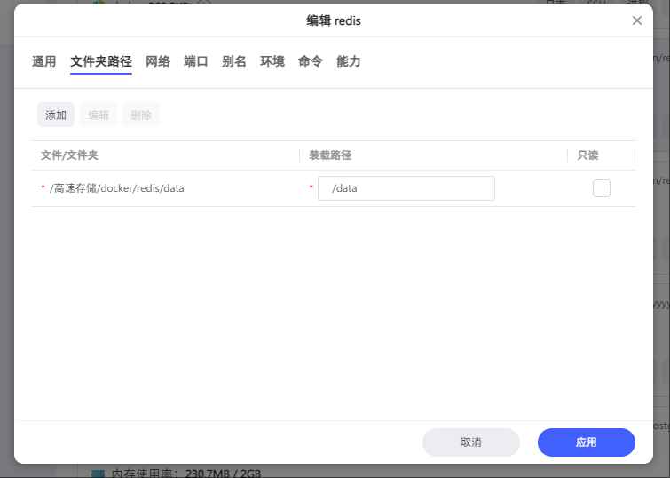
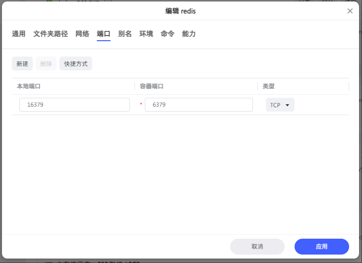
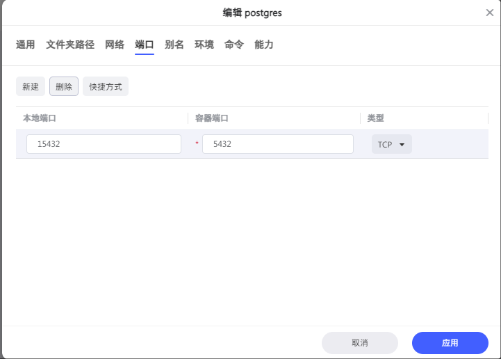
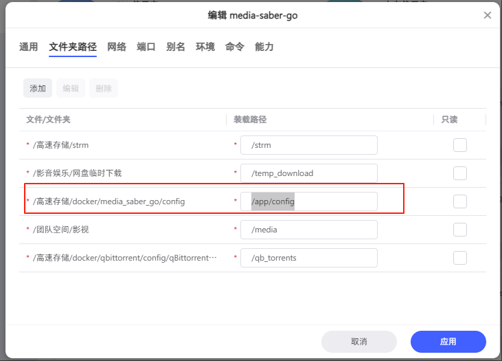

### 前言

本教程将介绍如何使用 docker 面板 在极空间 NAS 上安装 redis、postgres、Media Saber。

### 1. 环境准备

打开 **文件管理**，在 合适的存储，推荐固态硬盘 根据实际情况位置 新建以下文件夹：

以下仅供参考

- `/高速存储/docker/redis/data`
- `/高速存储/docker/pgsql/data`
- `/高速存储/docker/media_saber_go/config`

### 2. 镜像准备

打开 docker 在 `镜像 - 仓库- 自定义拉取`

分别输入拉取镜像：

#### 2.1. postgres 拉取(已安装请忽略)

输入镜像地址：

```shell
qqaazz.msaber.fun/postgres:17-alpine
```

等待成功

#### 2.2. redis 拉取(已安装请忽略)

输入镜像地址：

```shell
qqaazz.msaber.fun/redis:7.4-alpine
```

等待成功

#### 2.3. Media Saber 拉取

输入镜像地址：

```shell
qqaazz.msaber.fun/xylplm/media-saber:go-dev
```

等待成功

### 3. 部署 Redis(已安装请忽略)

双击镜像，把 `/高速存储/docker/redis/data` 挂载为 `/data`。



网络选 默认桥接模式，为了避免冲突设置一个不一样的端口，比如设置本地端口为`16379`，容器内部端口不变



环境变量：若不对外开放，环境变量可默认即可，若对外开放建议增加环境变量 `REDIS_PASSWORD`

点击应用即可

### 4. 部署 postgres(已安装请忽略)

双击镜像，把 `/高速存储/docker/pgsql/data` 挂载为 `/var/lib/postgresql/data`。

网络选 默认桥接模式，为了避免冲突设置一个不一样的端口，比如设置本地端口为`15432`，容器内部端口不变

环境变量：

```shell
POSTGRES_USER: postgres
POSTGRES_DB: ms
POSTGRES_PASSWORD: ms888888
POSTGRESQL_WAL_COMPRESSION: lz4
POSTGRESQL_MAX_CONNECTIONS: 2048
```
数据库名称 
若有特殊需求，需要多个数据库，可不设置`POSTGRES_DB`。自行进入 pg 容器，创建数据库。特殊需求，这里不做详细说明。

点击应用即可

### 5. 部署 Media Saber

双击镜像，把 `/高速存储/docker/media_saber_go/config` 挂载为 `/app/config`。
其他诸如 STRM 目录，媒体库目录，下载目录等自行根据实际情况添加

网络选 默认桥接模式，为了避免冲突设置一个不一样的端口，比如设置本地端口为`8288`，容器内部端口可不变。 主语容器内部端口对应的值为环境变量的`MS_PORT`,一般情况下不修改。

环境变量：

```shell
MS_PORT:3000
MS_REDIS_HOST:极空间内网IP:16379 # 和前面定义的redis ip:端口
MS_REDIS_PASS:****** # 和前面定义的redis 密码对应，如果没有设置则为空
MS_TIMEOUT:60000
MS_PGSQL_USERNAME:postgres # 和前面定义的pg账号对应
MS_PGSQL_PASSWORD:ms888888 # 和前面定义的pg密码对应
MS_PGSQL_PATH:极空间内网IP # 替换为pgsql所在服务器的实际IP
MS_PGSQL_PORT:15431 # 和前面定义的pg端口对应
MS_PGSQL_DBNAME:ms # 和前面定义的pg数据库对应
MS_AUTH_EMAIL:name@sample.com # 认证邮箱
MS_AUTH_SLOGAN:大佬牛逼 # 认证口令
MS_MQ_CONCURRENCY: 10 # MQ 最大并发数
```
应用即可