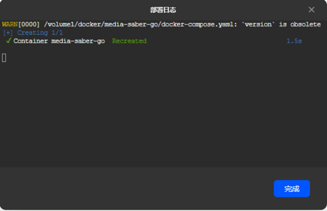

:::note 致谢
感谢`@XXX` 大佬 为大家带来本篇的教程。
:::
:::danger
- 为了项目的安全性，请一定要注意：**请勿外传！请勿外传！请勿外传！请勿外传！请勿外传！**
- 项目运行需要自行添加 **激活密钥**，这里不说明是什么
:::

1. 打开绿联 文件管理器，在 docker 目录下新建 redis和 media-saber-go 两个文件夹，redis目录下新建data 文件夹 media-saber-go 目录下新建 config 文件夹。


绿联用户使用docker直接部署。 这里，将redis和media-saber进行分开部署 打开docker在项目中点击新增，输入项目名称redis，设置路径为刚刚创建的路径，Compose配置，在代码框中粘贴以下代码
```
version: "3.3"
services:
  redis:
    image: redis:latest
    container_name: redis
    restart: always
    ports:
      - 6379:6379
    environment:
      - REDIS_PASSWORD=**********
    volumes:
      - /volume1/docker/redis/data:/data
```


点击 立即部署


部署完后，点击 完成即可。
media-sabe部署，方法同redis 在docker项目中点击新增，输入项目名称media-saber-go，设置路径为刚刚创建的路径，Compose配置，在代码框中粘贴以下代码
```
version: "3.0"
services:
  media-saber-go:
    image: xylplm/media-saber:go-dev
    container_name: media-saber-go
    privileged: true
    volumes:
      - /volume1/docker/media-saber/config:/app/config
      - /volume6/media:/media
    environment:
     - MS_REDIS_HOST=ip:6379 # redis ip:端口
     - MS_REDIS_PASS=**********
     - MS_PORT=3000
      - MS_LOG_MODE=file #console
     - MS_AUTH_EMAIL=name@sample.com # 认证邮箱
     - MS_AUTH_SLOGAN=大佬牛逼 # 认证口令
     - TZ=Asia/Shanghai
    ports:
      - 3000:3000 # 映射容器内的3000端口到主机的3000端口
    restart: always
    networks:
      - bridge-network
networks:
  bridge-network:
    driver: bridge  # 使用 bridge 网络驱动
```


:::warning
在部署media-saber时，请修改以下变量的值，其余变量不用动，认证信息请勿分享！！！
:::

```
# redis地址:ip:6379
# redis密码:**********
# media-saber访问端口:3000
# 宿主机media-saber配置文件路径：/volume1/docker/media-saber/config
# 宿主机media-saber媒体库路径：/Volume1/media
# media-saber认证邮箱:name@sample.com
# media-saber认证口令:大佬牛逼

```



部署完后，点击 完成即可。
