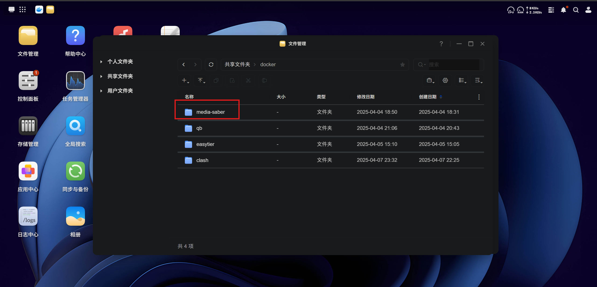
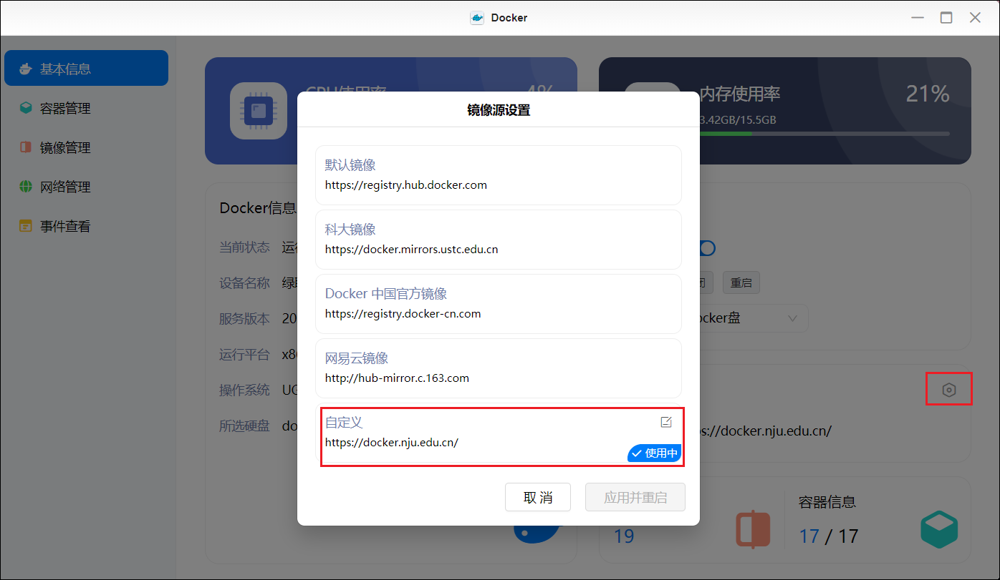
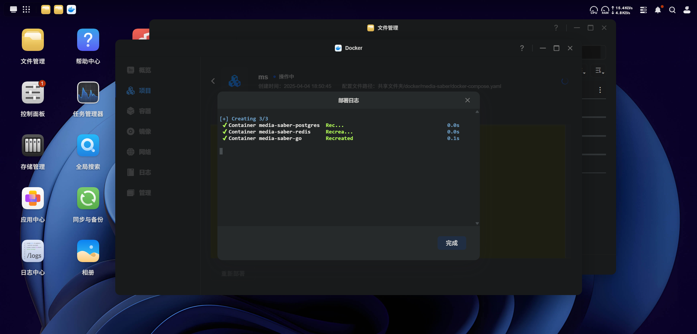

### 一、创建目录

打开绿联 文件管理器，在 docker 目录下新建 media-saber-go 文件夹。



### 二、使用compose部署

绿联用户使用docker直接部署。 这里使用一个compose部署完全。想要分开部署的自己摸索

把下面写了中文的地方全部设置好。
```
services:
  msgo:
    image: xylplm/media-saber:go-dev
    container_name: media-saber-go
    privileged: true
    depends_on:
      ms-redis:
        condition: service_healthy
      ms-postgres:
        condition: service_healthy
    volumes:
      - ./ms/config:/app/config 
      - 写你自己的:和下载器一样 #媒体文件目录映射，这里下载器里面写了几个这里就写几个
    environment:
      - MS_REDIS_HOST=ms-redis:6379
      - MS_REDIS_PASS= #和下面的REDIS_PASSWORD保持一致
      - MS_PORT=3000
      - MS_SITE_CONFIG_DIR=/app/config/site_configs
      - MS_LOG_MODE=file
      - MS_LOG_LEVEL=debug
      - MS_PGSQL_LOG_MODE=prod
      - MS_LOG_KEEP_DAYS=14 
      - MS_AUTH_EMAIL= # 认证邮箱,填你自己的
      - MS_AUTH_SLOGAN= # 认证口令，填你自己的
      - MS_PGSQL_USER=postgres
      - MS_PGSQL_PASSWORD= # 和下面的PGSQL_PASSWORD保持一致
      - MS_PGSQL_DBNAME=media_saber
      - MS_PGSQL_PATH=ms-postgres
      - MS_PGSQL_PORT=5432
    ports:
      - "3000:3000" 
    restart: always
    networks:
      - bridge-network

  ms-redis:
    image: redis:7.0.14-alpine
    container_name: media-saber-redis
    restart: always
    environment:
      - REDIS_PASSWORD= #和上面的MS_REDIS_PASS保持一致
      - PUID=1000
      - PGID=10
    healthcheck:
      test: ["CMD", "redis-cli", "ping"]
      interval: 5s
      timeout: 3s
      retries: 5
    networks:
      - bridge-network

  ms-postgres:
    image: postgres:17-alpine
    container_name: media-saber-postgres
    restart: always
    volumes:
      - ./pg/data:/var/lib/postgresql/data
    environment:
      - POSTGRES_USER=postgres
      - POSTGRES_PASSWORD= #和上面的PGSQL_PASSWORD保持一致
      - POSTGRES_DB=media_saber
    healthcheck:
      test: ["CMD-SHELL", "pg_isready -U postgres"]
      interval: 5s
      timeout: 3s
      retries: 5
    networks:
      - bridge-network

networks:
  bridge-network:
    driver: bridge
```



注意。存放位置填你希望放docker配置的目录。我个人推荐是固态
点击 立即部署



部署完后，点击 完成即可。

好了。可以开始使用了
