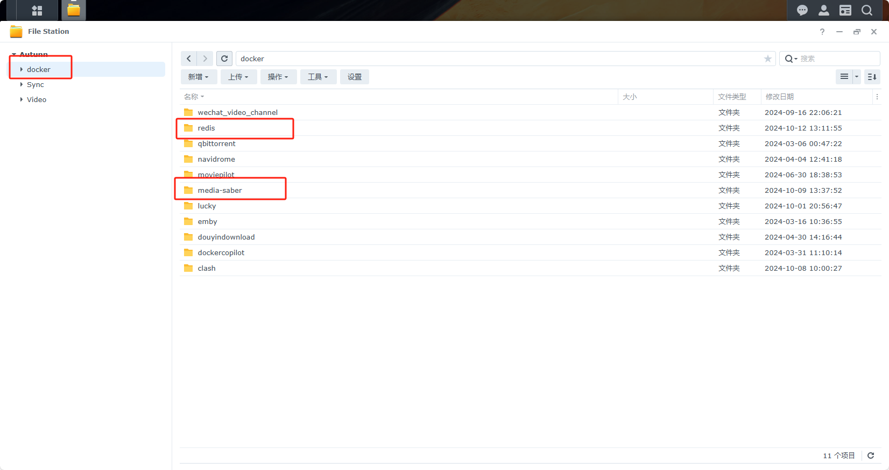
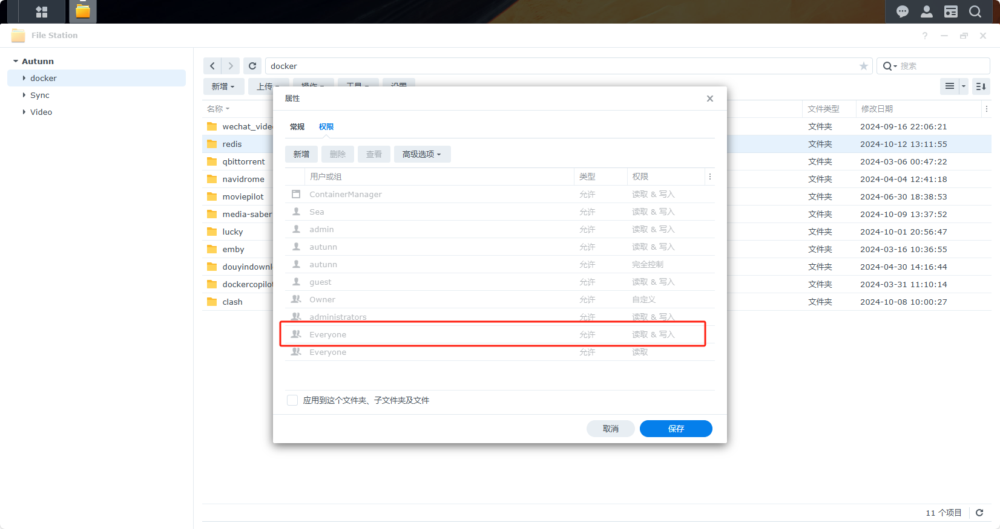
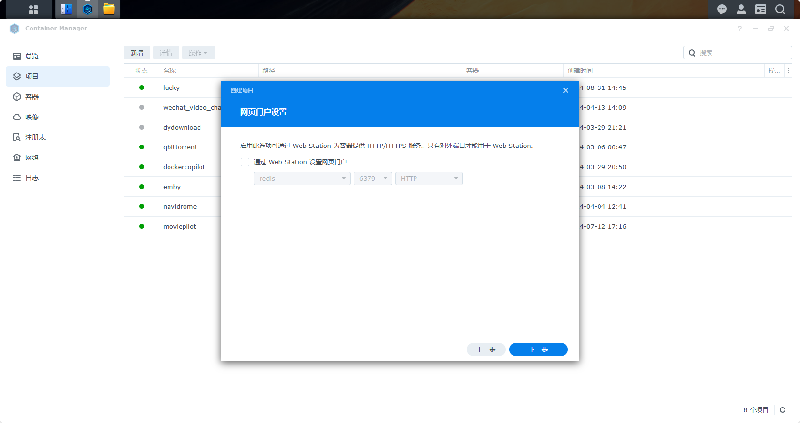
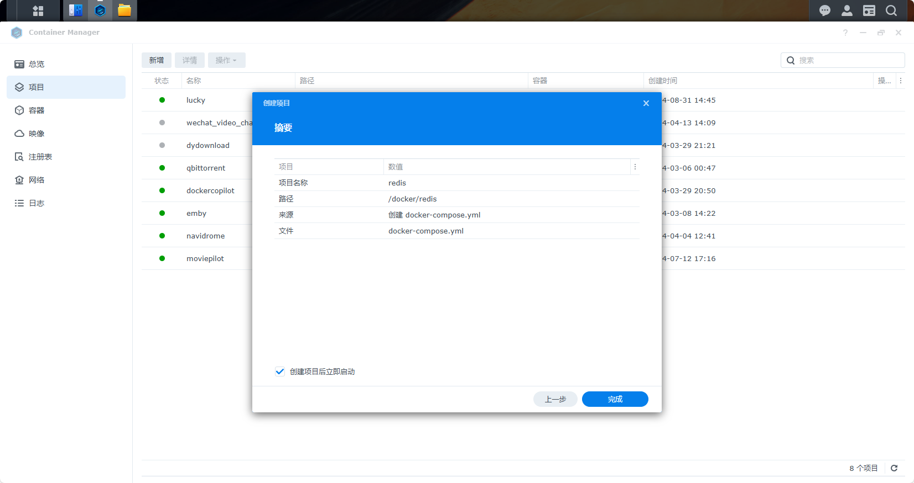
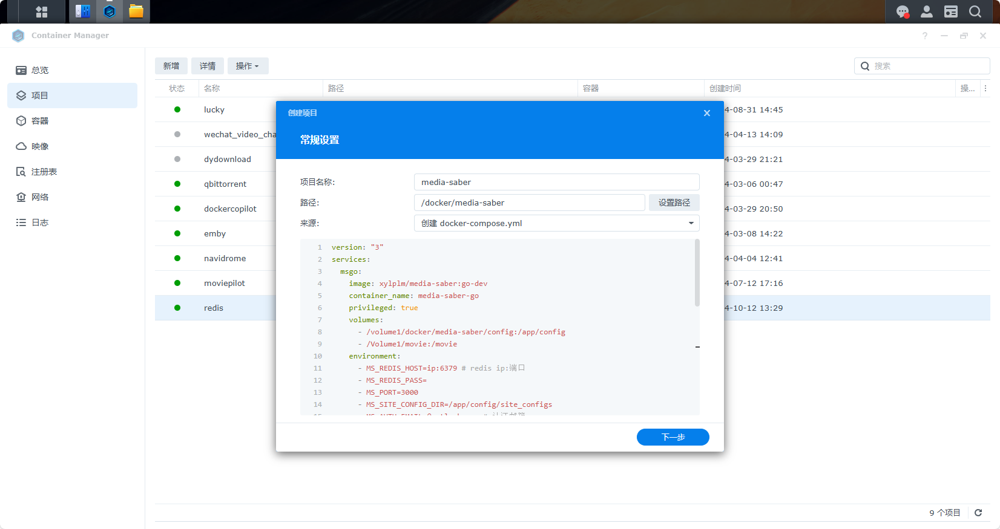
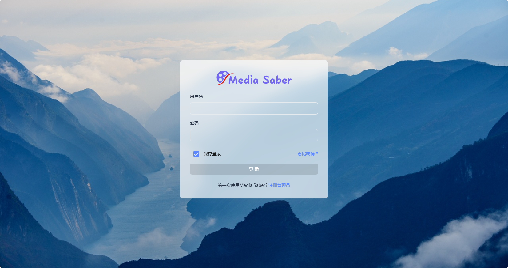
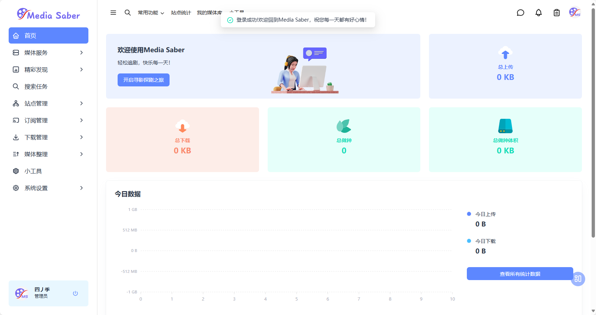

:::danger
- 为了项目的安全性，请一定要注意：**请勿外传！请勿外传！请勿外传！请勿外传！请勿外传！**
- 项目运行需要自行添加 **激活密钥**，这里不说明是什么
:::

打开群晖 File Station，在 `docker` 目录下新建 `redis` `Media-Saber` 两个文件夹，`redis`目录下新建data 文件夹 `Media-Saber` 目录下新建 `config` 文件夹。



记得给文件夹写入权限。



群晖 DSM 7.2用户推荐使用Container Manager直接部署。
这里，将redis和media-saber进行分开部署
打开Container Manager在项目中点击新增，输入项目名称redis，设置路径为刚刚创建的路径，来源选择创建docker-compose.yaml，在代码框中粘贴以下代码
```
docker run -d \
  --name redis \
  --restart always \
  -p 6379:6379 \
  -v /volume1/docker/redis/data:/data \
  --network bridge \
  redis:latest
```
注意将`/volume1/docker/redis/data`修改为你自己的文件夹路径

点击下一步

再次点击下一步

点击完成，redis开始自动从dockerhub拉取映像，并自动进行构建
注：这里需要良好的网络环境，可以在群晖Container Manager注册表中修改使用docker加速镜像地址
media-saber部署，方法同redis
在Container Manager在项目中点击新增，输入项目名称media-saber，设置路径为刚刚创建的路径，来源选择创建docker-compose.yaml，在代码框中粘贴以下代码
```
version: "3"
services:
  msgo:
    image: xylplm/media-saber:go-dev
    container_name: media-saber-go
    privileged: true
    volumes:
      - /volume1/docker/media-saber/config:/app/config
      - /Volume1/movie:/movie
    environment:
      - MS_REDIS_HOST=ip:6379 # redis ip:端口
      - MS_REDIS_PASS=
      - MS_PORT=3000
      - MS_SITE_CONFIG_DIR=/app/config/site_configs
      - MS_AUTH_EMAIL=@outlook.com # 认证邮箱
      - MS_AUTH_SLOGAN= # 认证口令
    ports:
      - "3000:3000"  # 映射容器内的3000端口到主机的3000端口
    restart: always
    networks:
      - bridge-network
networks:
  bridge-network:
    driver: bridge  # 使用 bridge 网络驱动
```


注意，在部署media-saber时，请修改以下变量的值，其余变量不用动
```
# 宿主机 ms 配置路径：/volume1/docker/media-saber/config
# 宿主机媒体库路径：/Volume1/movie
# redis地址：ip:6379
# 认证邮箱：name@sample.com
# 认证口令：大佬牛逼
# media-saber端口：3000
```
redis和media-saber都部署完成后，即可使用http://ip:port/访问media-saber

点击注册管理员进行管理员账号注册，然后登陆即可进入media-saber页面
