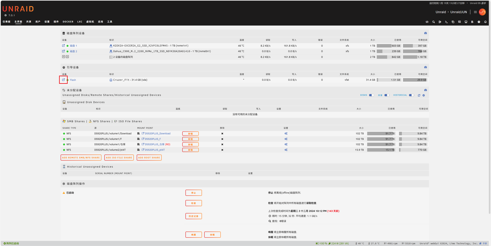
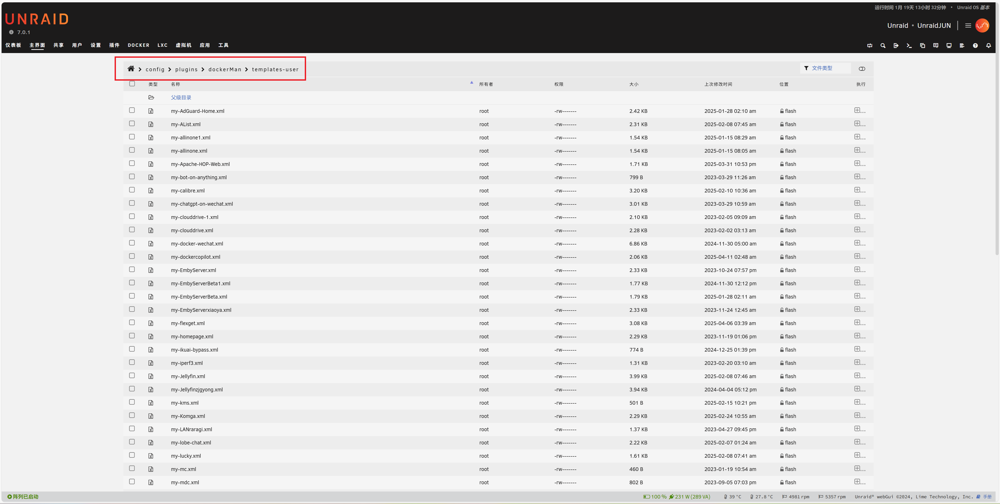
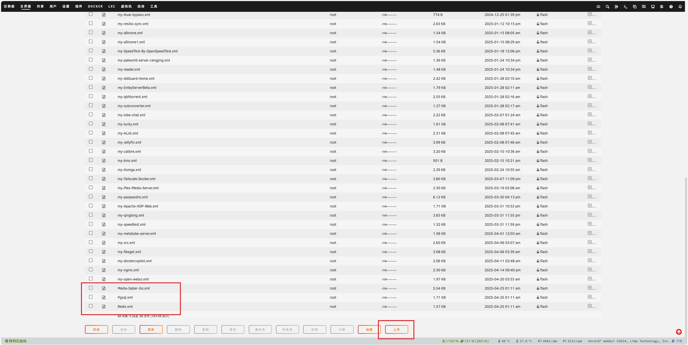
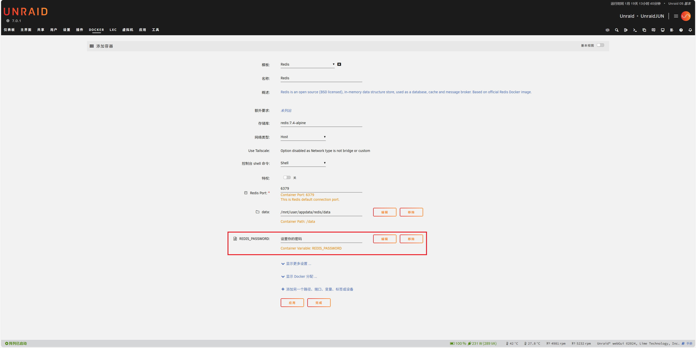
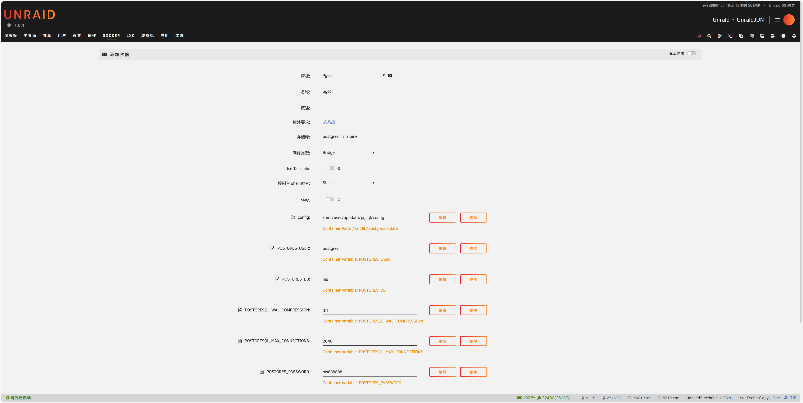
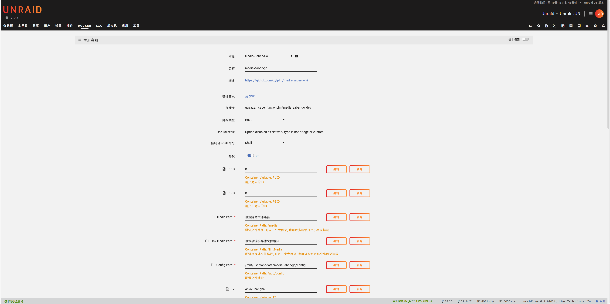

### 1. XML模板文件准备

[下载并解压](https://raw.githubusercontent.com/xylplm/media-saber-wiki/refs/heads/main/docs/01.新手指引/02.如何安装/other/MSGO_UNRAID.zip)，得到三个XML模板文件 

或者手动创建以下三个XML模板文件

-Redis.xml

```xml
<?xml version="1.0"?>
<Container version="2">
  <Name>Redis</Name>
  <Repository>redis:7.4-alpine</Repository>
  <Registry>https://registry.hub.docker.com/_/redis/</Registry>
  <Network>host</Network>
  <MyIP/>
  <Shell>sh</Shell>
  <Privileged>false</Privileged>
  <Support>https://forums.unraid.net/topic/69490-support-jj9987-redis/</Support>
  <Project>https://redis.io/</Project>
  <Overview>Redis is an open source (BSD licensed), in-memory data structure store, used as a database, cache and message broker. Based on official Redis Docker image.</Overview>
  <Category>Network:Management Productivity: Tools:Utilities</Category>
  <WebUI/>
  <TemplateURL>https://raw.githubusercontent.com/juusujanar/unraid-templates/master/Redis.xml</TemplateURL>
  <Icon>https://raw.githubusercontent.com/juusujanar/unraid-templates/master/img/Redis-logo.png</Icon>
  <ExtraParams/>
  <PostArgs/>
  <CPUset/>
  <DateInstalled>1744807881</DateInstalled>
  <DonateText/>
  <DonateLink/>
  <Requires/>
  <Config Name="Redis Port" Target="6379" Default="6379" Mode="tcp" Description="This is Redis default connection port." Type="Port" Display="always-hide" Required="true" Mask="{8}">6379</Config>
  <Config Name="data" Target="/data" Default="" Mode="rw" Description="" Type="Path" Display="always" Required="false" Mask="false">/mnt/user/appdata/redis/data</Config>
  <Config Name="REDIS_PASSWORD" Target="REDIS_PASSWORD" Default="" Mode="" Description="" Type="Variable" Display="always" Required="false" Mask="false">设置你的密码</Config>
  <TailscaleStateDir/>
</Container>
```

-Pgsql.xml

```xml
<?xml version="1.0"?>
<Container version="2">
  <Name>pgsql</Name>
  <Repository>postgres:17-alpine</Repository>
  <Registry/>
  <Network>bridge</Network>
  <MyIP/>
  <Shell>sh</Shell>
  <Privileged>false</Privileged>
  <Support/>
  <Project/>
  <Overview/>
  <Category/>
  <WebUI/>
  <TemplateURL/>
  <Icon/>
  <ExtraParams/>
  <PostArgs/>
  <CPUset/>
  <DateInstalled>1744810203</DateInstalled>
  <DonateText/>
  <DonateLink/>
  <Requires/>
  <Config Name="config" Target="/var/lib/postgresql/data" Default="" Mode="rw" Description="" Type="Path" Display="always" Required="false" Mask="false">/mnt/user/appdata/pgsql/config</Config>
  <Config Name="POSTGRES_USER" Target="POSTGRES_USER" Default="" Mode="" Description="" Type="Variable" Display="always" Required="false" Mask="false">postgres</Config>
  <Config Name="POSTGRES_DB" Target="POSTGRES_DB" Default="" Mode="" Description="" Type="Variable" Display="always" Required="false" Mask="false">ms</Config>
  <Config Name="POSTGRESQL_WAL_COMPRESSION" Target="POSTGRESQL_WAL_COMPRESSION" Default="" Mode="" Description="" Type="Variable" Display="always" Required="false" Mask="false">lz4</Config>
  <Config Name="POSTGRESQL_MAX_CONNECTIONS" Target="POSTGRESQL_MAX_CONNECTIONS" Default="" Mode="" Description="" Type="Variable" Display="always" Required="false" Mask="false">2048</Config>
  <Config Name="POSTGRES_PASSWORD" Target="POSTGRES_PASSWORD" Default="" Mode="" Description="" Type="Variable" Display="always" Required="false" Mask="false">ms888888</Config>
  <Config Name="PORTS" Target="5432" Default="" Mode="tcp" Description="" Type="Port" Display="always" Required="false" Mask="false">5431</Config>
  <TailscaleStateDir/>
</Container>
```

-Media-Saber-Go.xml

```xml
<?xml version="1.0"?>
<Container version="2">
  <Name>media-saber-go</Name>
  <Repository>qqaazz.msaber.fun/xylplm/media-saber:latest</Repository>
  <Registry>https://hub.docker.com/r/xylplm/media-saber/</Registry>
  <Network>host</Network>
  <MyIP/>
  <Shell>sh</Shell>
  <Privileged>true</Privileged>
  <Support>https://wiki.msaber.fun/docs/start/info/</Support>
  <Project>https://wiki.msaber.fun/</Project>
  <Overview>https://github.com/xylplm/media-saber-wiki</Overview>
  <Category>&#x4E00;&#x6B3E;&#x65B9;&#x4FBF;&#x597D;&#x7528;&#x7684;&#x5A92;&#x4F53;&#x7BA1;&#x7406;&#x5DE5;&#x5177;</Category>
  <WebUI>http://[IP]:[PORT:8888]</WebUI>
  <TemplateURL/>
  <Icon>https://wiki.msaber.fun/img/logo.png</Icon>
  <ExtraParams>--restart=unless-stopped</ExtraParams>
  <PostArgs/>
  <CPUset/>
  <DateInstalled>1744810255</DateInstalled>
  <DonateText/>
  <DonateLink/>
  <Requires/>
  <Config Name="PUID" Target="PUID" Default="0" Mode="" Description="&#x7528;&#x6237;&#x5BF9;&#x5E94;&#x7684;ID" Type="Variable" Display="always" Required="false" Mask="false">0</Config>
  <Config Name="PGID" Target="PGID" Default="0" Mode="" Description="&#x7528;&#x6237;&#x4E3B;&#x5BF9;&#x5E94;&#x7684;ID" Type="Variable" Display="always" Required="false" Mask="false">0</Config>
  <Config Name="Media Path" Target="/media" Default="/mnt/user/your media path" Mode="rw" Description="&#x5A92;&#x4F53;&#x6587;&#x4EF6;&#x8DEF;&#x5F84;, &#x53EF;&#x4EE5;&#x4E00;&#x4E2A;&#x5927;&#x76EE;&#x5F55;, &#x4E5F;&#x53EF;&#x4EE5;&#x591A;&#x65B0;&#x589E;&#x51E0;&#x4E2A;&#x5C0F;&#x76EE;&#x5F55;&#x6302;&#x8F7D;" Type="Path" Display="always" Required="true" Mask="false">设置媒体文件路径</Config>
  <Config Name="Link Media Path" Target="/linkMedia" Default="/mnt/user/your link media path" Mode="rw" Description="&#x786C;&#x94FE;&#x63A5;&#x5A92;&#x4F53;&#x6587;&#x4EF6;&#x8DEF;&#x5F84;, &#x53EF;&#x4EE5;&#x4E00;&#x4E2A;&#x5927;&#x76EE;&#x5F55;, &#x4E5F;&#x53EF;&#x4EE5;&#x591A;&#x65B0;&#x589E;&#x51E0;&#x4E2A;&#x5C0F;&#x76EE;&#x5F55;&#x6302;&#x8F7D;" Type="Path" Display="always" Required="true" Mask="false">设置硬链接媒体文件路径</Config>
  <Config Name="Config Path" Target="/app/config" Default="" Mode="rw" Description="&#x914D;&#x7F6E;&#x6587;&#x4EF6;&#x5730;&#x5740;" Type="Path" Display="always" Required="true" Mask="false">/mnt/user/appdata/mediaSaber-go/config</Config>
  <Config Name="TZ" Target="TZ" Default="" Mode="" Description="" Type="Variable" Display="always" Required="false" Mask="false">Asia/Shanghai</Config>
  <Config Name="MS_PORT" Target="MS_PORT" Default="" Mode="" Description="" Type="Variable" Display="always" Required="false" Mask="false">8888</Config>
  <Config Name="MS_REDIS_HOST" Target="MS_REDIS_HOST" Default="" Mode="" Description="redis ip:&#x7AEF;&#x53E3;" Type="Variable" Display="always" Required="false" Mask="false">设置unraid的IP:6379</Config>
  <Config Name="MS_REDIS_PASS" Target="MS_REDIS_PASS" Default="" Mode="" Description="redis&#x5BC6;&#x7801;" Type="Variable" Display="always" Required="false" Mask="false">设置redis的密码</Config>
  <Config Name="MS_TIMEOUT" Target="MS_TIMEOUT" Default="" Mode="" Description="" Type="Variable" Display="always" Required="false" Mask="false">60000</Config>
  <Config Name="MS_PGSQL_USERNAME" Target="MS_PGSQL_USERNAME" Default="" Mode="" Description="" Type="Variable" Display="always" Required="false" Mask="false">postgres</Config>
  <Config Name="MS_PGSQL_PASSWORD" Target="MS_PGSQL_PASSWORD" Default="" Mode="" Description="" Type="Variable" Display="always" Required="false" Mask="false">ms888888</Config>
  <Config Name="MS_PGSQL_PATH" Target="MS_PGSQL_PATH" Default="" Mode="" Description="&#x66FF;&#x6362;&#x4E3A;pgsql&#x6240;&#x5728;&#x670D;&#x52A1;&#x5668;&#x7684;&#x5B9E;&#x9645;IP" Type="Variable" Display="always" Required="false" Mask="false">设置unraid的IP</Config>
  <Config Name="MS_PGSQL_PORT" Target="MS_PGSQL_PORT" Default="" Mode="" Description="&#x7AEF;&#x53E3;&#x4E00;&#x822C;&#x4FDD;&#x6301;&#x4E3A;5432" Type="Variable" Display="always" Required="false" Mask="false">5431</Config>
  <Config Name="MS_PGSQL_DBNAME" Target="MS_PGSQL_DBNAME" Default="" Mode="" Description="" Type="Variable" Display="always" Required="false" Mask="false">ms</Config>
  <Config Name="MS_AUTH_EMAIL" Target="MS_AUTH_EMAIL" Default="" Mode="" Description="&#x8BA4;&#x8BC1;&#x90AE;&#x7BB1;" Type="Variable" Display="always" Required="false" Mask="false">设置你的邮箱</Config>
  <Config Name="MS_AUTH_SLOGAN" Target="MS_AUTH_SLOGAN" Default="" Mode="" Description="&#x8BA4;&#x8BC1;&#x53E3;&#x4EE4;" Type="Variable" Display="always" Required="false" Mask="false">设置MS的认证口令</Config>
  <Config Name="MS_LOG_LEVEL" Target="MS_LOG_LEVEL" Default="" Mode="" Description="" Type="Variable" Display="always" Required="false" Mask="false">debug</Config>
  <Config Name="MS_PGSQL_LOG_MODE" Target="MS_PGSQL_LOG_MODE" Default="" Mode="" Description="ports" Type="Variable" Display="always" Required="false" Mask="false">silent</Config>
  <Config Name="MS_LOG_KEEP_DAYS" Target="MS_LOG_KEEP_DAYS" Default="" Mode="" Description="&#x65E5;&#x5FD7;&#x4FDD;&#x7559;&#x5929;&#x6570;&#xFF0C;&#x53EA;&#x6709;&#x5728;&#x6587;&#x4EF6;&#x6A21;&#x5F0F;&#x624D;&#x4F1A;&#x751F;&#x6548;" Type="Variable" Display="always" Required="false" Mask="false">1</Config>
  <Config Name="UMASK" Target="UMASK" Default="" Mode="" Description="" Type="Variable" Display="always" Required="false" Mask="false">022</Config>
  <TailscaleStateDir/>
</Container>
```

### 2. XML 模板文件上传
打开UNRAID的webui，进入 `主界面` 菜单，并点击`Flash`前的浏览图标

<div align="center"></div> 
依次进入 <code>boot</code> → <code>config</code> → <code>plugins</code> → <code>dockerMan</code> → <code>templates-user</code> 文件夹

<div align="center"></div> 
点击上传，将刚才准备好的三个XML模版文件上传至当前目录

<div align="center"></div> 

### 3. 容器创建

进入 `docker` 菜单，点击`添加容器`

首先部署Redis，点开模板下拉菜单，选择Redis，注意在 `user templates` 下面

<div align="center"></div> 

在 `设置你的密码` 处，为 REDIS_PASSWORD 设置你的 Redis 密码。

接着部署Pgsql

同样点开模板下拉菜单，选择Pgsql

<div align="center"></div> 

无需修改，直接点击 `应用`

最后部署Media-Saber

同样点开模板下拉菜单，选择Media-Saber-Go

<div align="center"></div> 

:::warning ⚙️ 请修改以下参数为你的实际参数：

- MS_REDIS_HOST REDIS地址
- MS_REDIS_PASS REDIS密码
- MS_PGSQL_PATH pgsql数据库地址
- MS_PGSQL_PORT pgsql数据库端口
- MS_PGSQL_USERNAME pgsql数据库用户名
- MS_PGSQL_PASSWORD pgsql数据库密码
- MS_AUTH_EMAIL 访问邮箱认证
- MS_AUTH_SLOGAN 认证口令
- Media Path 媒体文件路径

其余参数保持默认即可
:::

至此，所有容器部署完成
