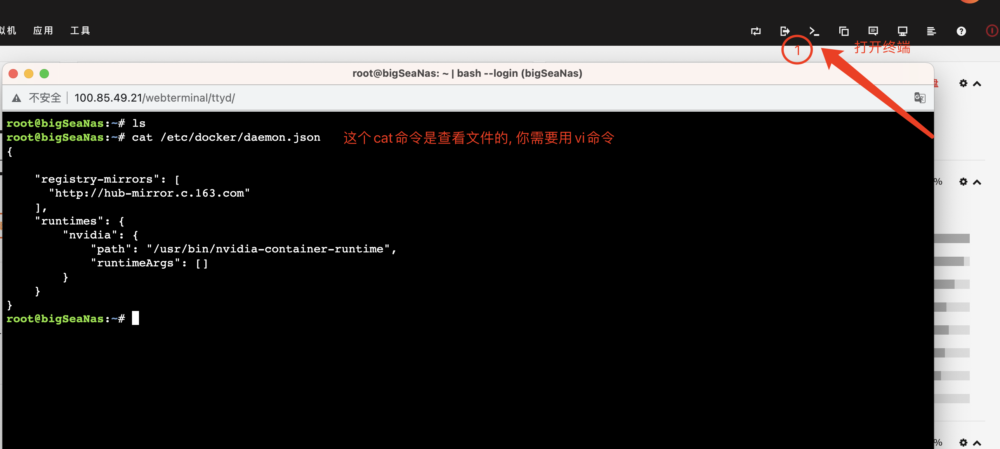
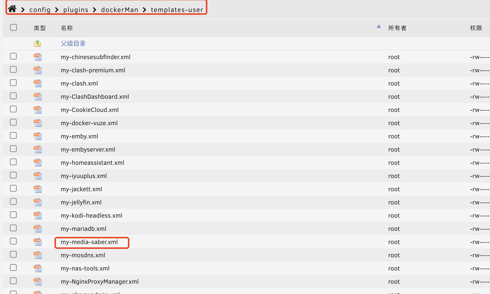
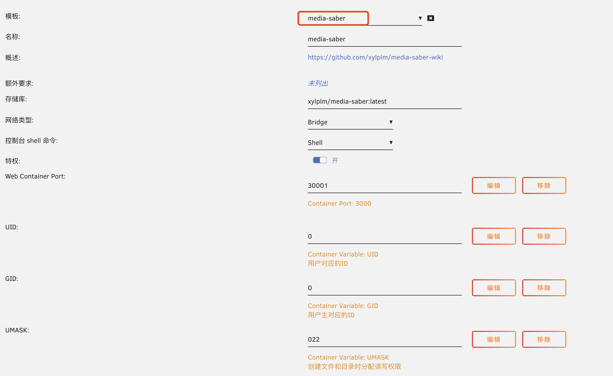

:::danger
- 为了项目的安全性，请一定要注意：**请勿外传！请勿外传！请勿外传！请勿外传！请勿外传！**
- 项目运行需要自行添加 **激活密钥**，这里不说明是什么
:::
:::note 致谢
感谢`@XXX` 大佬 为大家带来本篇的教程。
:::
## 1. 镜像下载

因为现在 dockerhub 被墙了，部分网友可能拉取不到 Media Saber 的镜像，所以我们需要先在 docker 的 `daemon.json` 里面新增一个镜像地址，来拉取镜像

我这里使用的163的镜像地址：`http://hub-mirror.c.163.com`

可以通过 `vi` 命令或者 `其他工具` 新增修改都可以这个文件都可以



```yaml
{
    "registry-mirrors": [
      "http://hub-mirror.c.163.com"
    ]
}
```

一般只用 `registry-mirrors` 就可以了，我是因为有 `NVIDIA` 显卡，所以才有下面这个配置，可以忽略

添加好之后就可以 **pull image** 了，执行命令 `docker pull xylplm/media-saber:latest-beta` 即可


## 2. 准备模板文件

下载这个 [模板文件](https%3A%2F%2Fgithub.com%2Fxylplm%2Fmedia-saber-wiki%2Ftree%2Fmain%2Fdocs%2Fdocs%2F01.%E6%96%B0%E6%89%8B%E6%8C%87%E5%BC%95%2F02.%E5%A6%82%E4%BD%95%E5%AE%89%E8%A3%85%2Funraid_files%2F03.my-media-saber.xml)

如果失效了，可以直接自己创建一个`xml`的文件

```xml
<?xml version="1.0"?>
<Container version="2">
  <Name>media-saber</Name>
  <Repository>xylplm/media-saber:latest-beta</Repository>
  <Registry>https://hub.docker.com/r/xylplm/media-saber/</Registry>
  <Network>bridge</Network>
  <MyIP/>
  <Shell>sh</Shell>
  <Privileged>true</Privileged>
  <Support>https://wiki.msaber.fun/docs/start/info/</Support>
  <Project>https://wiki.msaber.fun/</Project>
  <Overview>https://github.com/xylplm/media-saber-wiki</Overview>
  <Category>&#x4E00;&#x6B3E;&#x65B9;&#x4FBF;&#x597D;&#x7528;&#x7684;&#x5A92;&#x4F53;&#x7BA1;&#x7406;&#x5DE5;&#x5177;</Category>
  <WebUI>http://[IP]:[PORT:3000]</WebUI>
  <TemplateURL/>
  <Icon>https://wiki.msaber.fun/img/logo.png</Icon>
  <ExtraParams>--restart=unless-stopped</ExtraParams>
  <PostArgs/>
  <CPUset/>
  <DateInstalled>1697522248</DateInstalled>
  <DonateText/>
  <DonateLink/>
  <Requires/>
  <Config Name="Web Container Port" Target="3000" Default="3000" Mode="tcp" Description="" Type="Port" Display="always" Required="false" Mask="false">30001</Config>
  <Config Name="UID" Target="UID" Default="0" Mode="{3}" Description="&#x7528;&#x6237;&#x5BF9;&#x5E94;&#x7684;ID" Type="Variable" Display="always" Required="false" Mask="false">0</Config>
  <Config Name="GID" Target="GID" Default="0" Mode="{3}" Description="&#x7528;&#x6237;&#x4E3B;&#x5BF9;&#x5E94;&#x7684;ID" Type="Variable" Display="always" Required="false" Mask="false">0</Config>
  <Config Name="UMASK" Target="UMASK" Default="022" Mode="{3}" Description="&#x521B;&#x5EFA;&#x6587;&#x4EF6;&#x548C;&#x76EE;&#x5F55;&#x65F6;&#x5206;&#x914D;&#x8BFB;&#x5199;&#x6743;&#x9650;" Type="Variable" Display="always" Required="false" Mask="false">022</Config>
  <Config Name="Continer Env 1" Target="MEDIA_SABER_AUTH_EMAIL" Default="&#x7533;&#x8BF7;&#x7684;&#x90AE;&#x7BB1;" Mode="{3}" Description="&#x4F60;&#x7533;&#x8BF7;&#x7684;&#x90AE;&#x7BB1;" Type="Variable" Display="always" Required="false" Mask="false">申请的账号</Config>
  <Config Name="Continer Env 2" Target="MEDIA_SABER_AUTH_SLOGAN" Default="&#x7533;&#x8BF7;&#x7684;&#x53E3;&#x4EE4;" Mode="{3}" Description="&#x4F60;&#x7533;&#x8BF7;&#x7684;&#x53E3;&#x4EE4;" Type="Variable" Display="always" Required="false" Mask="false">申请的密码</Config>
  <Config Name="Media Path" Target="/media" Default="/mnt/user/your media path" Mode="rw" Description="&#x5A92;&#x4F53;&#x6587;&#x4EF6;&#x8DEF;&#x5F84;, &#x53EF;&#x4EE5;&#x4E00;&#x4E2A;&#x5927;&#x76EE;&#x5F55;, &#x4E5F;&#x53EF;&#x4EE5;&#x591A;&#x65B0;&#x589E;&#x51E0;&#x4E2A;&#x5C0F;&#x76EE;&#x5F55;&#x6302;&#x8F7D;" Type="Path" Display="always" Required="true" Mask="false">/mnt/user/resources/media/</Config>
  <Config Name="Link Media Path" Target="/linkMedia" Default="/mnt/user/your link media path" Mode="rw" Description="&#x786C;&#x94FE;&#x63A5;&#x5A92;&#x4F53;&#x6587;&#x4EF6;&#x8DEF;&#x5F84;, &#x53EF;&#x4EE5;&#x4E00;&#x4E2A;&#x5927;&#x76EE;&#x5F55;, &#x4E5F;&#x53EF;&#x4EE5;&#x591A;&#x65B0;&#x589E;&#x51E0;&#x4E2A;&#x5C0F;&#x76EE;&#x5F55;&#x6302;&#x8F7D;" Type="Path" Display="always" Required="true" Mask="false">/mnt/user/resources/linkMedia/</Config>
  <Config Name="Config Path" Target="/config" Default="/mnt/user/appdata/mediaSaber" Mode="rw" Description="&#x914D;&#x7F6E;&#x6587;&#x4EF6;&#x5730;&#x5740;" Type="Path" Display="always" Required="true" Mask="false">/mnt/user/appdata/mediaSaber</Config>
</Container>
```

将这个文件保存或创建到 `/boot/config/plugins/dockerMan/templates-user` 目录下面

一种是直接通过页面进入到 `终端`，一种是通过工具进入





## 3. 容器创建

进入 `docker` 菜单，创建容器


选择一个模板，注意在 `user templates` 下面



模板都已经写好注释了，也可以看下其他的说明，输入自己进群登记的过的 `邮箱` 和 `认证口令`，修改对应的 `媒体文件目录`，就可以创建了

其中 `UID`、`GID`、`UMASK` 可以根据自己的喜好填写，我是因为懒，直接就填写 0 了

