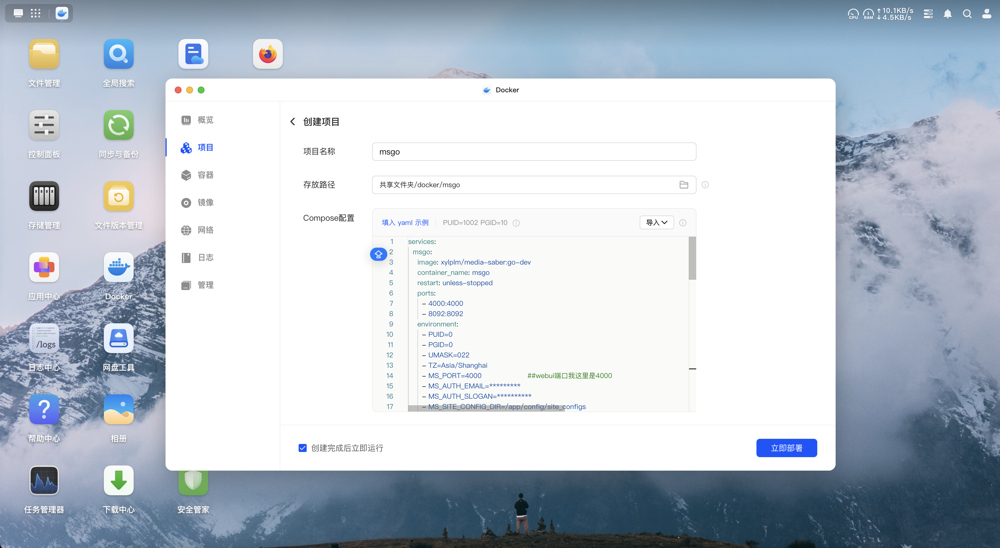

# UGOS Pro安装msgo教程

## 一、创建映射文件夹

​​

### 1、目录层级

```undefined
.
├── docker
│   ├── msgo
│   │   └── configs
│   ├── redis
│   │   └── data
│   └── pgsql
│       └── data
└── video   #存储媒体文件的目录
```

## 二、配置文件

### 1.使用绿联项目编排

<div align="center"></div>

```
services:
  msgo:
    image: xylplm/media-saber:go-dev
    container_name: msgo
    restart: unless-stopped
    ports:
      - 4000:4000                      ##webui端口
      - 8092:8092                      ##媒体服务器反代端口，我这里是8092
    environment:
      - PUID=0
      - PGID=0
      - UMASK=022
      - TZ=Asia/Shanghai
      - MS_PORT=4000                    ##webui端口我这里是4000
      - MS_AUTH_EMAIL=*********
      - MS_AUTH_SLOGAN=**********
      - MS_SITE_CONFIG_DIR=/app/config/site_configs
      - MS_LOG_LEVEL=debug
      - MS_REDIS_HOST=redis:6379        ##当你使用一个compose文件创建项目，会被创建到同一个桥接网络，容器之间可以直接填写容器名称代替IP地址通讯
      - MS_REDIS_PASS=assword
      - MS_TIMEOUT=60000
      - MS_PGSQL_USERNAME=postgres
      - MS_PGSQL_PASSWORD=password
      - MS_PGSQL_PATH=pgsql
      - MS_PGSQL_DBNAME=ms
    privileged: true
    volumes:
      - */configs:/app/config           ##自行创建文件及映射
      - */video:/video                  ##自行创建文件及映射
  redis:
    image: redis:latest
    container_name: redis
    restart: unless-stopped
    volumes:
      - */data:/data                   ##自行创建文件及映射
    environment:
      - TZ=Asia/Shanghai
      - GOSU_VERSION=1.17
      - REDISPASS=password
      - PUID=0
      - PGID=0
  pgsql:
    image: postgres:17-alpine
    container_name: pgsql
    restart: unless-stopped
    volumes:
      - */data:/var/lib/postgresql/data       ##自行创建文件及映射
    environment:
      - POSTGRES_USER=postgres
      - POSTGRES_DB=ms
      - POSTGRESQL_WAL_COMPRESSION=lz4
      - POSTGRESQL_MAX_CONNECTIONS=2048
      - POSTGRES_PASSWORD=password
```

### 2.直接启动即可
