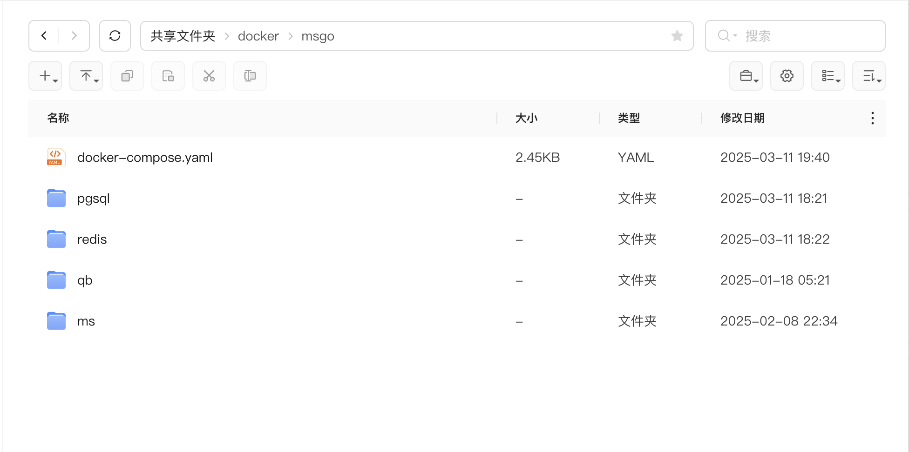

此处以UGOS Pro设备为例

## 项目目录


## 配置
- 全家桶 docker-compose 一键部署
- 项目存放路径选 /共享文件夹/docker/msgo
- 默认使用自定义网络，容器之间互访使用容器名+内部端口
- 如需使用 host 网络，记得把容器改为 ip
- 需要修改的地方使用 xxx 代替了
```yaml
services:
  # redis 缓存数据，加速运行，必选
  redis:
    image: redis:latest
    container_name: redis
    restart: unless-stopped
#    network_mode: host
    networks:
      - msgo_network
    volumes:
      - ./redis/data:/data
    environment:
      TZ: Asia/Shanghai
      GOSU_VERSION: 1.17
#    ports:
#      - "6379:6379" # 仅外部使用

  # pgsql 主数据库，必选
  pgsql:
    image: postgres:17-alpine
    container_name: pgsql
    restart: unless-stopped
#    network_mode: host
    networks:
      - msgo_network
    volumes:
        - ./pgsql/data:/var/lib/postgresql/data
    environment:
      POSTGRES_DB: ms # 数据库
      POSTGRESQL_WAL_COMPRESSION: lz4  # 压缩算法
      POSTGRESQL_MAX_CONNECTIONS: 2048 # 最大连接数
      POSTGRES_USER: postgres # 用户
      POSTGRES_PASSWORD: ms888888 # 密码
#    ports:
#      - "5432:5432" # 仅外部使用

  # emby 媒体服务器，可选
  emby:
    image: linuxserver/emby:latest
    container_name: emby
    network_mode: bridge # DLNA and Wake-on-Lan 需要 bridge
    environment:
      - PUID=0 # 设置容器用户 ID 为 0 (通常是 root)
      - PGID=0 # 设置容器组 ID 为 0 (通常是 root)
      - GIDLIST=0 # 设置容器组 ID 列表为 0
      - TZ=Asia/Shanghai # 设置容器的时区为亚洲/上海
    devices:
      - /dev/dri:/dev/dri             # 将主机的 /dev/dri 设备挂载到容器 开启硬解
    ports:
      - 8096:8096 # 对外访问端口
    restart: unless-stopped
    privileged: true
    volumes:
      - ./emby/config:/config
      # strm 目录，emby 添加这个目录到媒体库
      - /home/xxx/strm:/strm

  # msgo go 重写船新版本
  msgo:
    image: xylplm/media-saber:latest
    container_name: msgo
    restart: unless-stopped
#    network_mode: host
    networks:
      - msgo_network
    environment:
      TZ: Asia/Shanghai
      MS_PORT: 8888 # 前端端口
      MS_AUTH_EMAIL: xxx # 邮箱
      MS_AUTH_SLOGAN: xxx # 授权码
      MS_LOG_LEVEL: debug # 日志级别
      MS_LOG_KEEP_DAYS: 14 # 日志保留天数
      MS_REDIS_HOST: redis:6379 # redis 容器名:端口
      MS_REDIS_PASS:  # redis 密码
      MS_TIMEOUT: 60000 # 接口请求超时，单位毫秒
      MS_PGSQL_DBNAME: ms # pgsql 数据库
      MS_PGSQL_USERNAME: postgres #  pgsql 用户
      MS_PGSQL_PASSWORD: ms888888 # pgsql 密码
      MS_PGSQL_PATH: pgsql # pgsql 容器名
      MS_PGSQL_PORT: 5432 # pgsql 端口
      MS_PGSQL_LOG_MODE: prod # 数据库日志 options=dev|test|prod|silent
      MS_MQ_CONCURRENCY: 10 # MQ 最大并发数
      MS_MCP_SERVER_HTTP_ADDR: "0.0.0.0:5000" # mcp streamable http addr
    privileged: true
    volumes:
      - ./ms/config:/app/config
#      - ./qb:/qb # 挂载 qb 目录，转种要用到
    ports:
      - "8888:8888" # 前端端口
#      - "22698:22698" # 后端端口
#      - "8091:8091" # 使用 strm302 功能后，emby/jellyfin 代理端口
#      - "8091:8091" # 使用 strm302 功能后，emby/jellyfin 代理端口
#      - "6060:6060" # pprof 端口
#      - "6080:5000" # mcp 端口

  # ocr 
  ms-baidu-ocr:
    image: xylplm/media-saber-baidu-ocr:latest
    container_name: ms-baidu-ocr
    # network_mode: bridge
    networks:
      - msgo_network
    environment:
      - TZ=Asia/Shanghai
      - OCR_APP_ID=xxx # 应用 id
      - OCR_API_KEY=xxx # apikey
      - OCR_SECRET_KEY=xxx # 密钥
    # ports:
    #   - 29898:9898
    restart: unless-stopped

  # qb 下载器，可选
  qb:
    image: lscr.io/linuxserver/qbittorrent:14.3.9
    container_name: qb
    restart: unless-stopped
#    network_mode: host
    networks:
      - msgo_network
    environment:
      PGID: 0
      PUID: 0
      TZ: Asia/Shanghai
      WEBUI_PORT: 8080
      TORRENTING_PORT: 6881
    volumes:
      - ./qb/config:/config
    ports:
      - "8080:8080"
      - "6881:6881"
      - "6881:6881/udp"

  # 任务队列监控，可选
  asynqmon:
    image: hibiken/asynqmon:latest
    container_name: asynqmon
    restart: unless-stopped
    networks:
      - msgo_network
    ports:
      - '38080:8080'
    environment:
      - TZ=Asia/Shanghai
    command: --redis-addr=redis:6379 --read-only=true

networks:
  msgo_network:
    name: msgo_network
```
