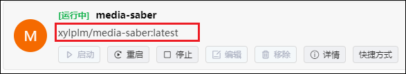

:::danger
- 为了项目的安全性，请一定要注意：**请勿外传！请勿外传！请勿外传！请勿外传！请勿外传！**
- 项目运行需要自行添加 **激活密钥**，这里不说明是什么
:::
:::note 致谢
感谢`@XXX` 大佬 为大家带来本篇的教程。
:::
:::tip
强烈推荐使用 @唯依 大佬的 dc 来更新，安装使用方法：[dc一键更新](/guide/update_version/dc/)。
:::

如果我们下载的 Media Saber 镜像正好是 latest-beta 标签，那么升级就会变得非常简单，下面我来介绍一下升级过程。

如下图所示，我当前的 Media Saber 镜像版本号是 2.2.1 的版本，镜像仓库的最新版本是 2.3.0 号的版本。

那么我们需要在 `镜像管理 - 镜像仓库 - 搜索镜像`，然后下载最新的版本。

在新镜像拉取完成以后，我们回到容器管理这里可以看到，本来应该显示 `xylplm/media-saber:latest-beta` 的现在变成了红框的内容。

并且在镜像管理中可以看到有两个镜像。

这时我们只需点击停止，然后再点击编辑，并且什么参数都不需要再修改，只用一路点击下一步，直到最后点击完成即可，最后再启动 Media Saber。

当我们启动成功以后，容器里面只会存在一个 Media Saber，并且标签又变回了 `xylplm/media-saber:latest`

而再次回到镜像管理中，我们又看到，我们成功在 latest-beta 版本上启动了一个容器，而之前的镜像是没有建立容器的，这时我们就可以把这个旧版本的镜像点击删除即可。

总而言之，绿联的更新非常简单：拉最新镜像-停容器并无脑下一步编辑容器-启动容器-删除旧镜像即可。

