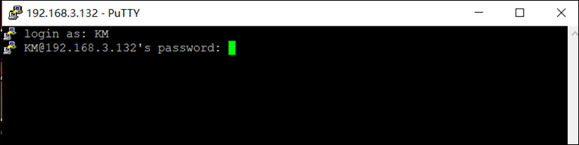

> 感谢`@WhoisKB` 为大家带来，群晖 NAS 的 MS 更新教程。

> 为了项目的安全性，请一定要注意：`请勿外传！请勿外传！请勿外传！请勿外传！请勿外传！`，需要自行添加`激活密钥`，这里不说明是什么


由于 docker hub 被墙无法访问后，群辉 7.2 以下系统无法打开 docker 注册表搜索镜像，推荐以下几种方式：

##  创建计划任务

群辉计划任务拉取 docker 镜像，在群辉控制面板中打开`计划任务`


新增计划任务---用户自定义脚本


名称随意填写，用户账号选择 root


任务设置---用户定义的脚本填入拉取 ms 镜像指令

```shell
docker pull xylplm/media-saber:latest
```


确定保存之后，执行计划任务即可


## SSH 命令行拉取

通过连接 SSH 工具使用命令行拉取，这边教程使用 PUTTY 演示；

打开 PUTTY，填入群辉的后台 `IP+22` 端口，如果更改过群辉 ssh 端口请自行更改端口


连接到 SSH 后按提示输入群辉的用户名+密码。输入密码的时候是看不见的，所以提前查看一下输入法大小写。



输入密码之后进入应该是在这个界面。紧接着输入命名 `sudo -i`，在输入一次密码，获得 root 权限。如图


如图有 root 说明有权限了。可以直接复制命令填入拉取镜像

拉取命令：

```shell
docker pull xylplm/media-saber:latest
```

输入命令后会拉取镜像，等待拉取完毕即可更新。如图


镜像下载完成了，接下来就是更新 Media-Saber 了，打开群辉 docker
先停止已经在运行的 Media-Saber 容器，如图：


然后选择已经停止的 Media-Saber 容器，执行`重置`操作


重置后`重新启动`容器，即可升级到最新版本，进入 Media-Saber 后台，可以看见已经是最新的 2.4.0 了。


> 注意此方法升级，如果原本的 Media-Saber 镜像名不是 `xylplm/media-saber:latest`，而是特定的版本，如 `xylplm/media-saber:2.2`则不能使用此方法升级。

> 在此感谢维护 Media-Saber 的大佬，大佬们辛苦了
