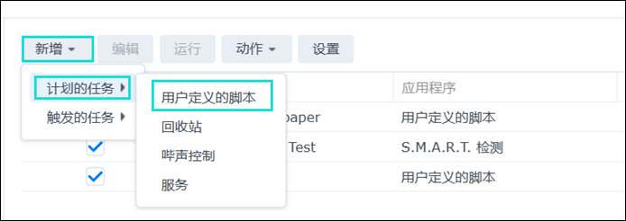
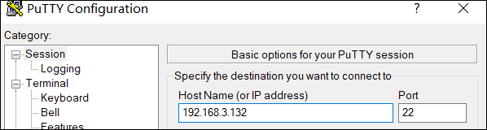
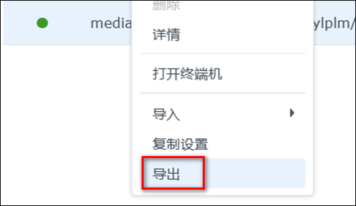
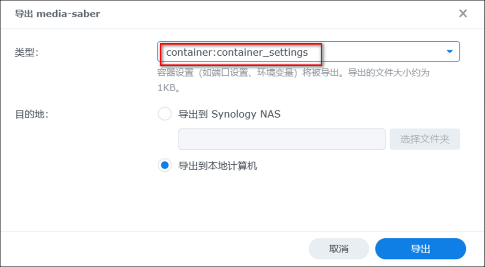
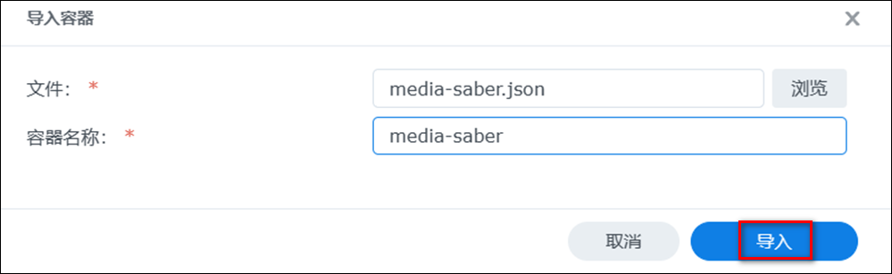

:::danger
- 为了项目的安全性，请一定要注意：**请勿外传！请勿外传！请勿外传！请勿外传！请勿外传！**
- 项目运行需要自行添加 **激活密钥**，这里不说明是什么
:::

:::tip
强烈推荐使用 @唯依 大佬的 dc 来更新，安装使用方法：[dc一键更新](/guide/update_version/dc/)。
:::

## 更新容器镜像

:::note 致谢
感谢`@WhoisKB` 为大家带来，群晖 NAS 的 Media Saber 更新教程。
:::

### Docker Compose 方式 <Badge text="推荐"/>

:::warning
只有使用 Docker Compose 方式创建的容器才可使用 Docker Compose 方式进行更新
:::

执行以下命令进入 Media Saber 容器配置文件夹，路径位置根据实际配置文件夹进行修改

```shell
cd /volume1/docker/Media-Saber
```

执行 Docker Compose 命令进行镜像拉取及容器更新

```shell
docker-compose pull && docker-compose up -d
```

### Docker CLI 方式

#### 1. 拉取最新镜像

拉取最新镜像有 [创建计划任务拉取](/guide/update_version/synology/#创建计划任务拉取) 和 [SSH 命令行拉取](/guide/update_version/synology/#ssh-命令行拉取) 两种方式，选择其中一种即可。

##### 创建计划任务拉取

群辉计划任务拉取 docker 镜像，在群辉控制面板中打开 `计划任务`


依次点击 `新增计划任务 - 用户自定义脚本`



名称随意填写，用户账号选择 root


点击 `任务设置`，在 `用户定义的脚本` 中填入拉取 Media Saber 镜像指令

```shell
docker pull xylplm/media-saber:latest-beta
```


确定保存之后，执行计划任务即可


##### SSH 命令行拉取

通过连接 SSH 工具使用命令行拉取，这边教程使用 PuTTY 演示

打开 PuTTY，填入群辉的后台 IP + 22 端口，如果更改过群辉 SSH 端口请自行更改端口



连接到 SSH 后按提示输入群辉的用户名 + 密码。输入密码的时候是看不见的，所以提前查看一下输入法大小写


输入密码之后进入应该是在这个界面。紧接着输入命令 `sudo -i`，再输入一次密码，获得 root 权限


如图有 root 说明有权限了。可以直接复制以下拉取命令并执行以拉取镜像

```shell
docker pull xylplm/media-saber:latest-beta
```

输入命令后会拉取镜像，等待拉取完毕即可更新


#### 2. 更新容器

镜像下载完成了，接下来就是更新 Media Saber 了，打开群辉 docker，先停止已经在运行的 Media Saber 容器


然后选择已经停止的 Media Saber 容器，执行 `重置` 操作


重置后 `重新启动` 容器，即可升级到最新版本，进入 Media Saber 后台，可以看见已经是最新版本的 latest-beta 了


## 更换镜像 TAG

:::note 致谢
感谢`@君` 为大家带来，群晖 NAS 的 Media Saber 更换镜像 TAG 教程。
:::

### Docker Compose 方式 <Badge text="推荐"/>

:::warning
只有使用 Docker Compose 方式创建的容器才可使用 Docker Compose 方式进行镜像 TAG 更换
:::

修改 `docker-compose.yaml` 文件中的 `image` 的值为 `xylplm/media-saber:latest-beta`

执行 Docker Compose 命令进行镜像拉取及容器更新

```shell
docker-compose pull && docker-compose up -d
```

### 群晖 WEBUI 方式

1. 选择 Media Saber 容器，点击 `导出`



2. 类型选择为容器设置，然后点击 `导出`



3. 打开 json 文件，修改 `image` 字段


4. 选择修改后的 json 文件，点击 `导入`



