:::danger
- 为了项目的安全性，请一定要注意：**请勿外传！请勿外传！请勿外传！请勿外传！请勿外传！**
- 项目运行需要自行添加 **激活密钥**，这里不说明是什么
:::
:::note 致谢
感谢`@XXX` 大佬 为大家带来本篇的教程。
:::
:::tip
由于现在推荐使用的是 `latest-beta` 版本，此版本更新比较频繁，因此强烈推荐大家使用项目组 @唯依 大佬的 docker copilot【下文统一缩写 dc】来更新
:::

dc 是一个主打简单操作的 docker 管理工具：

- 容器更新：可以直观的看到容器是否有更新然后一键更新，也可以很方便的更换容器版本
- 镜像管理：对于不使用的镜像可以一键清理
- 容器的备份与恢复：万一不幸遇到盘挂了或者更换设备，可以方便的一键复活。

dc 项目 GitHub 地址：<https://github.com/onlyLTY/dockerCopilot>。好用的话可以打个星给予鼓励哦~

> bug反馈和建议联系方式：部署遇到的问题和想要反馈的话都可以直接在上述的 Github 地址提 issue，或者发送到唯依佬的邮箱：`onlylty@lty.wiki`

## 安装

### 绿联篇

1. 打开绿联的Docker，点击镜像管理-本地镜像-添加，输入 `0nlylty/dockercopilot:UGREEN`，点击确认后会跳出选择版本的弹窗，继续点击确认即可，然后等待镜像拉取完成。

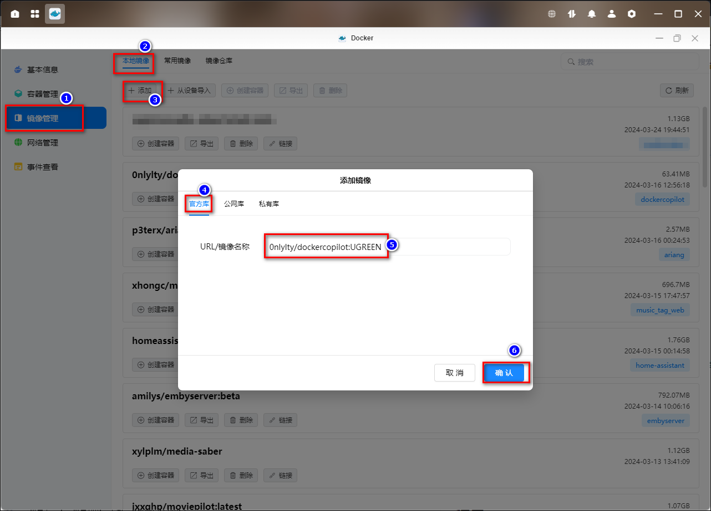

2. 找到刚刚拉取的镜像，点击创建容器，这里要使用 `高级模式`，可以勾选创建后启动容器，然后点击下一步

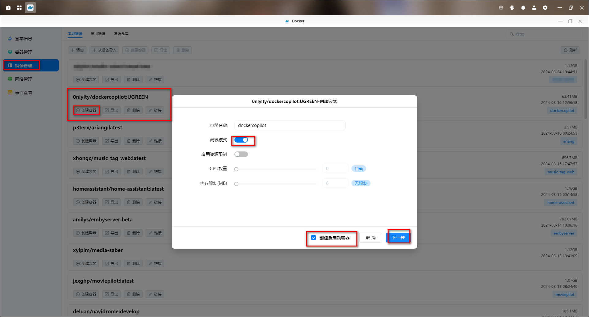


3. 基础设置：重启策略设置为 `容器退出时总是重启容器`

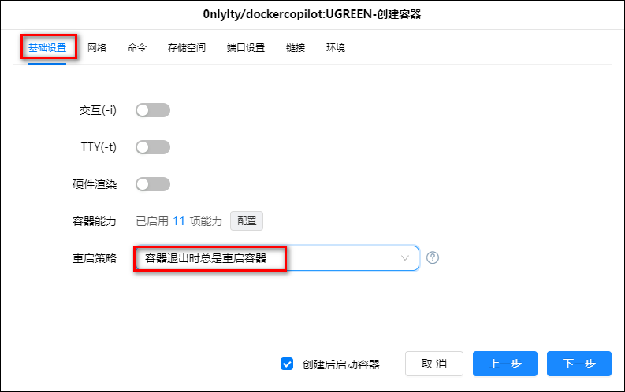


4. 网络：设置为host模式

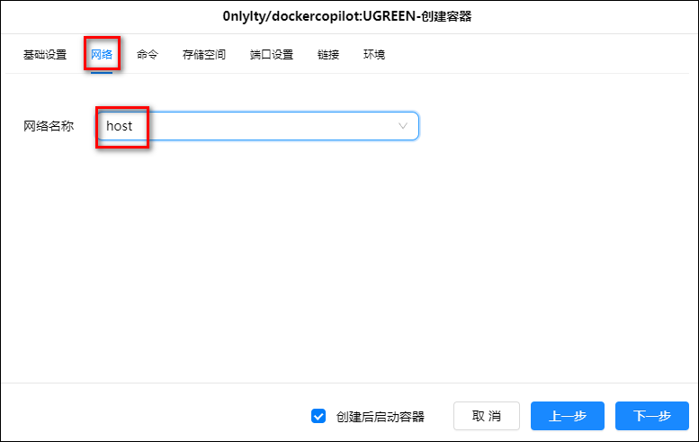


5. 存储空间：自定义 `/data` 对应的路径，同时类型要改为读写

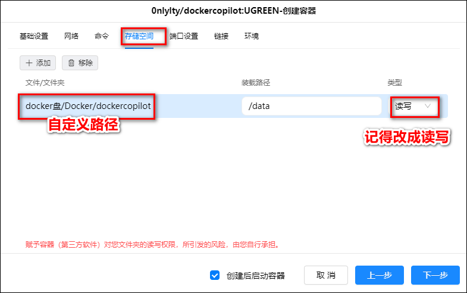


6. 环境：设置 `secretKey` 的值，也就是你的密码，注意：密码长度要大于 8 位，且不能为纯数字

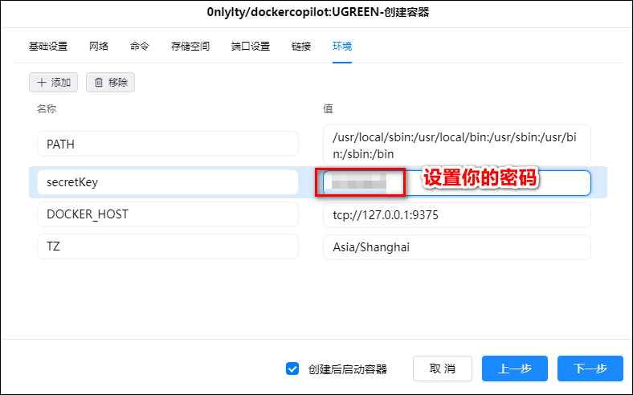


然后点击下一步，点击完成。至此，安装完成

### 群晖篇

1. 打开群晖 File Station，在 `docker` 目录下新建 `dockercopilot` 文件夹，`dockercopilot` 目录下新建 `data` 文件夹。

2.打开Container Manager在项目中点击新增，输入项目名称`dockercopilot`，设置路径为刚刚创建的路径`docker/dockercopilot`，来源选择创建docker-compose.yaml，在代码框中粘贴以下代码：

```shell
version: '3'

services:
  dockerCopilot:  # Docker服务名称
    container_name: dockerCopilot  # 容器名称
    image: qqaazz.msaber.fun/0nlylty/dockercopilot:UGREEN  # 使用的Docker镜像
    privileged: true  # 设置特权模式以便容器内部可以执行特权操作
    network_mode: "bridge"  # 使用桥接网络模式
    ports:  # 端口映射配置
      - "12712:12712"  # 将容器的12712端口映射到主机的12712端口
    environment:  # 环境变量配置
      - secretKey=*****  # 设置密钥环境变量
      - DOCKER_HOST=unix:///var/run/docker.sock  # 指定Docker守护进程的通信地址
      - githubProxy=https://mirror.ghproxy.com
      #- hubURL=https://docker.nju.edu.cn  # 设置hubURL环境变量
    volumes:  # 挂载卷配置
      - "/var/run/docker.sock:/var/run/docker.sock"  # 将主机的Docker守护进程的Unix套接字挂载到容器内
      - "/volume1/docker/dockercopilot/data:/data"  # 挂载数据目录到容器内
    restart: always  # 容器退出后总是重启

```

3. 修改映射路径为你自己的路径，点击下一步，选项保持默认，直至完成。

### 极空间篇

1. 打开极空间 docker，点击 `镜像 - 仓库 - 自定义拉取`

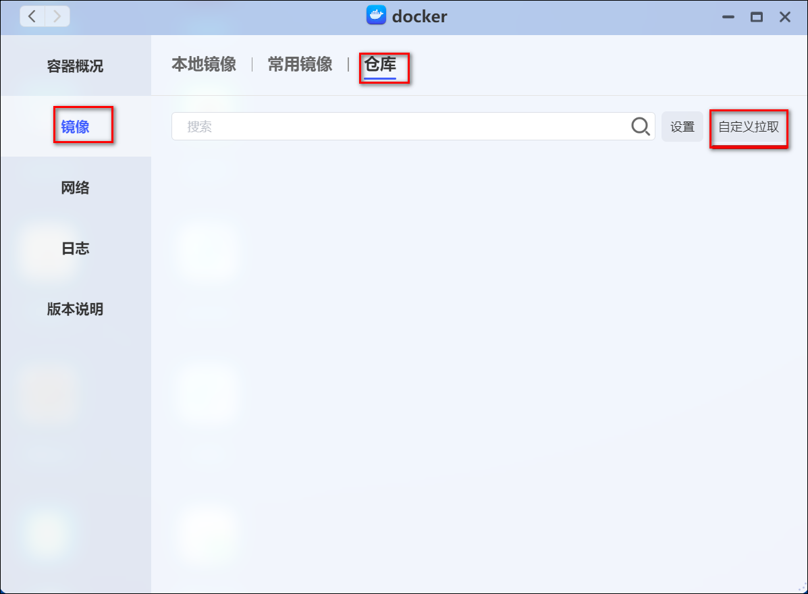

2. 输入 `0nlylty/dockercopilot:ZSPACE`，点击拉取，等待拉取完成。

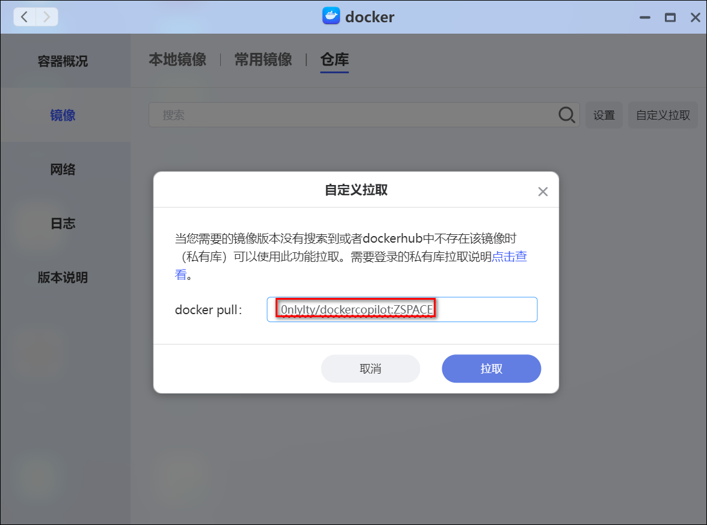

3. 在本地镜像找到拉取到的dc镜像，点击 `添加到容器`

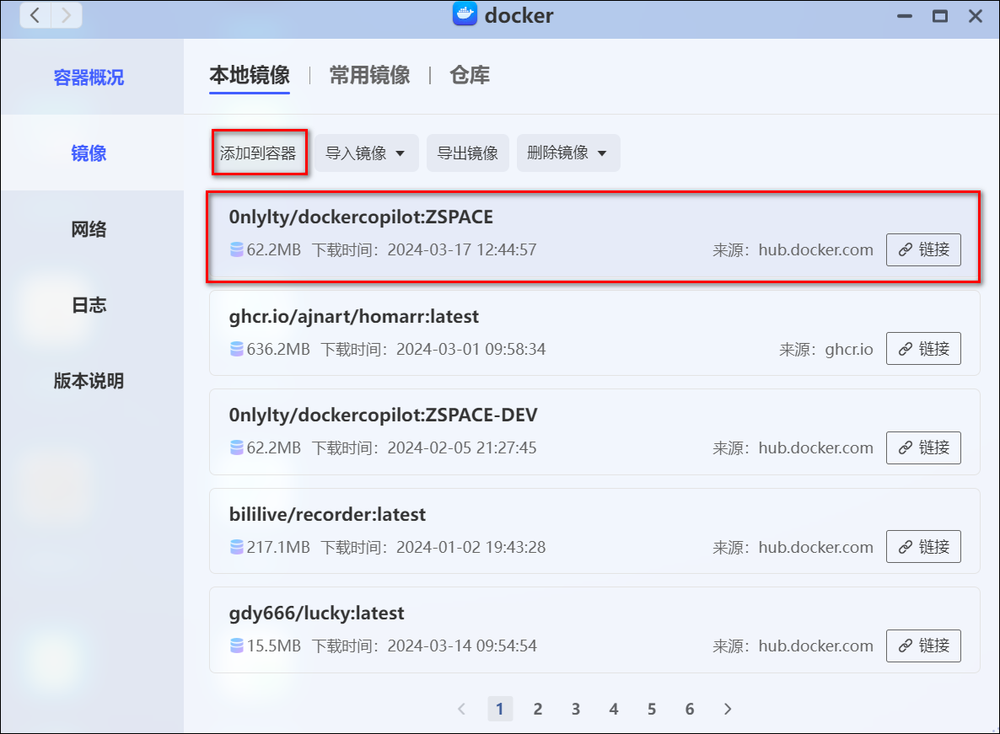

4. 基本设置：勾选 `极空间开机后自动启动此容器`

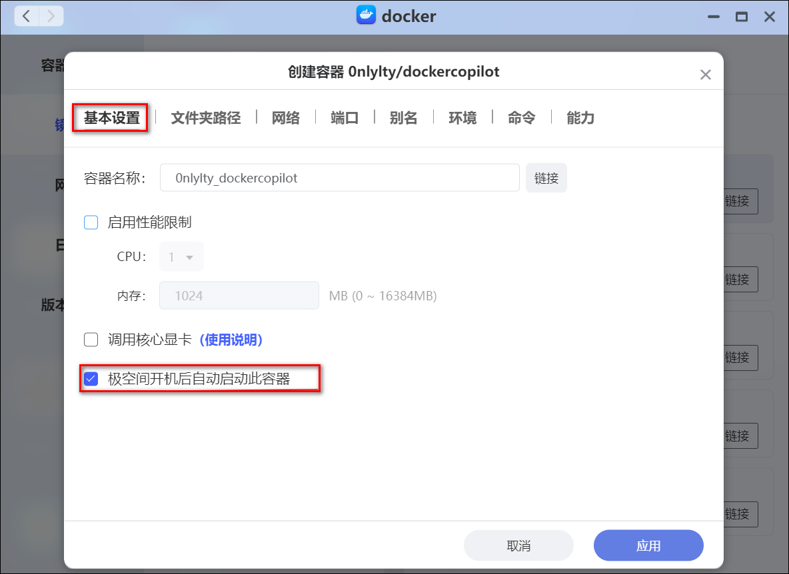

5. 文件夹路径：需要挂载 `/data` 目录来保存备份容器的文件，以及未来可能的配置文件

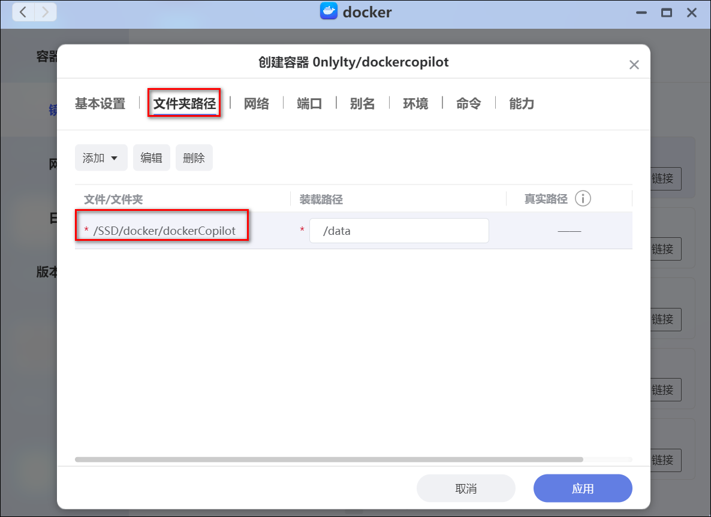

6. 网络：必须要修改为 host 模式

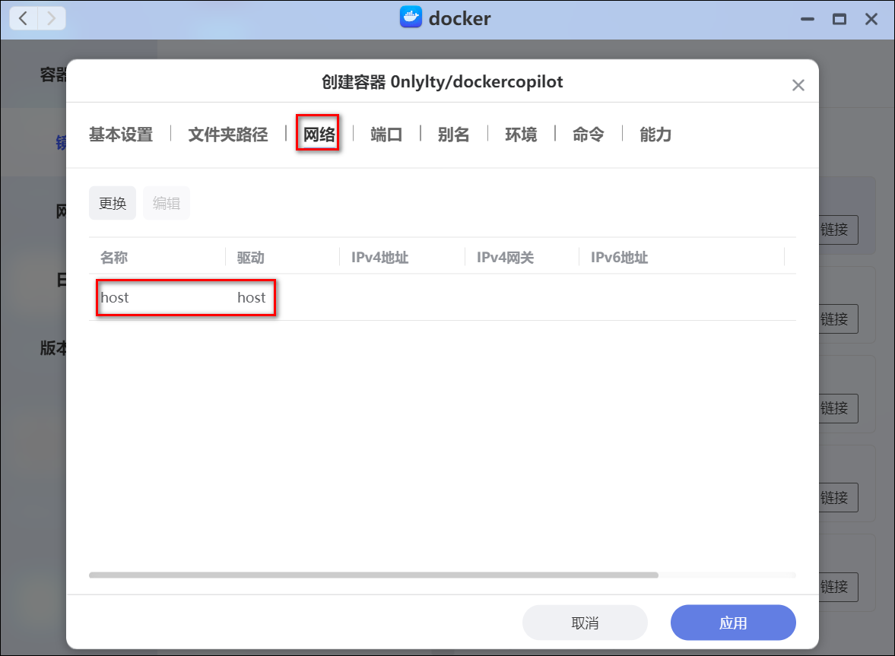

7. 环境：`account` 填写极空间的管理员账号。`secretKey` 填写一个自己设置的不少于 8 位的非纯数字密码

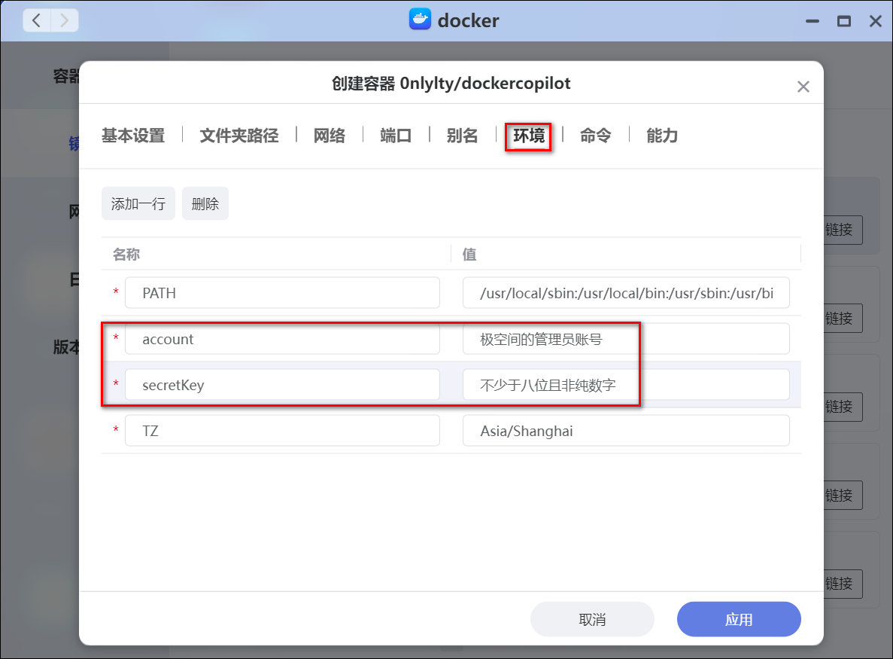

8、点击应用。至此安装完成

## 使用

### 登录

1. 在浏览器输入 `NAS的IP:12712` ，打开页面后可以看到一个登录框，会要求输入网址、端口、密钥，填写完后点击 `ok`，如果正确的话，登录框就会消失。如果没有消失就说明有东西输错了，请仔细检查

- 网址：写你 NAS 的 IP，如果你是用域名访问就写域名
- 端口：12712，这个是固定的。
- 密钥 ：刚刚设置的 `secretKey`，如果忘记的话可以在容器的环境看

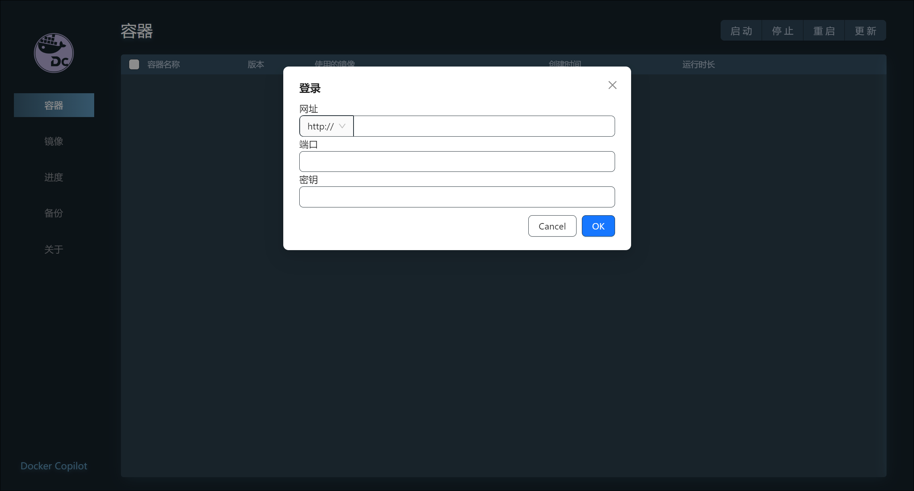

2. 这是一个正常登录后的页面。会显示容器的状态、版本状态、使用的镜像和创建的时间这样一些基础信息

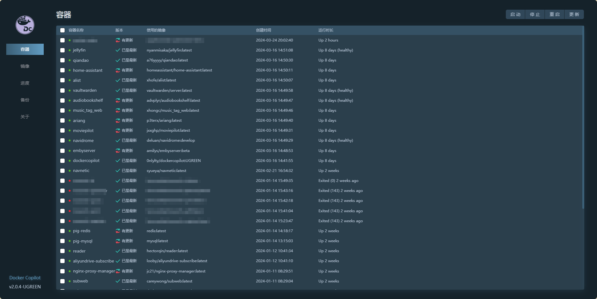

### 更新

1. 可以通过勾选多选框，对容器批量启动、停止、重启和更新。

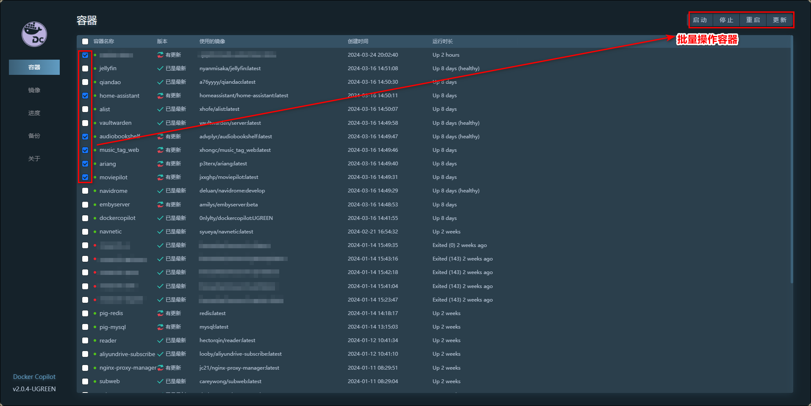

2. 可以点击想要操作的容器，右侧会有弹出栏，这样就可以单独对容器执行重命名、更换版本、更新等操作了。


比如现阶段需要把正式版本的 Media Saber 更新到测试版本，你可以只需要把版本号改成 `latest-beta` 然后点击更新即可。

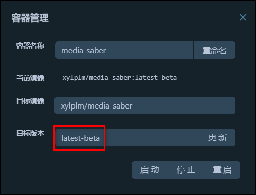


3. 如果进行了更新操作，右上角会有弹窗提示，且可以在进度里查看更新进度。


### 镜像

1. 点击镜像目录，可以清晰的看到哪些镜像在使用中，哪些已经没有使用了。我们可以手动选择未使用的镜像然后点击右上角的删除来清理镜像。

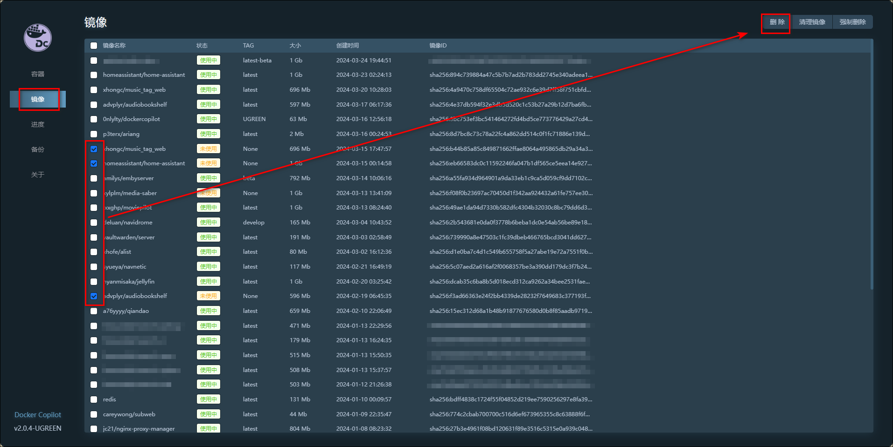

2. 可以直接点击右上角的清理镜像，根据条件批量清理镜像。

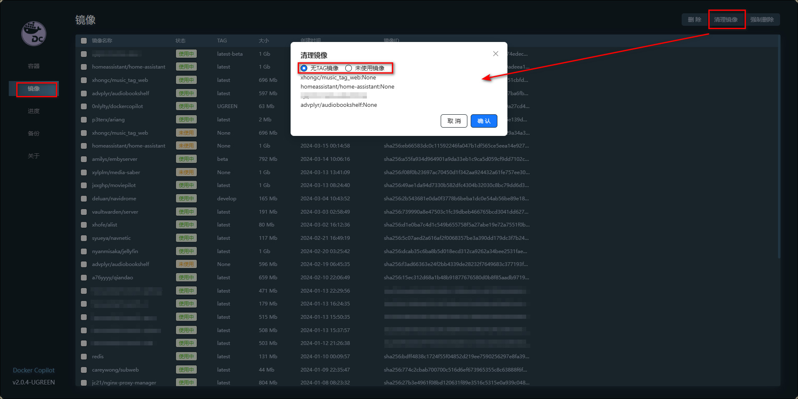

3. 有时候会有特殊情况，普通删除无法删除镜像，这时候可以使用强制镜像，但请谨慎使用强制删除
4. 清理完镜像后右上角会有删除成功的提示。

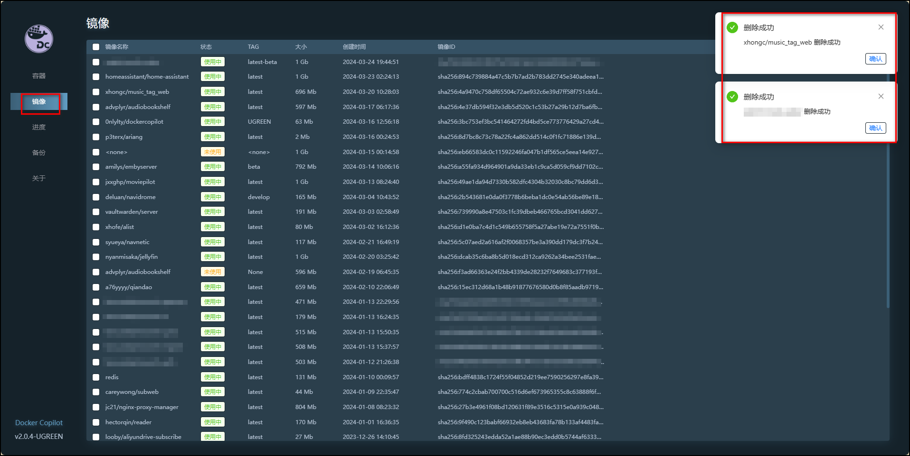

### 备份

点击备份目录，可以备份容器的创建参数和根据备份文件恢复容器。

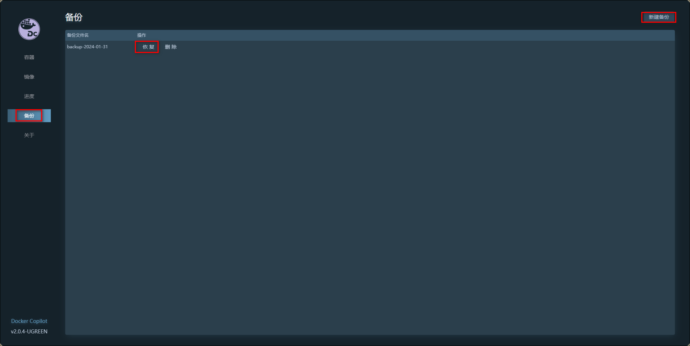

### 更新自身

dc 可以通过左下角的 `更新程序` 按钮来更新自身。这个按钮只有在有更新的时候才会显示，如果没有更新则不会显示

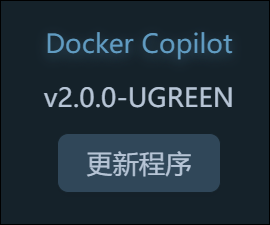


