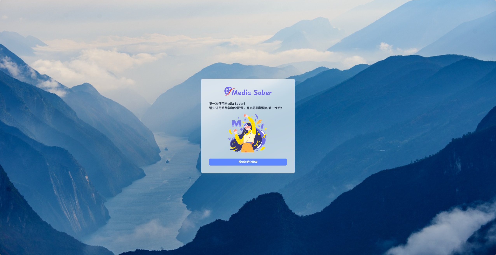
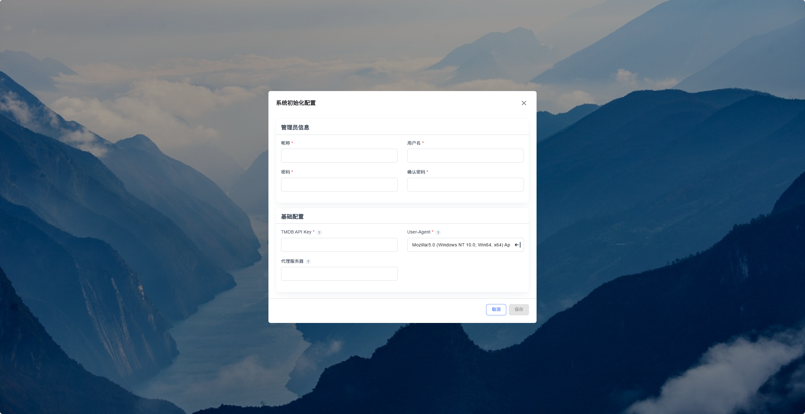
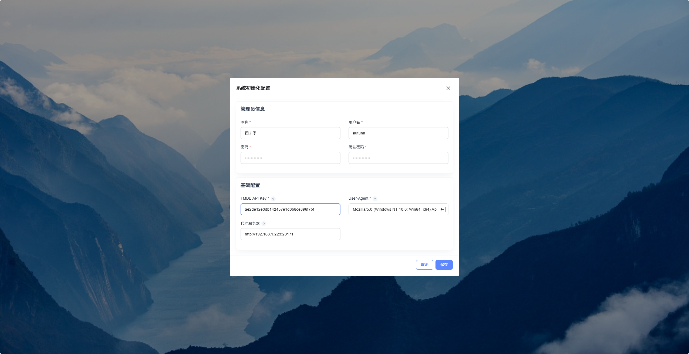
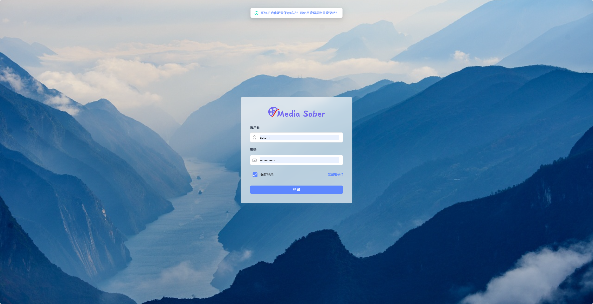
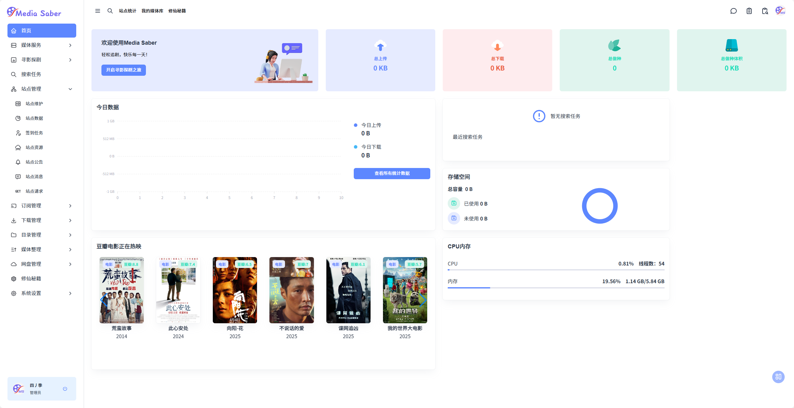

:::tip 提示

###  一、申请 TMDB API Key

Media Saber 使用 TMDB 提供的电影和电视剧元数据服务，需先申请 TMDB API Key。

#### 步骤如下：

1. 访问 [TMDB 官网](https://www.themoviedb.org/) 并注册账号  
2. 登录后，点击右上角头像 > 选择 **Settings（设置）**  
3. 左侧导航栏点击 **API**，进入 API 页面  
4. 点击 **"Create"** 创建新 API 密钥，选择用途为 **Developer**  
5. 填写基本信息（例如应用名称、用途说明等），提交申请  
6. 提交后即可在 API 页面看到你的 **API Key（v3 auth）**
> ⚠️ 注意：申请过程通常无需审核，Key 会即时生成，但请妥善保管，避免泄露。
:::

### 二、进入初始化页面

在浏览器输入 `IP:port`，进入 Media Saber 初始化页面，点击 **系统初始化配置**。

#### 1. 填写配置信息

在弹出的对话框中输入以下信息：

- 昵称  
- 用户名  
- 密码  
- TMDB API KEY （[TMDB详细注册教程](/guide/start/tmdb/) ）
- 代理服务器（可选）  

#### 2. 保存配置

点击保存后，系统将自动跳转至登录页面，并弹出提示：

> 系统初始化配置保存成功！请使用管理员账号登录吧！

#### 3. 登录管理员账号

使用设置好的管理员账号登录，开始配置各项基本参数。

