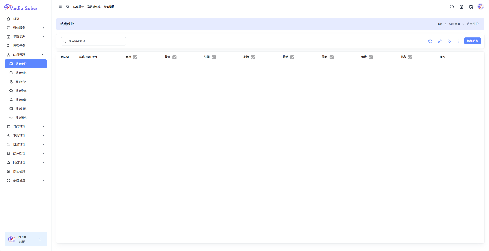
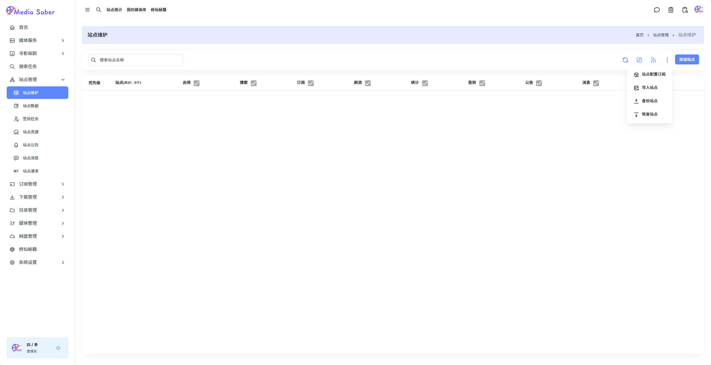
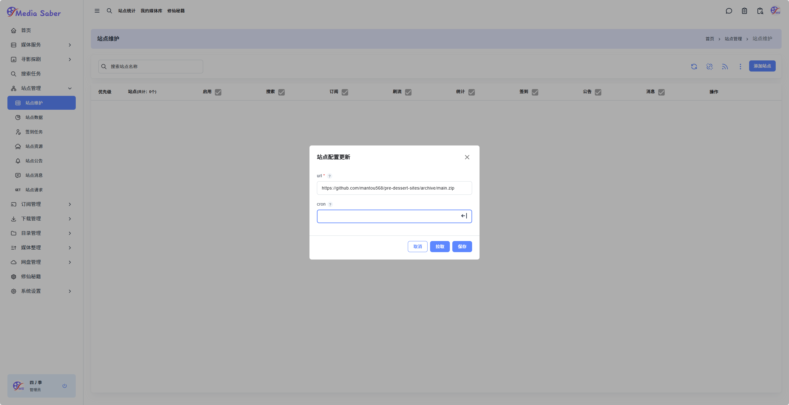
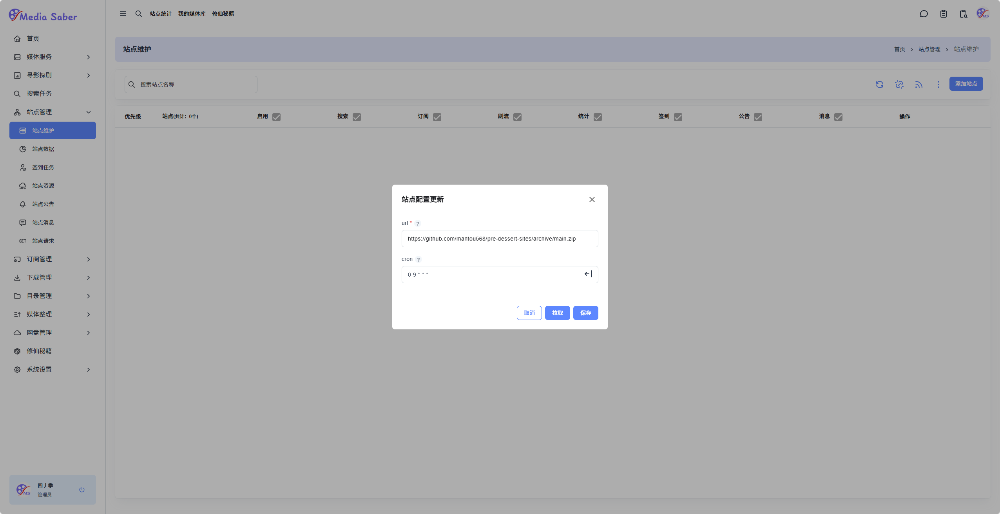
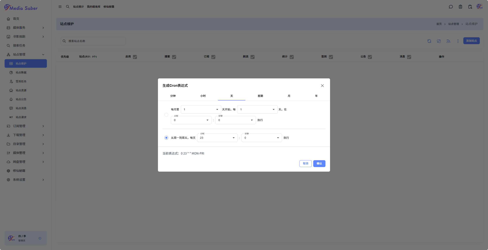
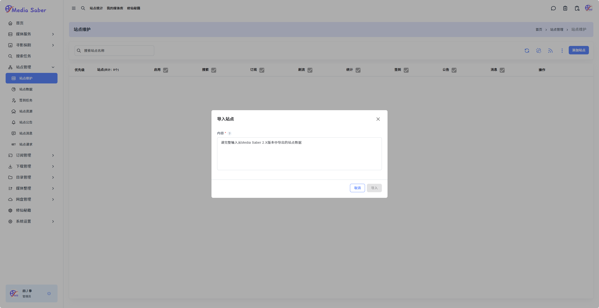

:::tip
Media Saber 不提供任何资源！但有热心网友贡献了站点文件，可点击访问：[pre-dessert-sites GitHub](https://github.com/mantou568/pre-dessert-sites)。  
配置文件会在环境启动时读取，修改配置后需要重启容器或环境，或点击 **站点维护 - 站点配置订阅 - 拉取** 按钮，重新加载站点配置。
:::

#### 1. 站点配置订阅

路径：**站点管理 → 站点维护 → 站点配置订阅**

  

如果初始化设置中填写了代理，可以在 URL 中直接使用以下地址获取站点配置文件：  
`https://github.com/mantou568/pre-dessert-sites/archive/main.zip`

未配置代理的用户，使用默认参数即可。

在 **cron** 栏中输入定时更新时间，例如：`0 9 * * *`每天上午9点自动拉取

  

点击保存后，再点击“拉取”，成功后将提示：

> 站点配置更新成功！

  

---

#### 2. 导入旧版站点数据

站点添加方式有两种：**手动添加** 或 **导入旧版 `media-saber` 站点数据**。  
本节仅介绍导入方法。

- ##### 导出旧版站点数据

在旧版 `media-saber` 中点击 **导出站点数据**：

  

点击复制内容，准备粘贴到新版中。

- ##### 导入至新版 media-saber

点击新版中的 **站点导入** 按钮，在弹出的对话框中粘贴刚复制的站点数据：

  

点击 **导入**，稍等片刻后刷新网页，即可看到导入的站点信息。

:::danger
注：站点信息涉及隐私及访问规则，导入效果不予展示，请大家务必遵守站点使用规定。
:::
