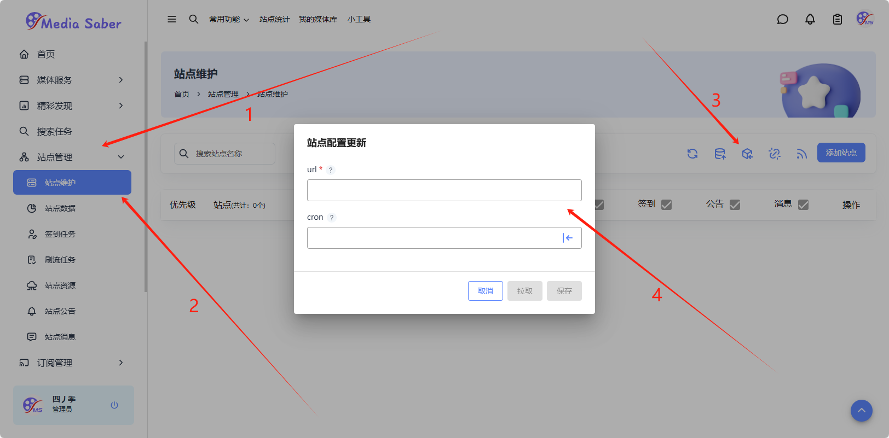
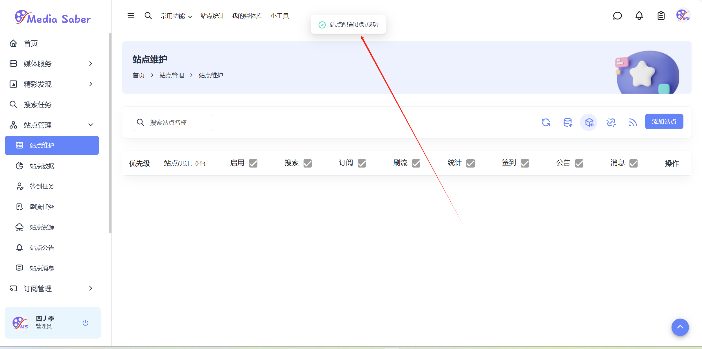
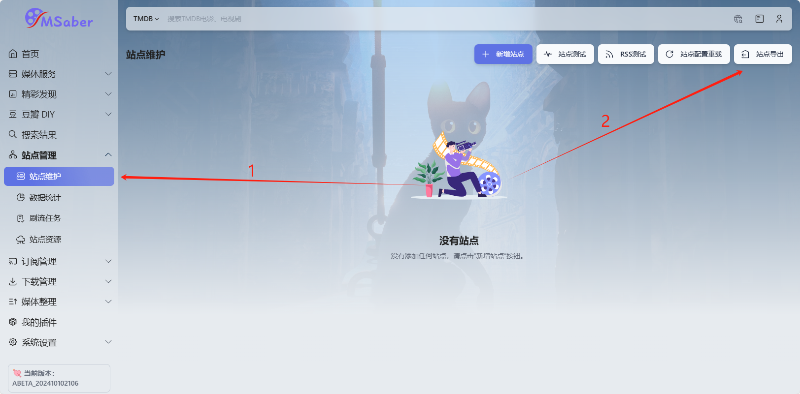
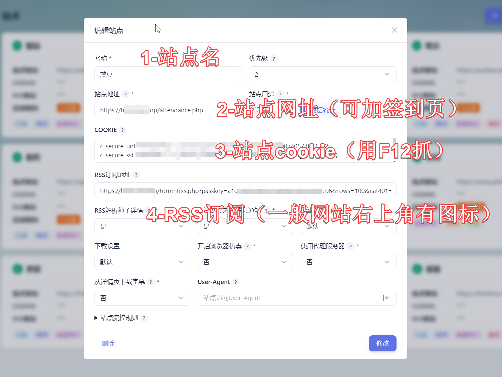
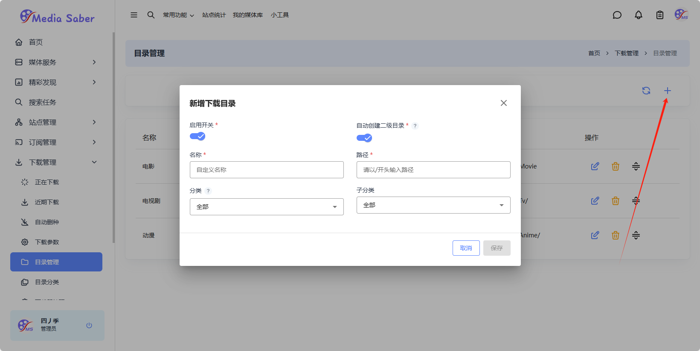

## 1. 站点配置

Media Saber 不提供任何资源！但有热心网友贡献了站点文件，点击进入 [pre-dessert-sites github](https://github.com/mantou568/pre-dessert-sites)。

:::tip
配置是在环境启动时读取，修改配置后，需要重启容器或者环境。也可尝试点击 `站点维护 - 站点配置订阅-拉取` 按钮，重新加载站点配置文件。
:::

## 2. 站点配置订阅

站点管理——站点维护——站点配置订阅

在url栏中输入`https://github.com/mantou568/pre-dessert-sites/archive/main.zip`
cron栏中输入自己想要设定的时间，这个时间是media-saber更新站点配置的时间 例如`0 9 * * *`,点击保存，然后点击拉取，拉取成功后可看到提示。

## 3. 导入站点

导入站点需要使用从旧版`media-saber`导出的站点数据

1.从旧版`media-saber`导出站点数据

点击复制内容

2.导入站点数据
点击站点导入按钮，在弹出对话框中粘贴刚刚复制的站点数据

点击导入，稍等片刻，刷新网页即可看到导入的站点
:::danger
注：站点信息不便展示，最终导入效果，这里不做展示，希望大家也要遵守站点规则。
:::