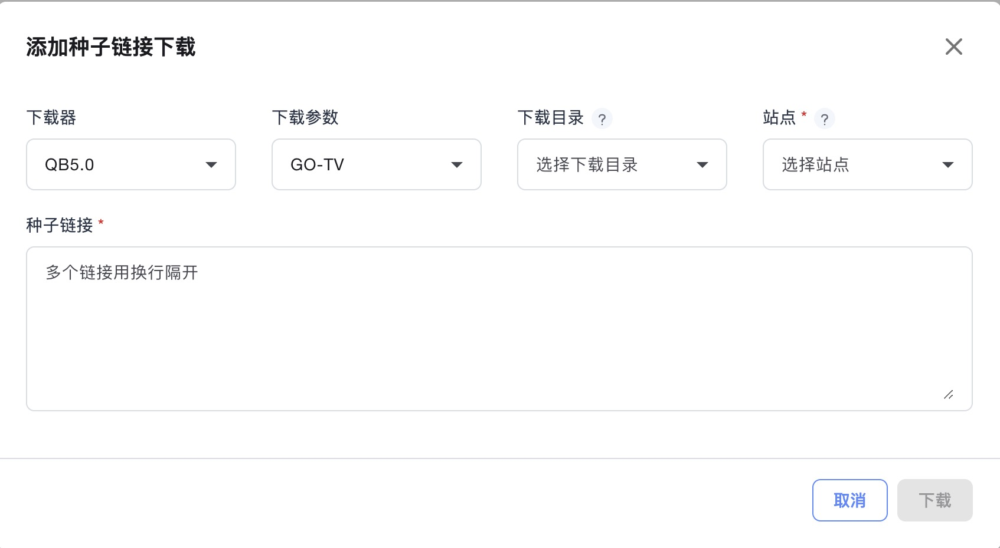
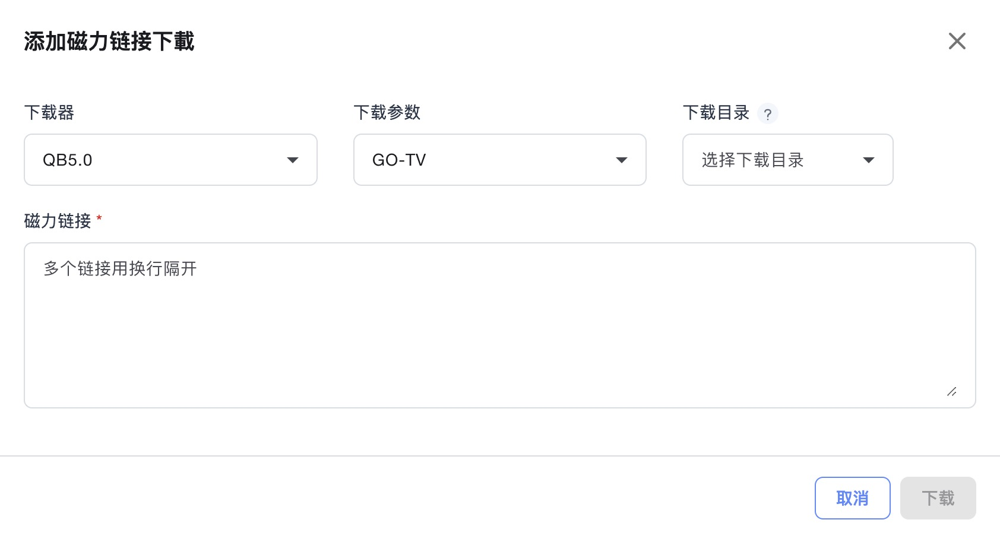
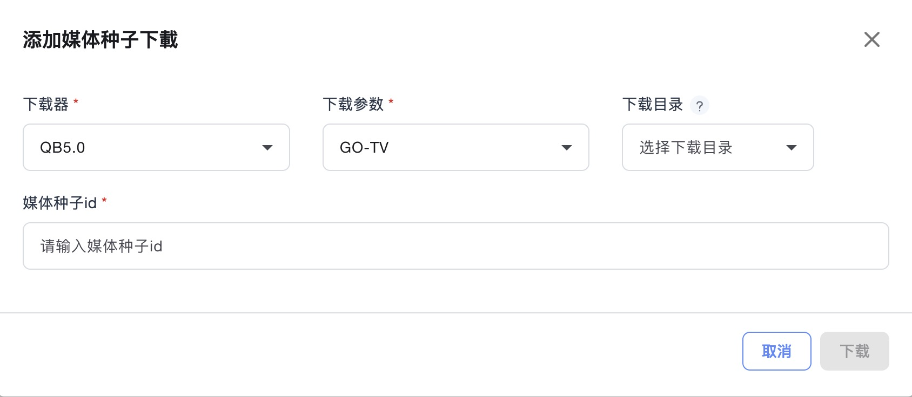
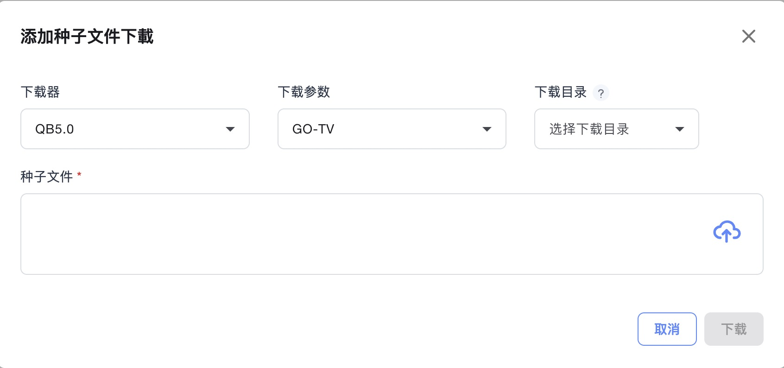
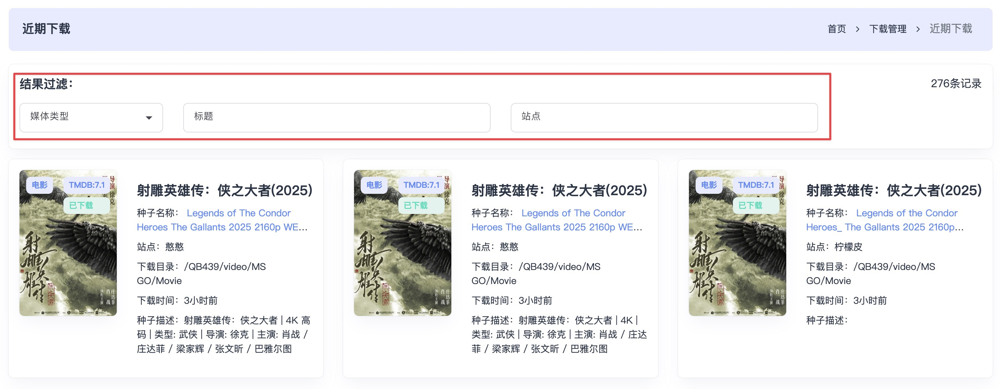
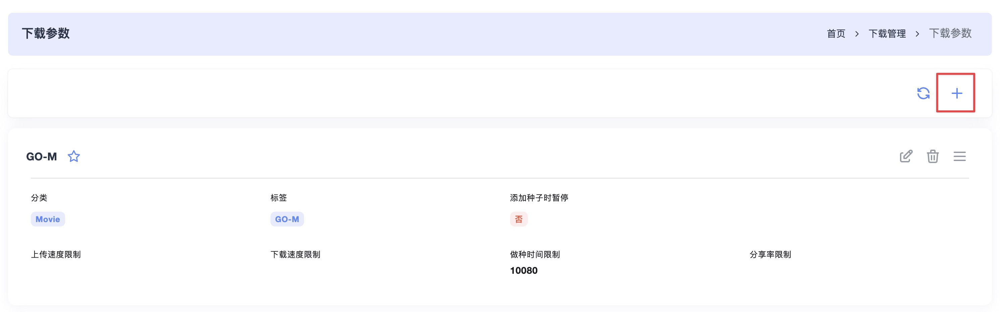
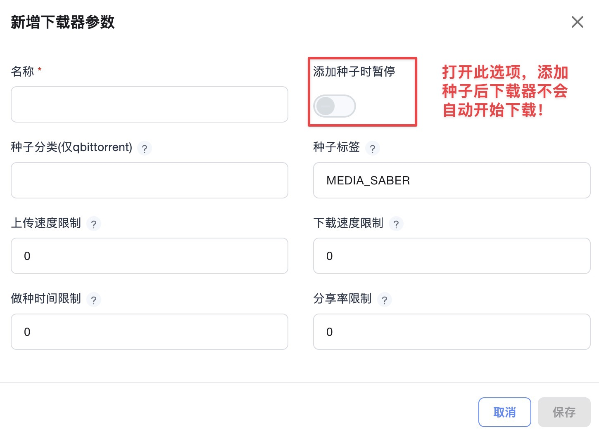
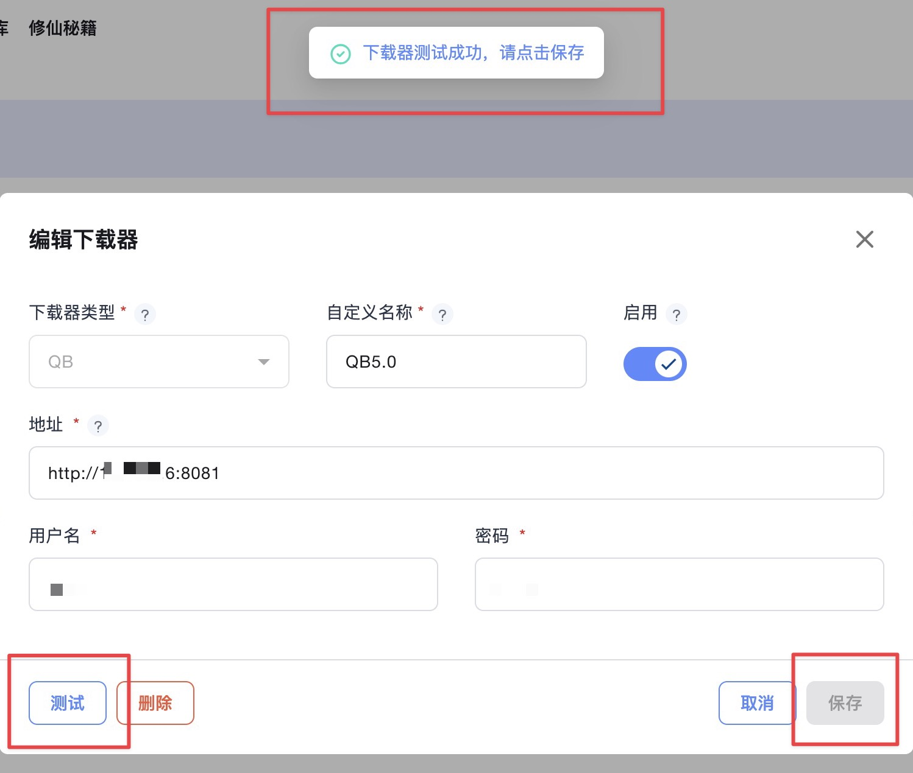

## 下载管理

### 一、正在下载

#### 1. 只有默认下载器的任务才会在这里显示，右上角可以点击手动新增下载。

  

- **手动添加种子链接**：输入框内输入要下载的种子链接，根据自身需求选择已添加的下载器、下载参数、下载目录，并选择要下载的站点。如系统已设置了默认配置，可跳过忽略。  
  

- **手动添加磁力链接**：输入框内输入要下载的磁力链接，根据自身需求选择已添加的下载器、下载参数、下载目录。如系统已设置了默认配置，可跳过忽略。  
  

- **手动添加媒体种子**：输入框内输入要下载的媒体种子 ID，根据自身需求选择已添加的下载器、下载参数、下载目录。如系统已设置了默认配置，可跳过忽略。  
  

- **手动添加种子文件**：点击上传图标，添加要下载的种子文件，根据自身需求选择已添加的下载器、下载参数、下载目录。如系统已设置了默认配置，可跳过忽略。  
  

- **注意事项**：其他情况不能显示下载任务的，请检查下载器对应的版本是否兼容。

  - 下载器版本要求：  
    - Qbittorrent 版本要求 >= 4.3.9  
    - Transmission 版本要求 >= 3.0  
    - 其它版本可能存在适配问题。

---

#### 二、近期下载

显示近期添加过下载的任务，不代表对应的文件已入库。  

- 近期下载可通过“媒体类型”、“标题”、“站点”等关键字进行过滤筛选。

---

#### 三、自动删种

功能未完成，待后续更新。

---

#### 四、下载参数

1. 根据自身需求设定预设的下载参数，以便在下载时选择使用。下载设置可以实现上传/下载限速、做种时间、添加分类和标签等。  
   

   - **名称**：为下载器参数设置一个名称，便于使用中区分。
   - **种子分类**：为添加到下载器中的种子添加分类，仅适用于 Qbittorrent。
   - **种子标签**：为添加到下载器中的种子添加标签。若启用“只管理 Media Saber 添加的下载”，且该种子应用了下载参数，请添加 `MEDIA_SABER` 标签（默认为 `MEDIA_SABER`，可自定义）。
   - **上传/下载速度限制**：单位为 KB/s，0 表示不限速，建议默认。
   - **做种时间限制**：0 为不限制，单位为分钟或小时（视下载器而定）。
   - **分享率限制**：0 为不限制，建议默认。

2. 所有下载器均需通过下载参数来关联使用。

3. 如果设置了 1 个或多个下载参数，需选择一个，通过点亮下载设置的五角星，设置为默认下载参数，以便在自动化或未手动选择时使用。

---

#### 五、下载器管理

1. 当前系统仅支持以下下载器类型：

   - Qbittorrent  
   - Transmission

2. 同一个下载客户端可以添加为多个下载器，用于不同场景中选择使用。

   - **下载器类型**：从下拉框中选择所需类型。
   - **自定义名称**：为下载器设置名称，方便后续识别和区分。
   - **地址**：输入下载器完整地址（IP 或域名 + 端口号），末尾不能加 `/`。  
     - 示例：http://10.10.1.6:8080 或 https://example.com:8080
   - **用户名和密码**：填写下载器所需的认证信息。

3. 填写完成后，点击左下角的“测试”按钮。若提示“下载器测试成功，请点击保存”，即可点击右下角“保存”正常使用。  
   

---

:::tip

- 新增下载器后请点亮其右上角的五角星，设置为默认下载器。
- 下载器版本要求：
  - Qbittorrent ≥ 4.3.9
  - Transmission ≥ 3.0
  - 其他版本可能存在适配问题。
:::
