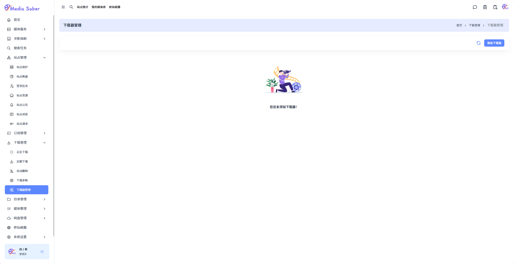
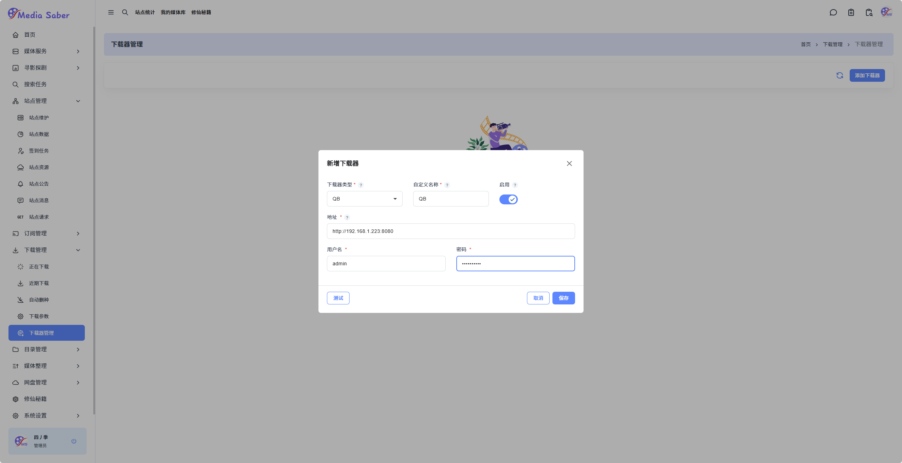
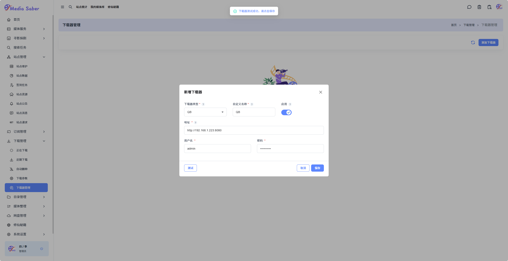
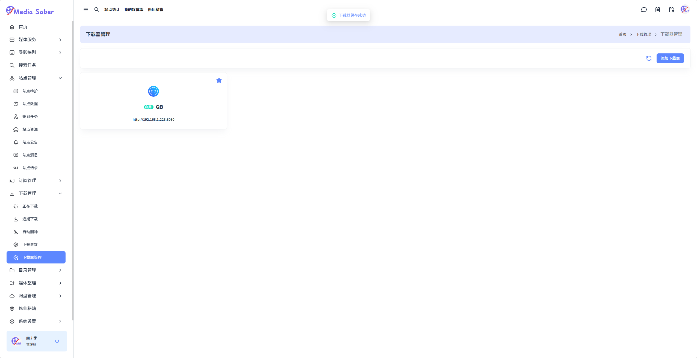
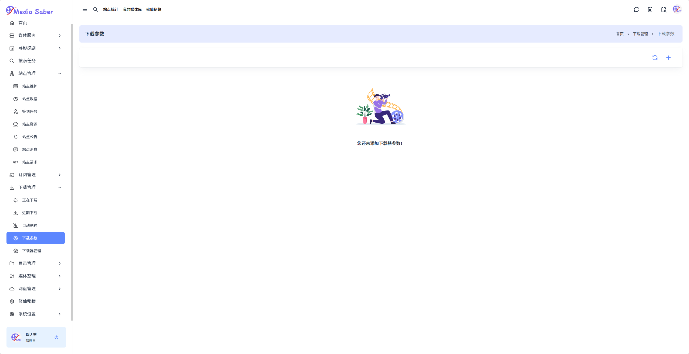
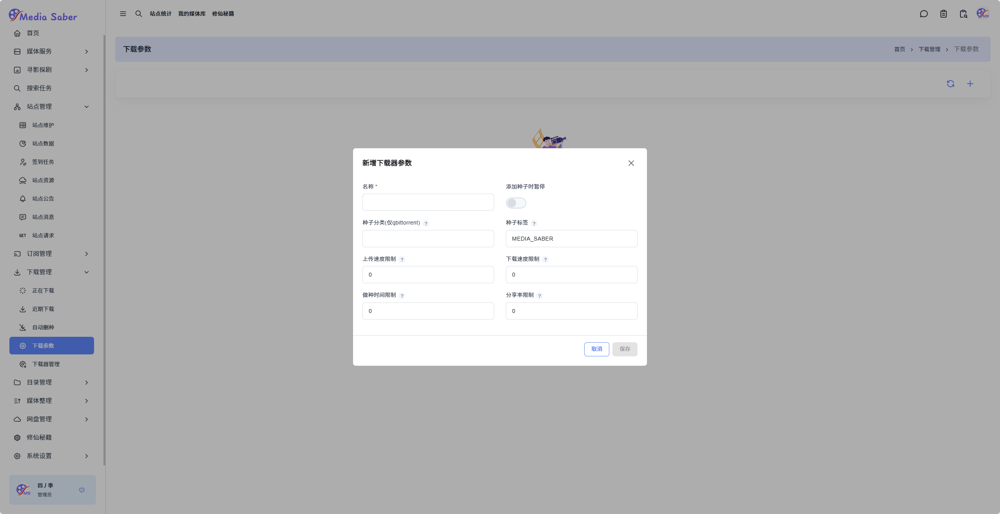
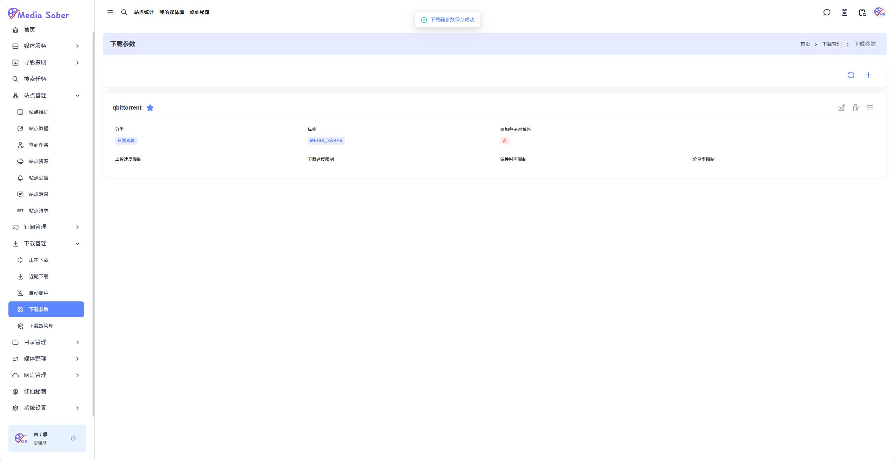

### 下载管理设置

#### 1. 添加下载器

路径：**下载管理 → 下载器管理 → 添加下载器**  
点击添加下载器

  

在弹出对话框中输入下载器相关参数：

- 下载器地址
- 下载器用户名
- 下载器密码

  

点击测试，参数有误时会有提示弹出：

> 下载器测试成功，请点击保存

  

点击保存，弹出提示：

> 下载器保存成功

  

---

#### 2. 下载参数设置

路径：**下载管理 → 下载参数 → 右上角 "+"**

  

输入参数：

- 下载器参数名称
- 种子分类
- 种子标签（默认为 `MEDIA_SABER`）
- 上传速度限制
- 下载速度限制
- 做种时间限制
- 分享率限制

> 默认不勾选 `添加种子时暂停`，  
> `上传速度限制、下载速度限制、做种时间限制、分享率限制` 默认为 `0` 即不限制

  

完成参数设置后，点击保存，弹出提示：

> 下载器参数保存成功

  

  
