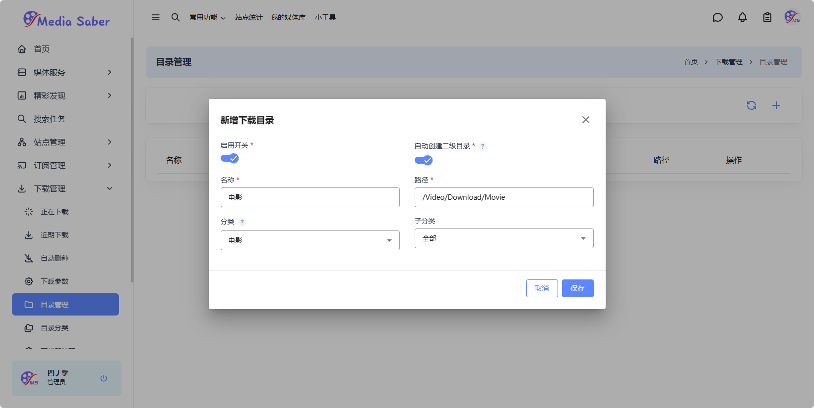

### 1. 下载器设置

`下载管理-下载器管理`点击`添加下载器按钮`

选择你的下载器类型，这里以`Qbittorrent`举例： 
输入下载器访问地址：`http://ip:port`,下载器用户名、密码，监控项选是，转移方式根据需要选择`软链接`或者`硬链接`（推荐使用硬链接）隔离标签选是，目录隔离根据需要选是或否。

### 2. 下载参数

`下载管理-下载参数`点击新增下载器参数按钮

输入自定义下载器参数名称、分类、标签 点击保存即可。

注：分类、标签ms在qb中新增下载项的参数。

### 3. 目录分类

在`下载管理-目录分类`点击`生成默认分类按钮`

:::tip
关于`media-saber`的目录分类这里没有做过多演示，实际上的目录分类自由度更高，分类支持完全自定义，举个例子，一级分类设置为国产剧，，子分类则可以设置为动作冒险、犯罪、剧情、家庭、悬疑···。
:::

修改默认配置文件：
点击下载
[默认配置文件](/docs/01.新手指引/04.初始化配置/default_categories.yaml)，修改完成后，将该配置文件放入`docker/media-saber/config`目录下即可。

### 4. 目录管理

在`下载管理-目录管理`点击`添加目录`

输入目录名称，填写路径（路径为媒体下载路径，例如`电影`的目录`Video/download/Movie`，选择分类`开启自动创建二级分类后，子分类选择全部`

:::tip
media-saber在下载媒体时会自动创建对应文件夹，所以只要映射了`Video`目录后，不需要手动创建路径，直接手动输入对应目录，以`/`结尾，点击保存即可
:::