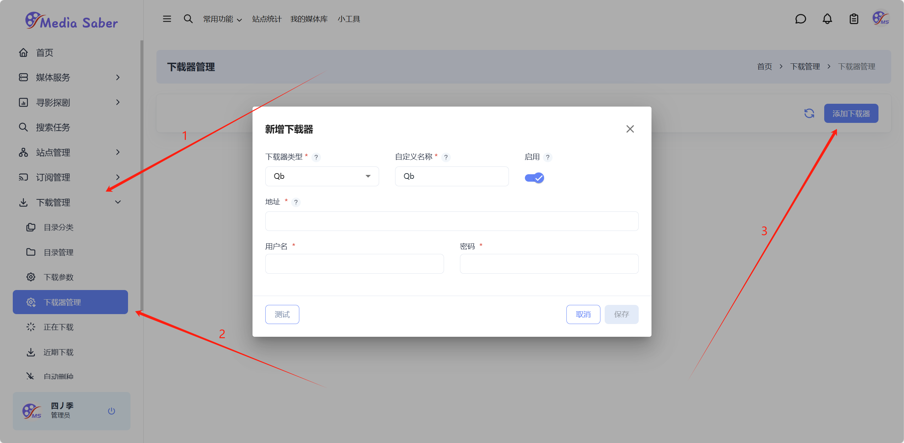
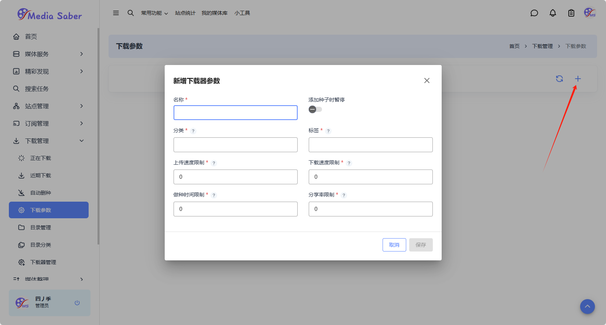
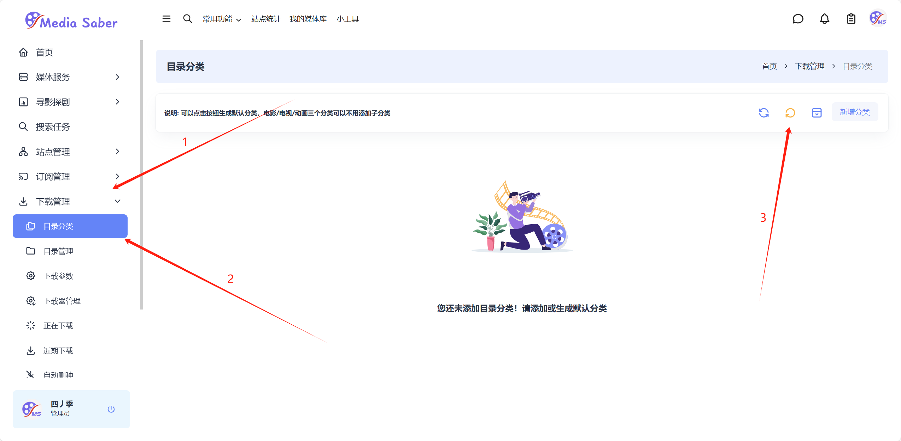
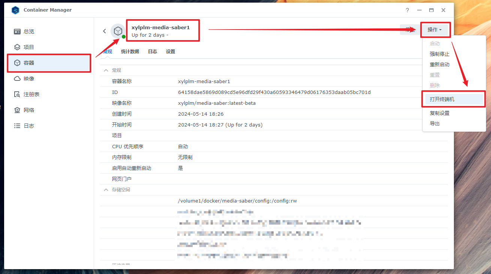
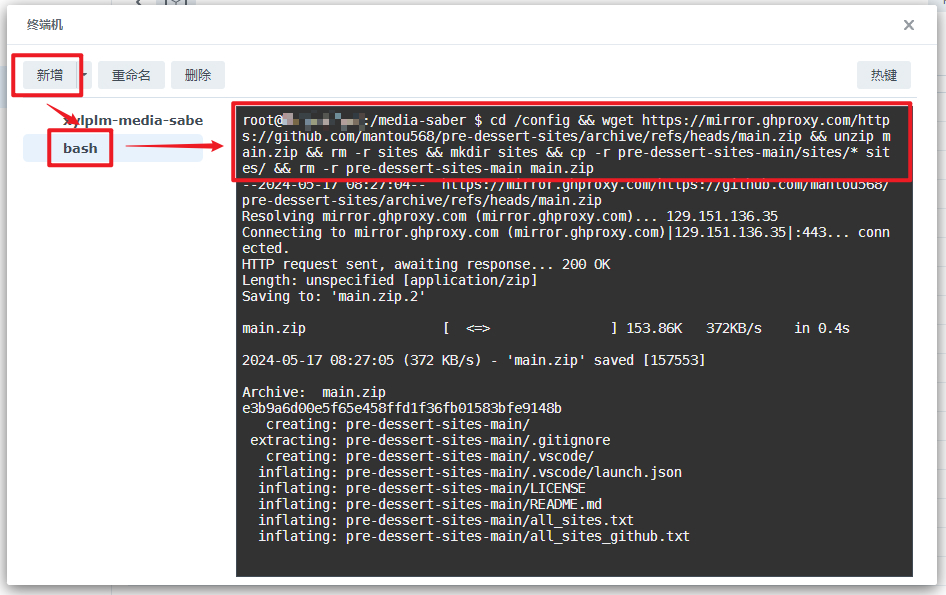
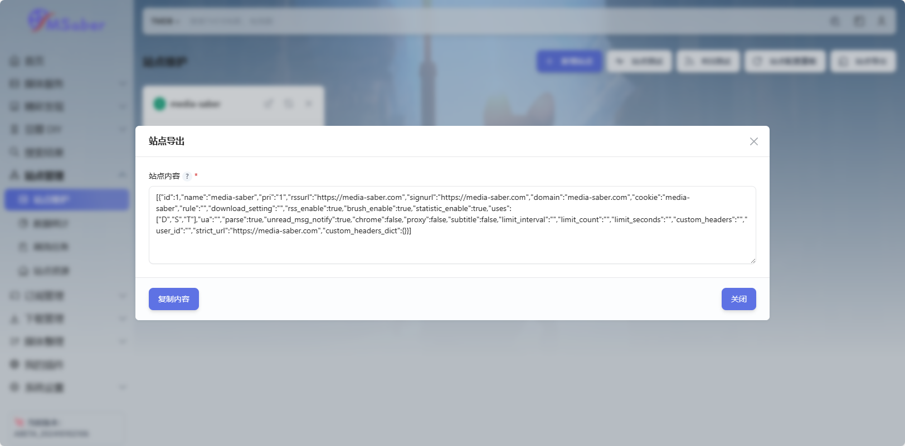
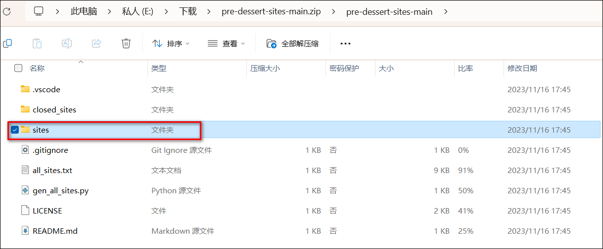
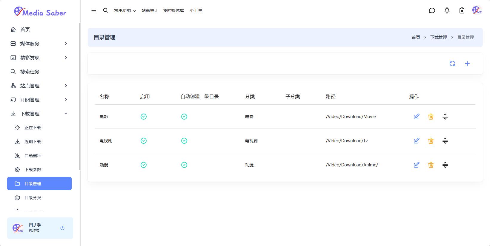

## 1. 站点配置

Media Saber 不提供任何资源！但有热心网友贡献了站点文件，点击进入 [pre-dessert-sites github](https://github.com/mantou568/pre-dessert-sites)。

:::tip
配置是在环境启动时读取，修改配置后，需要重启容器或者环境。也可尝试点击 `站点维护 - 站点配置重载` 按钮，重新加载站点配置文件。
:::

### Builtin Friend 插件 <Badge text="推荐"/>

可以通过 [builtin friend](/docs/plugin/builtin_friend) 插件来定时更新。

### 一键更新命令

在 docker 管理页，进入 Media Saber 容器的 SSH 终端服务进入 bash 命令行。

输入命令：

```shell
cd /config && wget https://mirror.ghproxy.com/https://github.com/mantou568/pre-dessert-sites/archive/refs/heads/main.zip && unzip main.zip && rm -r sites && mkdir sites && cp -r pre-dessert-sites-main/sites/* sites/ && rm -r pre-dessert-sites-main main.zip && reboot
```
该命令会下载站点配置到 `/config/sites` 文件夹下，并重启容器。请稍等一分钟再用索引器，此后索引器里多了一堆 BT 站点，可以检索BT电影资源（慢）。

**注意**：由于 GitHub 代理地址有变化，命令行的内容与下面截图中的可能有所差异，我们只需要学习配置方法即可，命令行内容以上面的内容为准。

#### 极空间





#### 绿联



#### 群晖





### 手动下载

在浏览器输入网址：<https://github.com/mantou568/pre-dessert-sites/archive/refs/heads/main.zip>。会自动下载一个压缩包文件。



把压缩包在本地解压后会得到一个如下文件夹，我们需要的是里面的 `sites` 文件夹。



把 `sites` 文件夹上传到 Media Saber 配置文件夹 `/config` 中。



## 2. 添加站点

Media Saber 可以帮我们签到，刷流，下载PT资源，数据统计。点开 `站点管理 - 站点维护 - 新增站点`，填入 `站点名称`、`站点地址`、`COOKIE`，`RSS订阅地址`，然后保存。

:::tip
各个配置项目更加详细的说明及部分 **特殊站点的配置**，请参考 [站点维护](/docs/sites/site/#新增站点)
:::


## 3. 索引器设置

在 `基础设置 - 索引器 - 内建索引器` 里勾选刚刚添加的 PT 站点，这样我们就可以检索它的资源了。


