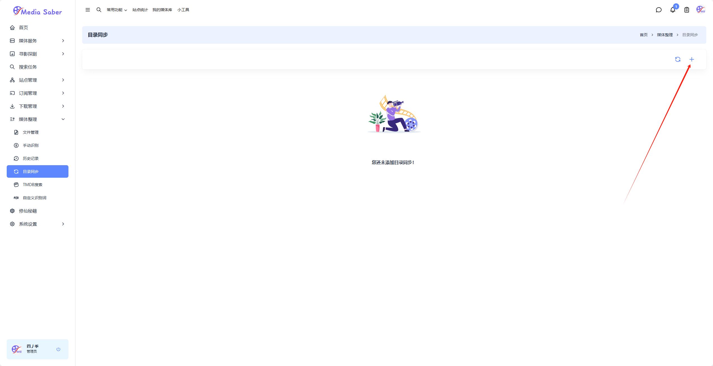
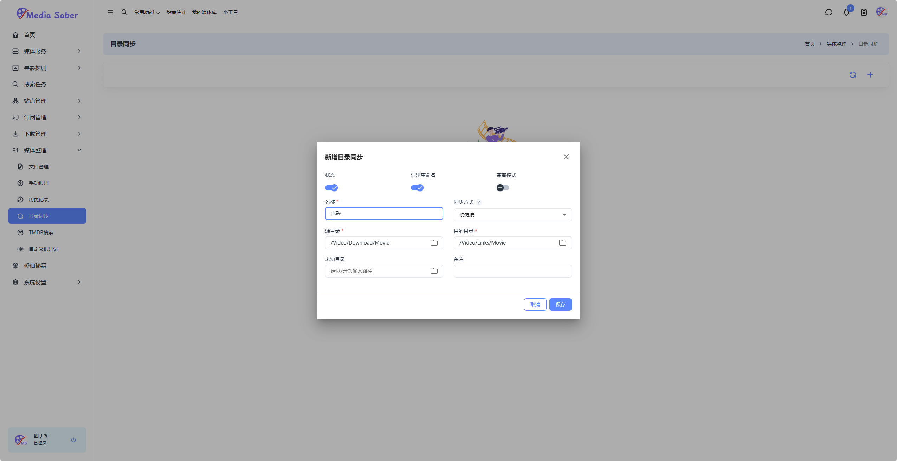
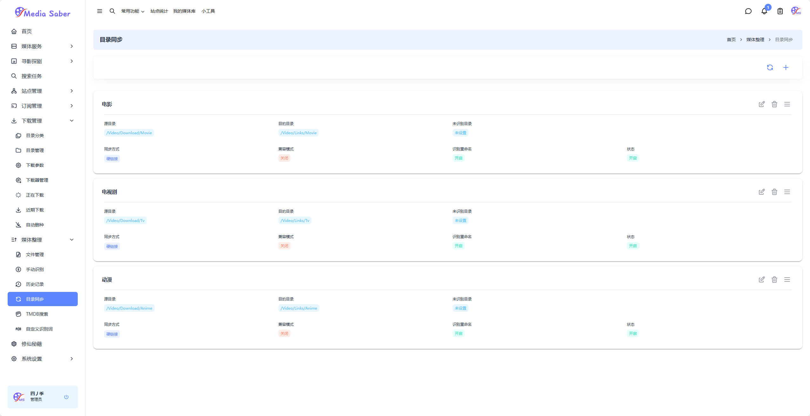

### 1. 目录设置

`媒体整理-目录同步`点击`添加新增按钮`

选择名称，例如：电影，选择同步方式（默认选择硬链接），输入源目录（即qBittorrent下载目录），输入目的目录（即硬链和刮削目录），位置目录可自定义或不填，点击保存即可

保存后的效果

:::tip
硬链目录需要提前创建后，例如：`/links/movie`,不用创建二级分类目录，二级分类目录会在硬链接和刮削过程中自动创建
:::