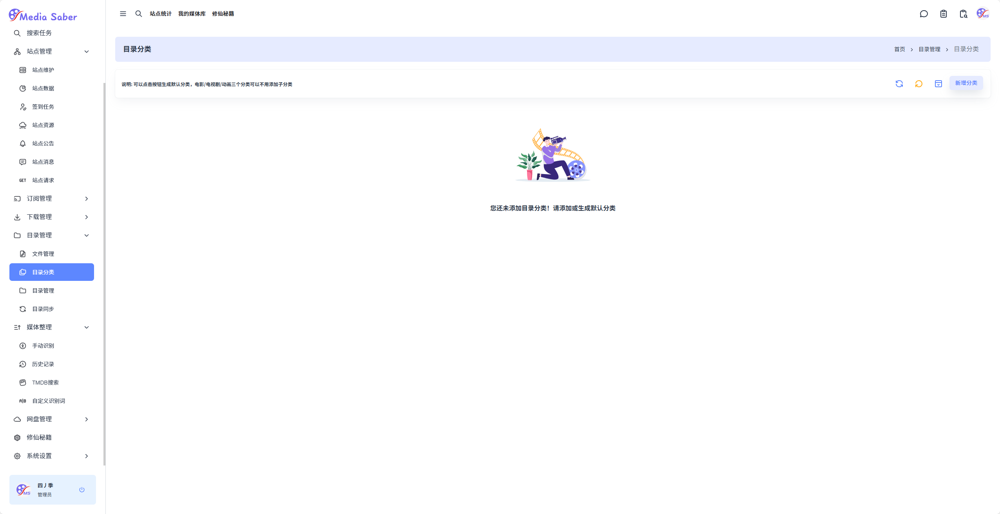
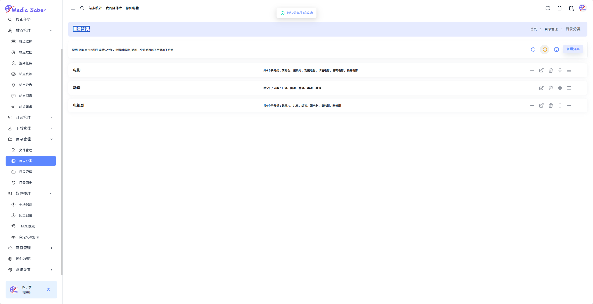
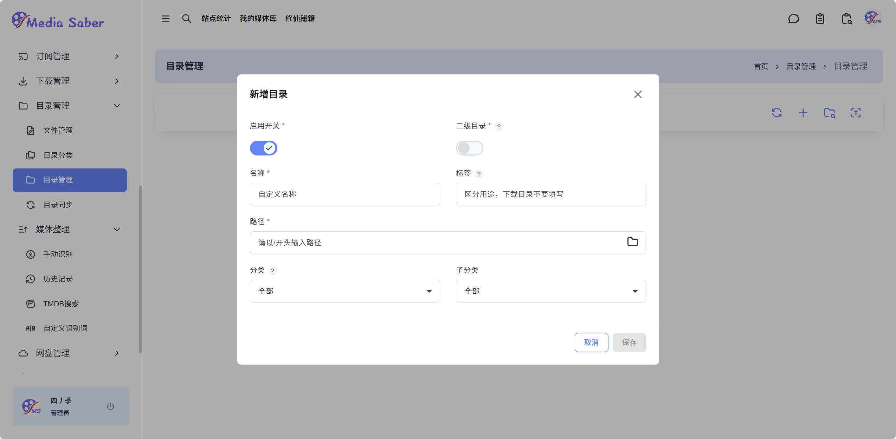
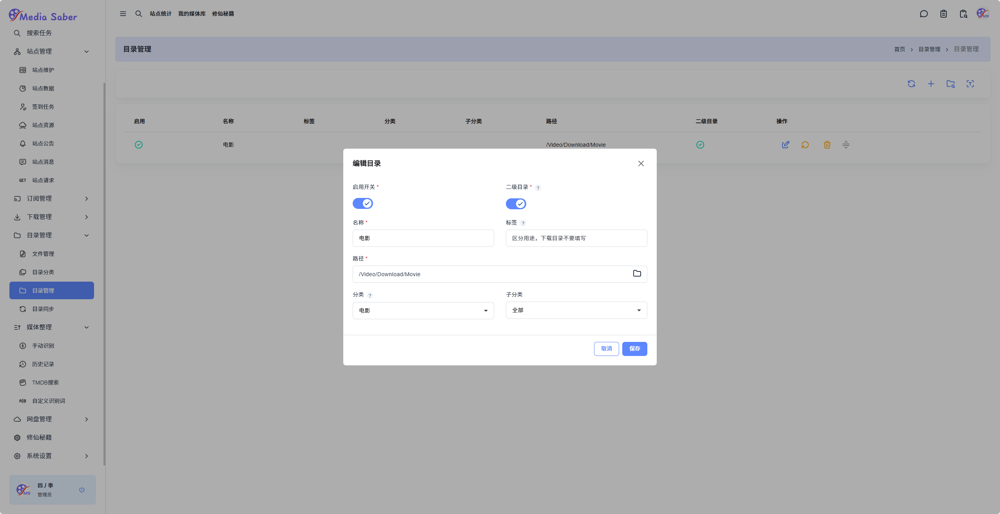
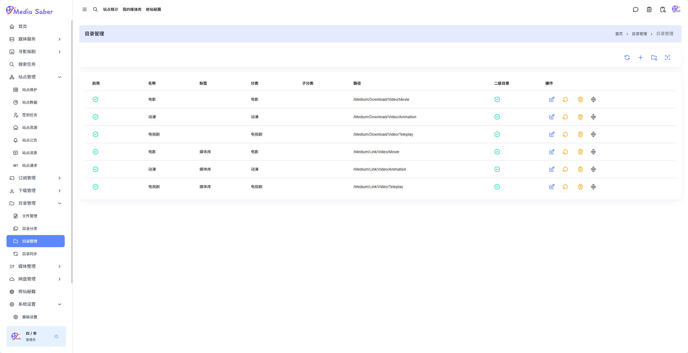
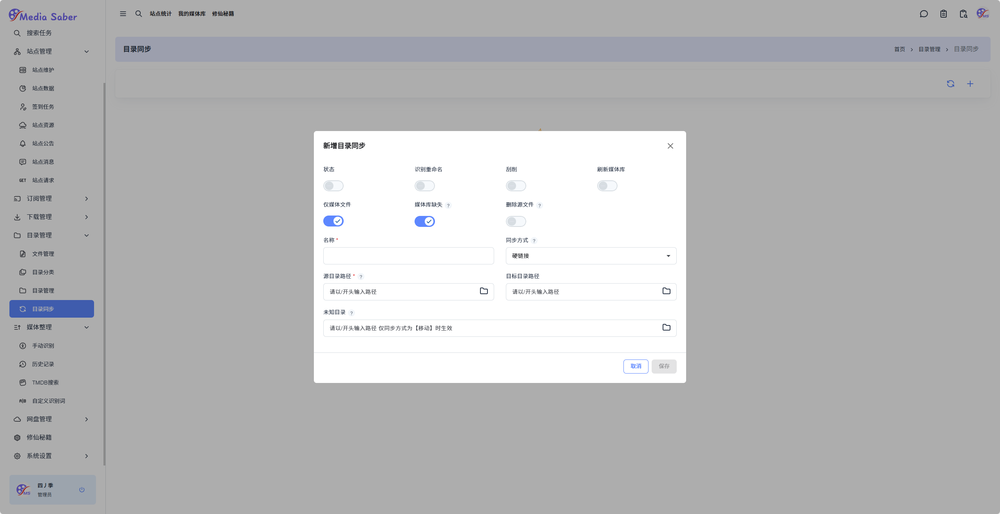
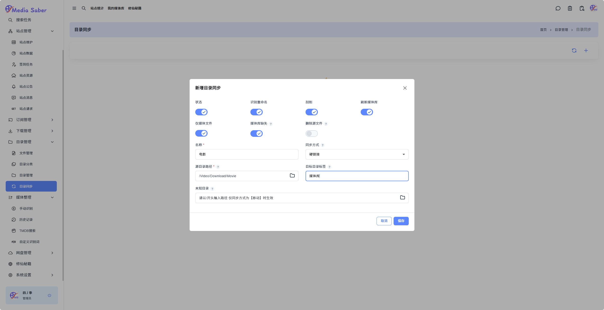
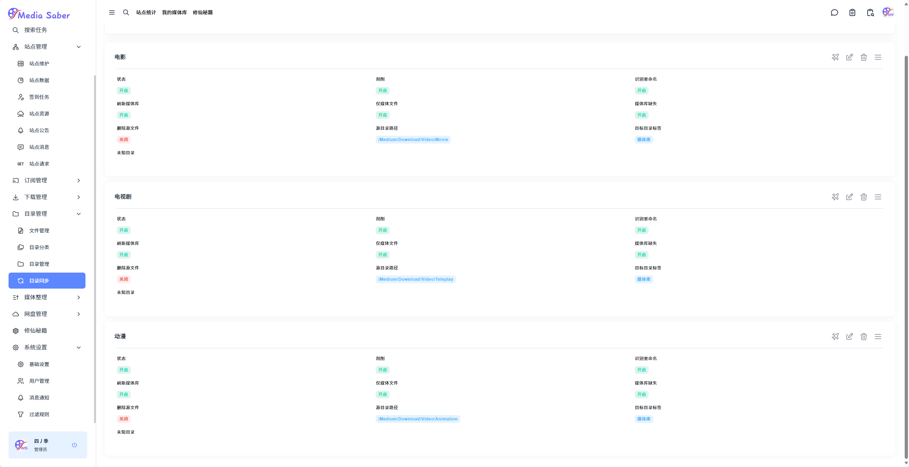

#### 1. 目录分类

 
  <strong>路径：</strong>
  目录管理 → 目录分类 →
  <svg xmlns="http://www.w3.org/2000/svg"
       viewBox="0 0 24 24"
       width="20" height="20"
       stroke="rgb(255, 174, 31)"
       fill="none"
       style="vertical-align: middle;">
    <path stroke="none" d="M0 0h24v24H0z" fill="none"/>
    <path d="M4.05 11a8 8 0 1 1 .5 4m-.5 5v-5h5"/>
  </svg>
  <strong>点击生成默认分类</strong>

  

  

#### 2. 目录管理

路径：**目录管理 → 目录管理 → 右上角 "+"**  
按照目录分类设置下载目录

  

按照目录分类设置媒体目录

  

根据需要在设置下载目录和媒体目录的时候勾选二级目录，媒体目录需要在标签栏中输入`媒体库`  

  <strong>创建完成后用鼠标点击每个目录最左边的按钮：</strong>
  <svg xmlns="http://www.w3.org/2000/svg"
       viewBox="0 0 24 24"
       width="20" height="20"
       stroke="black"
       fill="none"
       style="vertical-align: middle; margin-left: 4px;">
    <path stroke="none" d="M0 0h24v24H0z" fill="none"/>
    <path d="M4 10h16"/>
    <path d="M4 14h16"/>
    <path d="M9 18l3 3l3 -3"/>
    <path d="M9 6l3 -3l3 3"/>
  </svg>
  <strong>，拖动调整目录顺序</strong>

  

  

#### 3. 目录同步

路径：**目录管理 → 目录同步 → 右上角 "+"**  

  

分别创建`电影、电视剧、动漫`三个同步参数，这里以`电影`为例，勾选`状态、识别重命名、刮削、刷新媒体库、仅媒体文件、媒体库缺失`六个项，填入名称，选择同步方式，填入源目录路径（前面的下载目录路径），填入目标目录标签（媒体库）

  

完成后点击保存

  
