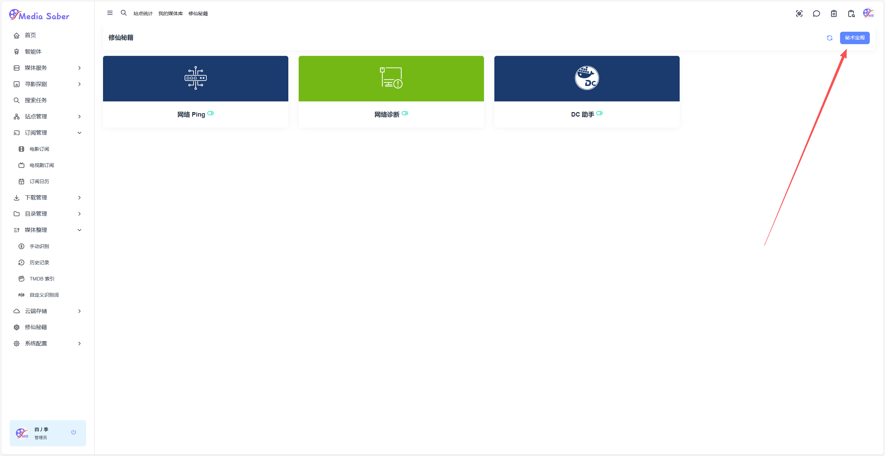
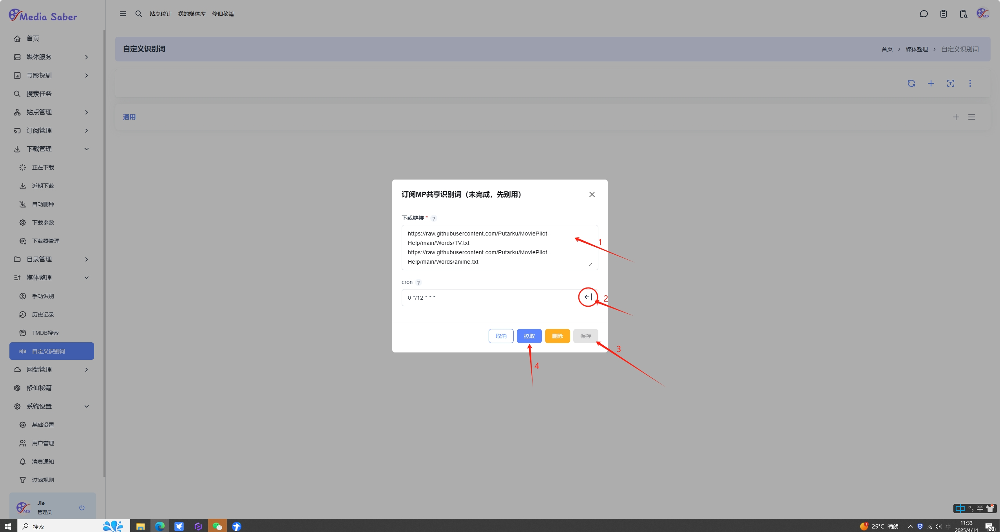

### 自定义识别词

路径：**媒体整理 → 自定义识别词 → 右上角 "+"**  
新增识别词组订阅

<div align="center"></div>  
<div align="center"></div>  

订阅链接如下（可根据需要添加多个）：
```shell
https://raw.githubusercontent.com/Putarku/MoviePilot-Help/main/Words/TV.txt
https://raw.githubusercontent.com/Putarku/MoviePilot-Help/main/Words/anime.txt
```