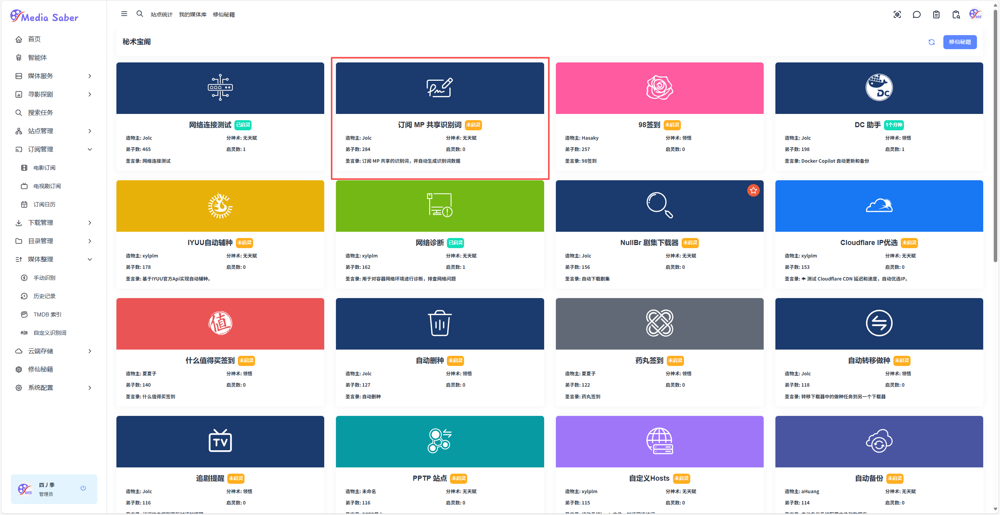
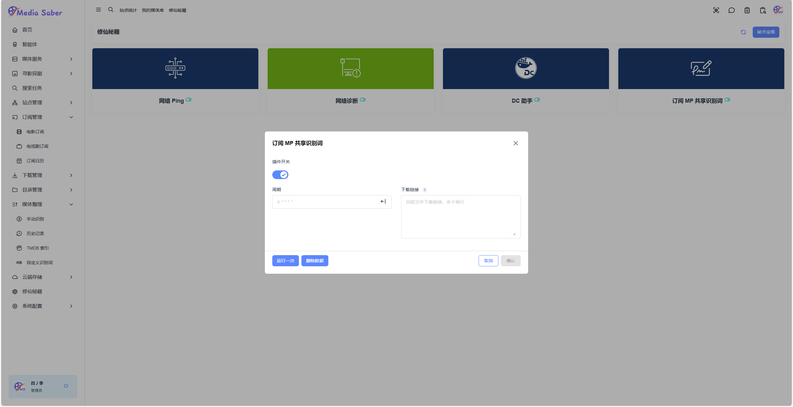

### 一、自定义识别词订阅

路径：**修仙秘籍 → 右上角秘术宝阁 →  订阅 MP 共享识别词**  

<div align="center"></div>  
<div align="center"></div>  

点击添加即可

<div align="center"></div>

:::warning
添加完插件后，在秘术宝阁页面点击 “订阅 MP 共享识别词（插件）” 在弹出页面手动填入“更新周期corn” 和 “订阅链” 点击保存即可
:::

### 订阅链接如下（可根据需要添加多个）：
```shell
https://raw.githubusercontent.com/Putarku/MoviePilot-Help/main/Words/TV.txt
https://raw.githubusercontent.com/Putarku/MoviePilot-Help/main/Words/anime.txt
```
### 二、手动添加识别词

路径：**媒体整理 → 自定义识别词**

<div align="center"></div>

点击右上角 + 号，输入想要创建的识别词组名称，例如：哈儿司令，点击保存

<div align="center"></div>

点击词组上的 + 号，在弹出框中，选择你想要的替换方式，并在被替换词和替换词中输入你的内容，保存即可

<div align="center"></div>

:::warning
电视剧会涉及到多集和多季的问题，这里就要用到正则表达式了，这里就不过多赘述了，需要的自然会去研究，但是有一点就是，记得勾选“正则表达式” 选项
:::