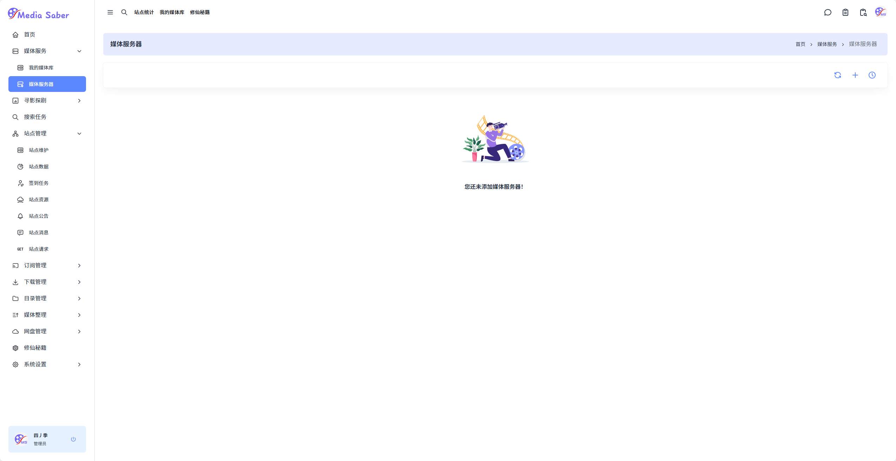
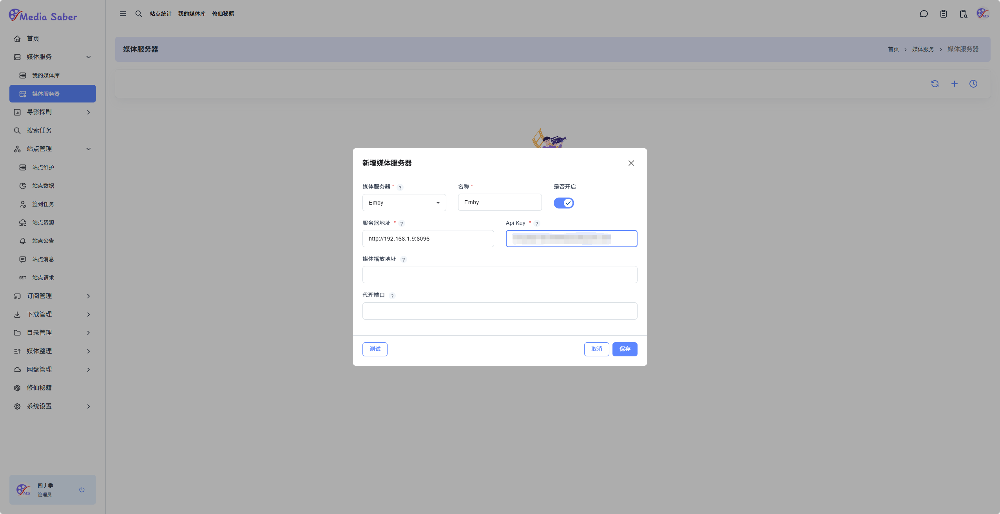
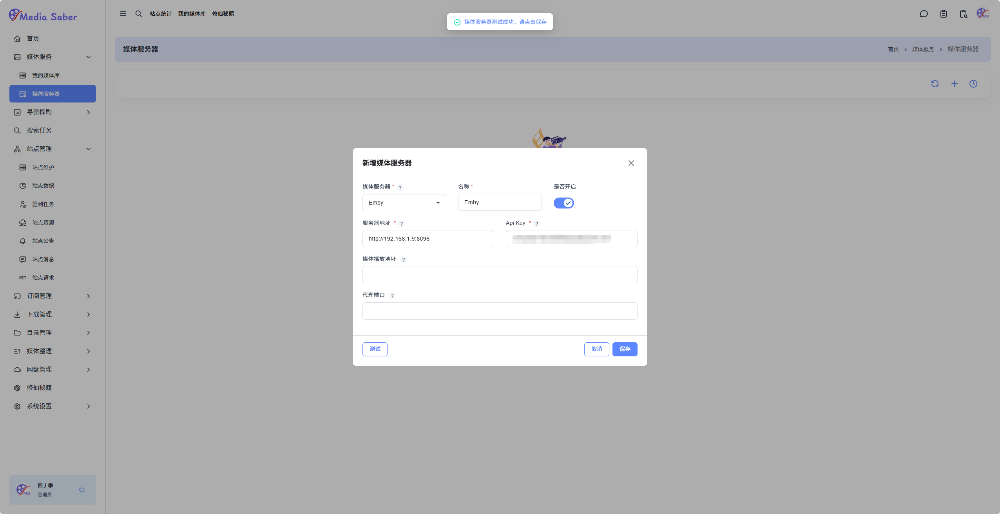
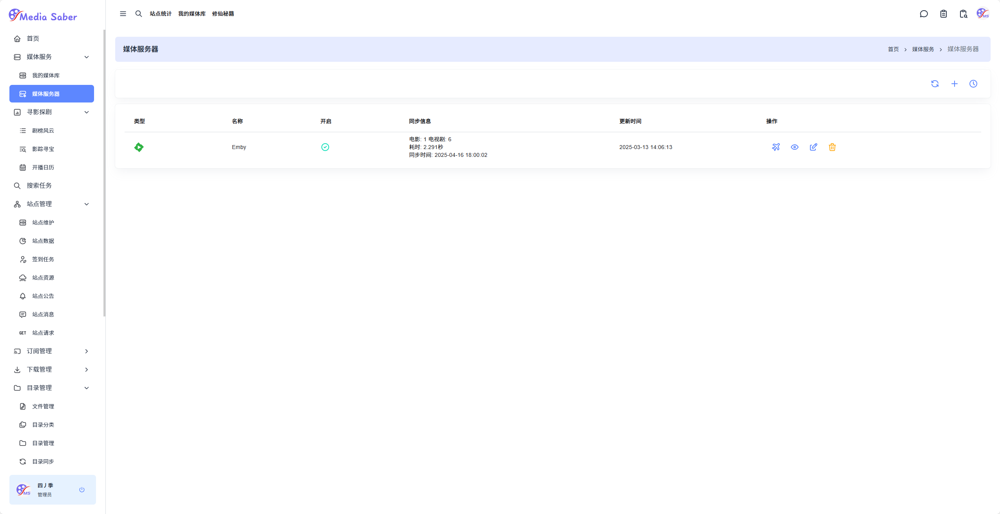
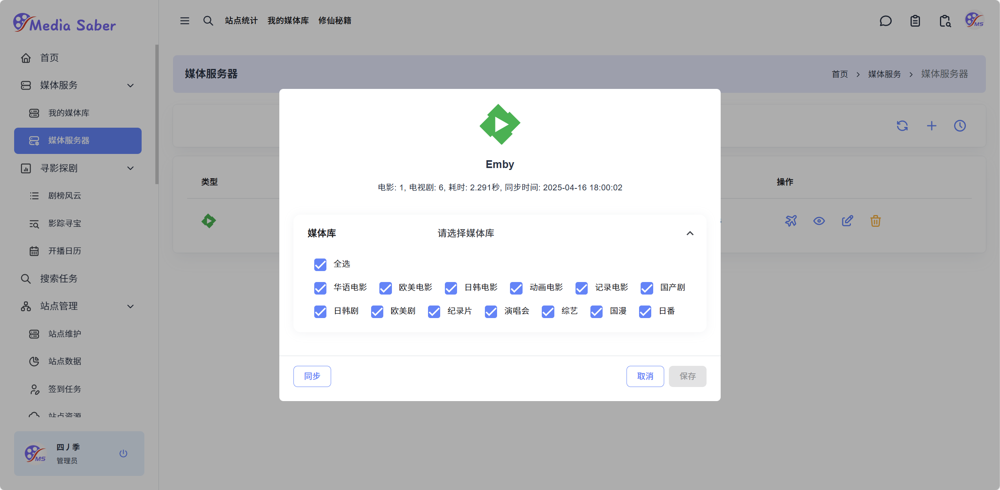
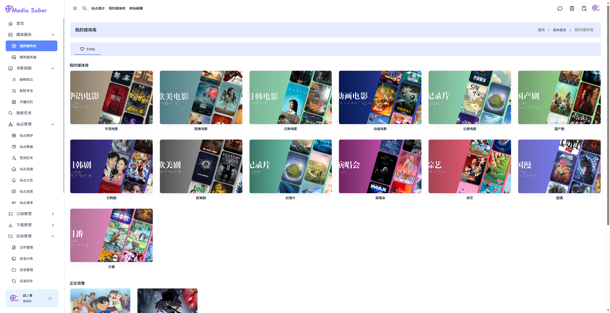

#### 1. 媒体服务 → 媒体服务器 → 右上角 "+"  

  

这里以 Emby 为例，输入以下信息：

- 名称  
- 服务器地址  
- API Key（不教了，不会的，从这里就放弃吧）  

> 建议直接在服务器地址中填入 **外网访问地址**。如果使用的是内网地址 `http://ip:port`，则需在 **媒体播放地址** 中填入外网访问地址。

  

点击测试按钮，若提示：

> 媒体服务器测试成功，请点击保存  

即可点击保存，完成媒体服务器设置。

  

  

  点击
  <svg xmlns="http://www.w3.org/2000/svg"
       viewBox="0 0 24 24"
       width="18" height="18"
       stroke="rgb(93, 135, 255)"
       fill="none"
       style="vertical-align: middle; margin-left: 4px;">
    <path stroke="none" d="M0 0h24v24H0z" fill="none"/>
    <path d="M14.5 6.5l3 -2.9a2.05 2.05 0 0 1 2.9 2.9l-2.9 3l2.5 7.5l-2.5 2.55l-3.5 -6.55l-3 3v3l-2 2l-1.5 -4.5l-4.5 -1.5l2 -2h3l3 -3l-6.5 -3.5l2.5 -2.5l7.5 2.5z"/>
  </svg>
  按钮，同步媒体库

  

勾选需要同步的媒体库，点击 **同步**，随后点击 **保存** 即可。

---

### 2. 媒体服务 → 我的媒体库

完成媒体服务器设置后，即可在 **我的媒体库** 中查看 Emby 中的：

- 媒体库
- 正在观看
- 最新入库 等内容

