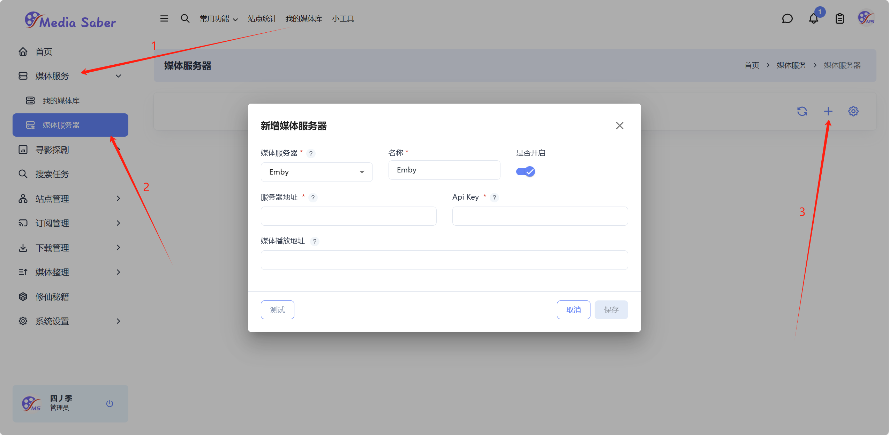
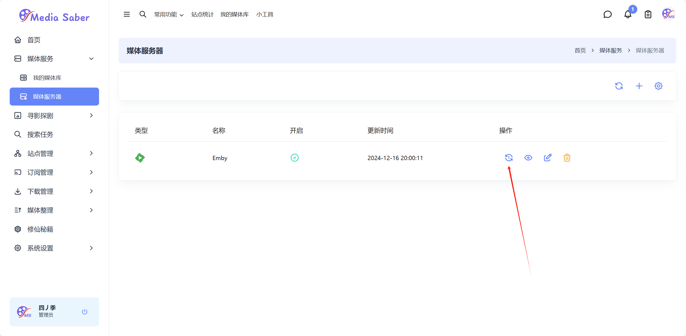
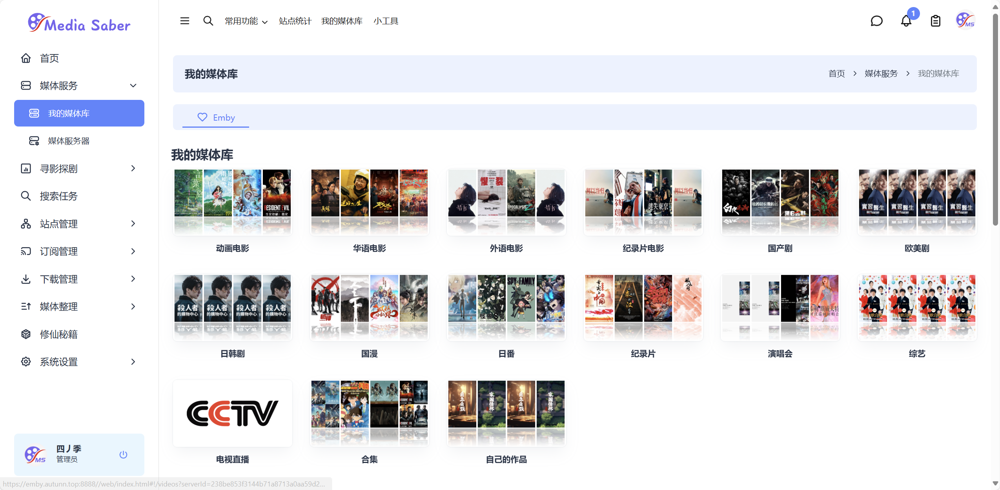

##  添加媒体服务器

### 媒体服务——媒体服务器

这里以Emby为例，输入`服务器地址`、`名称`、`Api Key`，点击保存即可。（这里建议直接在服务器地址中填入外网访问地址，如果填入的是内网访问地址`http://ip:port`需在媒体播放地址中填入外网访问地址）

点击媒体服务器同步按钮

### 媒体服务——我的媒体库

完成以上步骤，即可在我的媒体库中看到emby中的媒体库、正在观看、最新入库等内容

