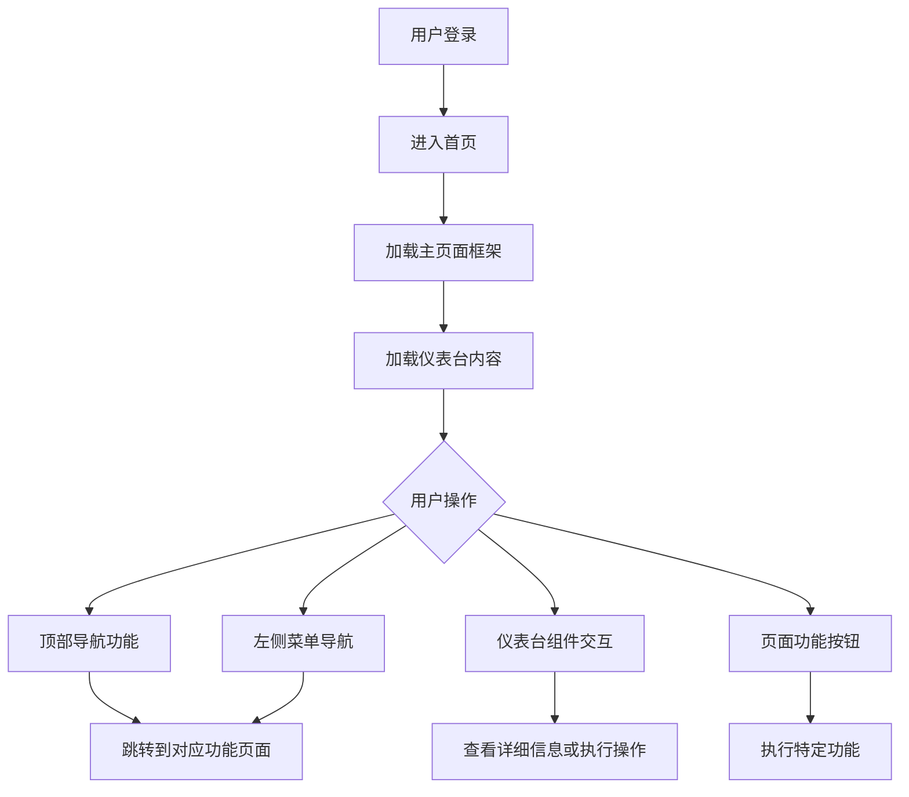

# 🏠 首页

MediaSaber 的首页是用户进入系统后的主界面，包含主页面布局和仪表台两大部分。主页面提供了系统的整体框架和导航结构，而仪表台则展示了关键信息和快捷操作。

## 🖥️ 主页面

主页面是 MediaSaber 系统的整体框架，包含顶部导航栏、侧边栏、内容区域等核心组件。

### 🎯 顶部导航栏

位于页面顶部，包含系统核心功能的快捷入口：

#### 🔍 搜索入口

- **位置**：顶部导航栏左侧
- **功能**：打开搜索对话框
- **详情**：[搜索功能文档](/docs/search/search/)

#### 📢 消息中心

- **位置**：顶部导航栏右侧（铃铛图标）
- **功能**：查看系统消息和通知
- **详情**：[消息中心文档](/docs/main_page/message_center/)

#### 📋 系统日志

- **位置**：顶部导航栏右侧（文档图标）
- **功能**：查看系统运行日志
- **详情**：[系统日志文档](/docs/main_page/system_log/)

#### 📊 业务日志

- **位置**：顶部导航栏右侧（带搜索图标的文档图标）
- **功能**：查看业务操作日志
- **详情**：[业务日志文档](/docs/main_page/business_log/)

#### 👤 用户信息

- **位置**：顶部导航栏最右侧（用户头像）
- **功能**：访问用户相关设置和功能
- **子功能**：
  - [我的信息](/docs/main_page/my_info/)
  - [定时任务](/docs/main_page/scheduled_tasks/)
  - 帮助文档
  - 退出登录

### 📋 左侧导航菜单

位于页面左侧，提供系统各功能模块的导航：

#### 📁 导航结构

- **仪表台**：系统首页和关键指标展示
- **搜索**：各种搜索功能入口
- **订阅**：媒体订阅管理
- **站点**：站点配置和管理
- **媒体库**：媒体资源管理
- **工具**：实用工具集合
- **系统**：系统配置和管理

#### 🎛️ 菜单操作

- **展开/收缩**：通过侧边栏顶部按钮控制
- **滚动浏览**：支持滚动查看所有菜单项
- **快速导航**：点击菜单项直接跳转到对应功能页面

### 🎨 右侧功能面板

通过顶部导航栏按钮可以打开右侧功能面板：

#### 💬 消息中心面板

- 通过消息中心按钮打开
- 实时显示系统消息和通知
- 支持消息交互和管理

#### ⚙️ 界面自定义面板

- 通过用户头像菜单中的"界面自定义"打开
- 支持主题、颜色、布局等个性化设置
- 详情请参考：[界面自定义文档](/docs/main_page/ui_customization/)

### 📱 页面功能按钮

#### ⬆️ 返回顶部

- **位置**：页面右下角
- **功能**：当页面滚动到一定位置时显示，点击可快速返回页面顶部

## 📊 仪表台

仪表台是用户进入系统后看到的首页内容，展示关键指标和快捷操作。

### 🎯 仪表台布局

采用网格布局，可自定义组件位置和大小：

#### 📦 信息组件

仪表台包含多个信息展示组件：

- **站点统计**：显示各站点的种子数量和上传下载统计
- **媒体库概览**：展示电影、电视剧等媒体资源统计
- **任务状态**：显示后台任务执行状态
- **系统状态**：展示系统运行状态和资源使用情况
- **最新消息**：显示最新的系统通知

#### 🎛️ 组件定制

- **定制按钮**：页面右下角的布局按钮
- **功能**：打开仪表台定制对话框
- **操作**：可添加、删除、调整组件位置和大小

### 📋 仪表台操作

#### 🎨 首页定制

1. 点击页面右下角的"首页定制"按钮（布局图标）
2. 打开仪表台定制设置对话框
3. 可以选择显示的组件
4. 调整组件的位置和大小
5. 保存设置后立即生效

#### 📊 数据刷新

- 各组件会定期自动刷新数据
- 部分组件支持手动刷新
- 刷新频率根据组件类型而定

## 🔄 交互流程

## ⚙️ 页面配置

### 🎨 界面自定义

通过界面自定义功能可以调整：

- **主题模式**：亮色/暗黑模式切换
- **主题颜色**：多种预设颜色方案
- **侧边栏状态**：展开/收缩默认状态
- **卡片样式**：阴影/边框样式切换

详细配置请参考：[界面自定义文档](/docs/main_page/ui_customization/)

### 📐 响应式适配

页面针对不同设备进行了适配：

#### 桌面设备

- 完整显示侧边栏
- 多列网格布局
- 鼠标操作优化

#### 移动设备

- 侧边栏默认隐藏，通过按钮切换
- 单列布局适应小屏幕
- 触控操作优化

## 🎯 使用技巧

### 快速导航

1. **顶部搜索**：通过搜索功能快速查找资源
2. **左侧菜单**：通过菜单快速跳转到各功能模块
3. **快捷入口**：利用顶部导航栏的快捷功能按钮

### 个性化设置

1. **界面定制**：根据个人喜好调整主题和布局
2. **仪表台定制**：选择关注的指标组件进行展示
3. **默认设置**：设置常用的默认状态提高效率

### 信息获取

1. **消息中心**：及时获取系统通知和消息
2. **仪表台组件**：快速了解系统关键指标
3. **日志查看**：通过系统日志和业务日志了解系统运行情况

通过首页的主页面和仪表台，用户可以快速访问系统各项功能，了解系统状态，并根据个人需求进行个性化定制。