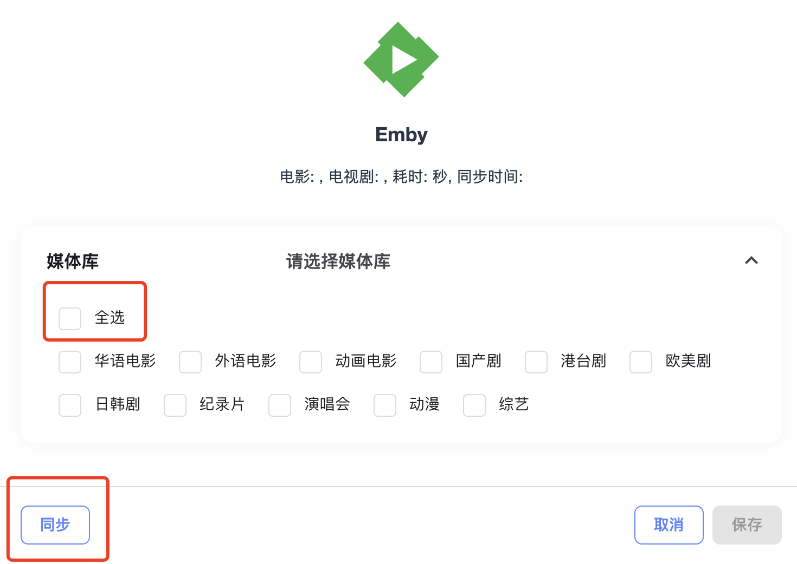
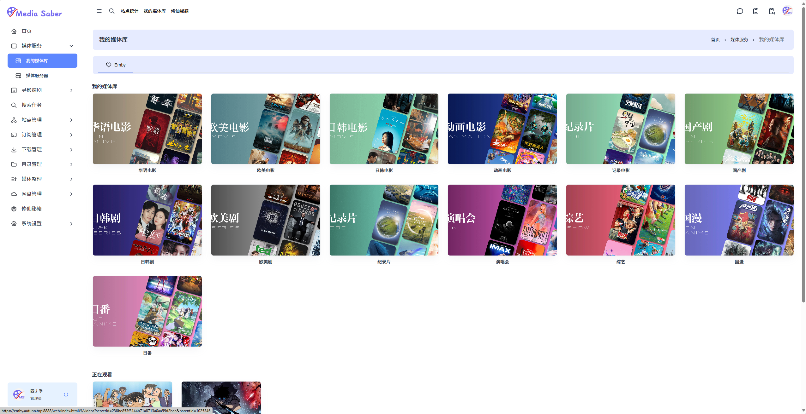

# 媒体服务 - 媒体服务器

---

## 一、新增媒体服务器

以 **Emby** 为例，输入服务器地址、名称、Api Key，点击“保存”即可完成添加。

> 建议在服务器地址中直接填入**外网访问地址**。  
> 若填写的是内网地址（例如 `http://ip:port`），则必须在“媒体播放地址”中填入外网访问地址以保证远程可访问。

---

### 1. Emby 的 API Key 获取方式

---

### 2. 关于“代理端口”的补充说明

“代理端口”配置是为有 **strm302 播放需求** 的用户准备的。

**strm302 应用场景简述：**  
当媒体库为网盘资源（即通过 strm 文件构建的媒体库）时，在远程播放（例如在公司播放家中媒体库）时，strm302 可以直接建立网盘播放通道，而无需占用家庭服务器的上行带宽。

> 若无相关需求，此项可忽略。

**配置说明：**

- 填入一个未被占用的端口号  
- **该端口需在部署 ms 时进行端口映射**（非常重要）

---

## 二、同步媒体服务器

点击操作栏中的同步按钮（小飞机图标）。

选择需要同步的媒体服务器，然后点击“同步”。

同步完成后，可以在“我的媒体库”中查看同步效果。

