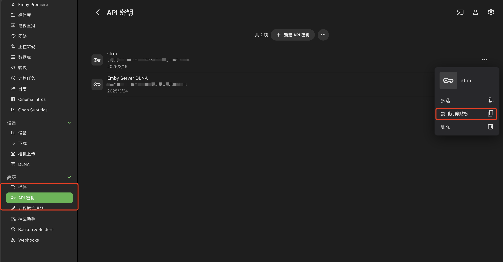

# 🎬 Emby

## 📋 简介

Emby是一个功能强大的媒体服务器软件，可以管理和播放存储在各种设备上的多媒体内容。它支持多种媒体格式，并提供友好的用户界面，可以在各种设备上访问媒体库。

## ⚙️ 配置说明

### 🔧 配置字段

- 📡 **服务器地址**：Emby服务器的访问地址，通常为 `http://IP:PORT` 或 `https://域名` 格式
- 🔑 **API密钥**：访问Emby API所需的密钥
- 📂 **媒体播放地址**：用于远程访问的播放地址（可选）
- 🚪 **代理端口**：用于strm302播放的代理端口（可选）

### 🌐 获取API密钥

1. 登录Emby管理界面
2. 进入"高级"->"API密钥"页面

3. 点击"添加新密钥"按钮
4. 输入应用名称（如"Media Saber"）
5. 复制生成的API密钥

### 📋 配置步骤

1. 在媒体服务器页面点击"新增媒体服务器"
2. 选择"Emby"作为服务器类型
3. 填写服务器名称（自定义）
4. 输入服务器地址（Emby服务器的IP和端口）
5. 输入API密钥
6. 点击"测试"按钮验证配置
7. 测试成功后点击"保存"

## 🔌 strm302代理播放配置

Emby支持通过strm302代理播放功能，特别适用于网盘资源的远程播放。

### 🔌 关于"代理端口"的补充说明

"代理端口"配置是为有 **strm302 播放需求** 的用户准备的。

**strm302 应用场景简述：**  
当媒体库为网盘资源（即通过 strm 文件构建的媒体库）时，在远程播放（例如在公司播放家中媒体库）时，strm302 可以直接建立网盘播放通道，而无需占用家庭服务器的上行带宽。

> 📝 若无相关需求，此项可忽略。

**配置说明：**

- 填入一个未被占用的端口号  
- **该端口需在部署 ms 时进行端口映射**（非常重要）
- 访问emby就需要访问配置的302端口，如截图配置了代理端口8097，访问emby地址为 http://127.0.0.1:8097 
- 经过测试，emby版本最高[4.9.0.42]，再高版本302不生效，如使用302不生效且版本高于4.9.0.42的请做降级处理。

---

### 配置说明

- 填入一个未被占用的端口号
- 该端口需在部署时进行端口映射（非常重要）
- 访问Emby就需要访问配置的302端口，如配置了代理端口8097，访问Emby地址为 http://127.0.0.1:8097
- 经过测试，Emby版本最高[4.9.0.42]，再高版本302不生效，如使用302不生效且版本高于4.9.0.42的请做降级处理

## ⚠️ 注意事项

- 确保Emby服务器在网络中可访问
- API密钥需要具有足够的权限以访问媒体库信息
- 建议使用Emby 4.9.0.42或更低版本以确保所有功能正常工作
- 需要确保防火墙设置允许相关端口通信
- 对于远程访问，建议配置HTTPS以提高安全性