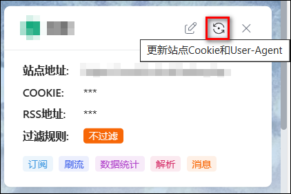

> 在新增站点前请先添加 **站点配置文件** 为内置索引工具适配站点，否则就算添加了站点，内置索引器也无法正常搜索和订阅站点！[点击前往](/guide/init/sites/)。

## 新增站点

新增维护好站点是使用本工具订阅、搜索下载功能的前提。

- **名称**：自定义站点名称。
- **优先级**：多个站点同时命中订阅时选择下载的优先级，数字越小越优先。
- **用户ID**：一般不需要填写，只有特殊的才需要。比如岛获取HR列表，馒头不想更新到beta版本时,飞天拉面获取用户统计信息。
- **站点地址**：对于有独立签到页面的站点，建议设置为站点签到页面（一般为：`/attendance.php`），从而实现自动签到。
- **站点用途**：选中的用途才会在对应场景中使用，支持控制 <kbd>订阅</kbd>、<kbd>刷流</kbd>、<kbd>数据统计</kbd>，<kbd>站点搜索</kbd>在 [内建索引器](/docs/setting/indexer#内建索引器) 中单独设置。
- **COOKIE**：在浏览器中打开站点，按 F12->网络选项卡获取站点 Cookie，也可使用[周边工具](/docs/other/peripheral_tools/)。
- **自定义请求头**：站点的 Requeste Headers，多个换行隔开。比如馒头和飞天拉面需要填写才能用于资源搜索、数据统计等。
- **RSS 订阅地址**：站点 RSS 订阅源 URL 地址，用于电影、电视剧订阅、刷流，点击站点 RSS 图标获取。
- **RSS 解析种子详情**：选择<kbd>是</kbd>时 RSS 订阅会解析站点种子详情页面获取种子<kbd>FREE</kbd>及<kbd>HR</kbd>状态，会增加站点访问压力；选择<kbd>否</kbd>时无法判断 FREE 种，无法实现 FREE 优先规则；`刷流任务`不受此限制。
- **发送站点未读消息通知**：选择是时检测到站点有未读消息会通过消息推送通知。
- **过滤规则**：选择该站点使用的过滤规则组，在`设置->过滤规则`中设置规则，选择了过滤规则后该站点只有符合规则的种子才会被命中下载；仅作用于 RSS、内建索引自动搜索；`刷流任务`不受此限制。
- **下载设置**：选择该站点使用的下载设置，在 [下载设置](/docs/media/download/#下载设置) 中预先设置好下载参数。
- **开启浏览器仿真**：开启后将调用浏览器内核模拟真实的站点访问，可以兼容更多站点的签到、数据统计，但获取数据耗时会大幅增加；需要拉取含`浏览器内核`的镜像才能使用（docker 镜像已包含，群晖套件需要安装 Web Station）。
- **使用代理服务器**：开启后该站点的访问将使用代理服务器，代理需在 [代理服务器](/docs/setting/base/#代理服务器) 中设置。
- **从详情页下载字幕**：开启后将查询该种子详情页是否有提供字幕，如有则会自动下载；字幕文件会一并下载到`下载保存目录`，同时随文件转移一起整理。
- **User-Agent**：从浏览器中获取 User-Agent，站点签到/数据获取/搜索请求时使用的 User-Agent，为空则使用基础配置中 User-Agent 设置。**该项需要与 Cookie 一同配置**。
- **站点流控规则**：控制全局站点访问频率，触发流控时将跳过该站点，留空则不限制。

- **自定义请求头**:
> - 馒头：可通过【控制台->實驗室->存取令牌】自助获取，然后在站点维护中，增加自定义请求头`x-api-key:XXXXXXX` ，注意是英文冒号，前后不要空格。
> - 飞天拉面：主页页面拉到最下面，点击API后获取，然后把获取的类似于 `APITOKEN:XXX`这样格式的内容填写进站点维护中的自定义请求头。

## 更新站点 Cookie

**1、手动更新**

点击站点卡片的`圆点图标`打开更新站点 Cookie 对话框（当前环境无浏览器内核时该图标不可见），输入用户名、密码后，自动调用浏览器模拟人工登录操作，获取 Cookie 和 UA 并更新到站点中。

可选择自动识别验证码或手工输入验证码，自动识别验证码成功率在 90%左右。

 

**2、插件更新**

查看[浏览器同步插件](/docs/other/browser_sync_plugin/)。

## 站点连通性测试

通过该功能测试站点是否连通，根据报错信息调整站点设置和网络环境，错误排查参考：[站点无法连通](/guide/start/problem/#站点无法连通)。

