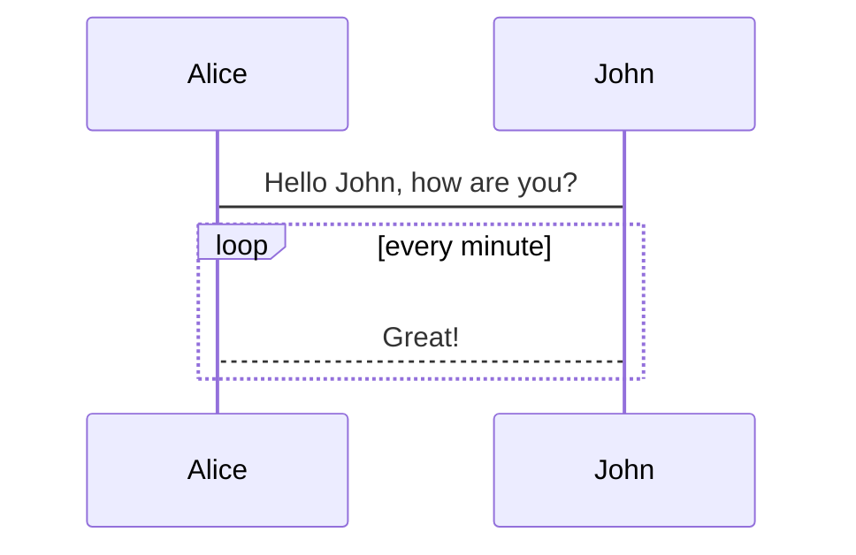
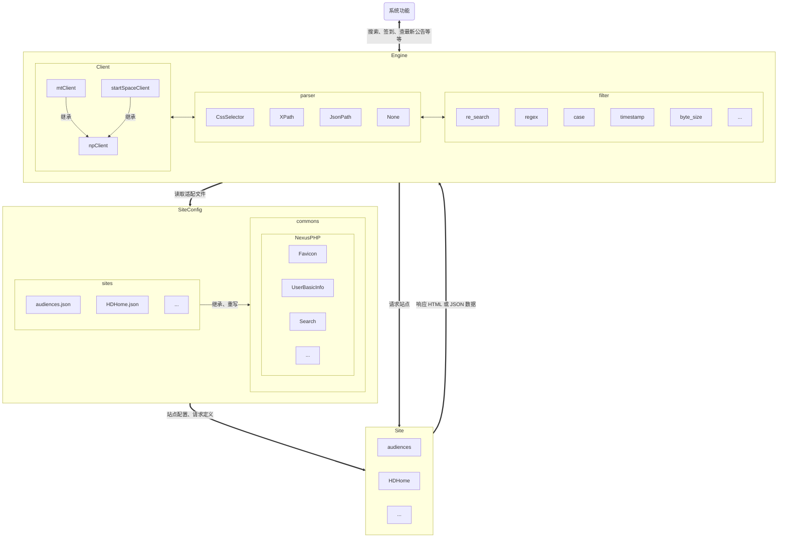

## 目录

- [原理](#原理)
- [目录结构](#目录结构)
- [名词解释](#名词解释)
    - [parser](#parser)
    - [filter](#filter)
    - [selection](#selection)
    - [通用请求定义](#通用请求定义)
    - [user_basic_info 字段](#user_basic_info-字段)
    - [user_details 字段](#user_details-字段)
    - [search 字段](#search-字段)
    - [seeding_statistics 字段](#seeding_statistics-字段)
    - [my_hr 字段](#my_hr-字段)
    - [messages 字段](#messages-字段)
    - [message_detail 字段](#message_detail-字段)
    - [notice 字段](#notice-字段)
    - [sign_in 字段](#sign_in-字段)
    - [details 字段](#details-字段)
- [JSON 数据结构](#json-数据结构)
    - [站点配置 JSON 说明](#站点配置-json-说明)
    - [站点公共配置 JSON 说明](#站点公共配置-json-说明)
- [注意事项](#注意事项)

## 原理


### 站点适配流程图


## 目录结构

```plaintext
/your_data_dir/site/configs
├── common/                     # 架构公共配置，一般定义公共请求
│   ├── NexusPhp.json           # NexusPhp 架构公共配置
│   ├── NexusRabbit.json        # NexusRabbit 架构公共配置
│   └── xxx.json                # 其他架构公共配置
├── sites/                      # 站点配置，可以复用对应架构的公共配置
│   ├── audiences.json          # 观众站点配置
│   ├── cyanbug.json            # 大青虫站点配置
│   └── xxx.json                # 其他站点配置
```

## 名词解释

### parser

解析器，用于解析站点的配置文件，目前支持以下解析器

| 名称          | 描述                                                                               |
|-------------|----------------------------------------------------------------------------------|
| CssSelector | css 选择器。                                                                         |
| XPath       | XPath 选择器。                                                                       |
| JsonPath    | JsonPath，使用方法：https://github.com/tidwall/gjson。 注：这种方式可以不写 selector 表达式, 默认使用字段名 |
| None        | 不解析，特殊站点需要写代码解析。                                                                 |

### filter

过滤器，用于对字段文本进行链式过滤转换，参数值部分支持 string、number、bool 类型，目前支持以下过滤器

| 名称           | 描述                               |
|--------------|----------------------------------|
| append_left  | 左边添加字符串                          |
| append_right | 右边添加字符串                          |
| blank        | 判断是否为空                           |
| byte_size    | 体积转为字节数                          |
| case         | 同 switch case                    |
| constant     | 固定值                              |
| eq           | 判断是否相等，自动转换为 bool 类型，或者转换任一指定的文本 |
| not_blank    | 判断是否不为空                          |
| querystring  | 搜索指定字符串索引，截取从索引开始的字符串部分          |
| regex        | 正则匹配                             |
| replace      | 字符串替换                            |
| re_search    | 正则表达式搜索文本                        |
| split        | 分割文本，获取第 n 段的子文本                 |
| strip        | 去除字符串两端的空白字符（空格、制表符、换行符等）        |
| timestamp    | 日期转为 unix 时间戳                    |

#### append_left

```json
{
  "name": "append_left",
  "args": "str"
}
```

#### append_right
```json
{
  "name": "append_right",
  "args": "str"
}
```

#### blank

三种方式  
第一种自动转 bool 类型
第二种转换为指定的 string 类型，如果不匹配则返回原始文本
第三种转换为指定的 string、number、bool 类型

```json
[
  {
    "name": "blank"
  },
  {
    "name": "blank",
    "args": "if True"
  },
  {
    "name": "blank",
    "args": [
      "if True",
      "if False"
    ]
  }
]
```

#### byte_size

```json
{
  "name": "byte_size"
}
```

#### case

value 支持 string、number、bool 类型

```json
{
  "name": "case",
  "args": {
    "k1": "v1",
    "k2": "v2",
    "*": "defaultValue"
  }
}
```

#### constant

```json
{
  "name": "constant",
  "args": "str"
}
```

#### eq

两种方式，第一种自动转 bool 类型，第二种转换为指定的 string、number、bool 类型

```json
[
  {
    "name": "eq",
    "args": "str"
  },
  {
    "name": "eq",
    "args": [
      "str",
      "if True",
      "if False"
    ]
  }
]
```

#### not_blank

用法同 blank

```json
[
  {
    "name": "not_blank"
  },
  {
    "name": "not_blank",
    "args": "if True"
  },
  {
    "name": "not_blank",
    "args": [
      "if True",
      "if False"
    ]
  }
]
```

#### querystring

```json
{
  "name": "querystring",
  "args": "str"
}
```

#### regex

两种方式，第一种自动转 bool 类型，第二种转换为指定的 string、number、bool 类型

```json
[
  {
    "name": "regex",
    "args": "regex"
  },
  {
    "name": "regex",
    "args": [
      "regex",
      "if True",
      "if False"
    ]
  }
]
```

#### replace

```json
{
  "name": "replace",
  "args": [
    "separator",
    "old",
    "new"
  ]
}
```

#### re_search

以下文本获取上传量字节数，上传量: 1 TB

```json
[
  {
    "name": "re_search",
    "args": [
      "上传量: (.*)",
      1
    ]
  },
  {
    "name": "byte_size"
  }
]
```

#### split

分隔以下文本：hello world，结果为：world  
-1 为最后一段

```json
{
  "name": "split",
  "args": [
    " ",
    -1
  ]
}
```

#### strip

```json
{
  "name": "strip"
}
```

#### timestamp

将时间格式： 2024-12-31 23:59:59，转为 unix 时间戳

```json
[
  {
    "name": "timestamp"
  },
  {
    "name": "timestamp",
    "args": [
      "2006-01-02 15:04:05",
      "2006-01-0215:04:05"
    ]
  }
]
```

### selection

选择器文本类型

| 名称   | 描述             |
|------|----------------|
| text | 取匹配节点的文本       |
| html | 取匹配节点的 html 源码 |

### 通用请求定义

字段的数据类型支持字段转换，目前支持 string 转 int、int64、bool、float64、string，如需更多类型请在 client.decodeHookFunc
代码里添加。

| 名称                 | 描述                |
|--------------------|-------------------|
| favicon            | 获取站点图标            |
| user_basic_info    | 获取用户基础信息          |
| user_details       | 获取用户详情            |
| search             | 搜索种子列表            |
| seeding_statistics | 获取做种统计信息          |
| my_hr              | HR 考核中列表          |
| messages           | 用户消息列表            |
| message_detail     | 消息详情，根据消息链接查询     |
| notice             | 公告                |
| sign_in            | 签到                |
| details            | 获取种子详情            |
| download_file      | 下载文件，种子、字幕等等都可以下载 |

#### user_basic_info 字段

| 名称         | 描述               |
|------------|------------------|
| is_login   | 是否登录             |
| signed_in  | 是否签到             |
| id         | 用户 id            |
| name       | 用户名称             |
| ratio      | 分享率              |
| uploaded   | 上传量              |
| downloaded | 下载量              |
| bonus      | 魔力               |
| gold       | 金币，特殊站点用，最终转换为魔力 |
| silver     | 银币，同上            |
| copper     | 铜币，同上            |

#### user_details 字段

| 名称            | 描述        |
|---------------|-----------|
| level         | 用户等级      |
| level_icon    | 用户等级 icon |
| join_at       | 加入时间，时间戳  |
| last_accessed | 最近动态，时间戳  |

#### search 字段

| 名称                   | 描述         |
|----------------------|------------|
| id                   | 用户等级       |
| category             | 类别         |
| title                | 标题         |
| description          | 描述         |
| details              | 详情页地址，相对地址 |
| download             | 下载地址，相对地址  |
| size                 | 体积         |
| grabs                | 完成数        |
| seeders              | 正在上传       |
| leechers             | 正在下载       |
| downloadvolumefactor | 下载因子       |
| uploadvolumefactor   | 上传因子       |
| date_added           | 发布时间       |
| date_elapsed         | 存活时间       |
| hr_days              | hr 天数      |
| labels               | 标签         |

#### seeding_statistics 字段

| 名称    | 描述 |
|-------|----|
| count | 数量 |
| size  | 体积 |

#### my_hr 字段

| 名称                        | 描述     |
|---------------------------|--------|
| id                        | hr id  |
| name                      | 标题     |
| uploaded                  | 上传量    |
| downloaded                | 下载量    |
| share_ratio               | 分享率    |
| download_time             | 下载时间   |
| need_seed_time            | 需要做种时间 |
| remaining_inspection_time | 考核剩余时间 |

#### messages 字段

| 名称      | 描述        |
|---------|-----------|
| id      | id        |
| title   | 标题        |
| date    | 时间        |
| content | 内容        |
| link    | 消息链接，相对地址 |

同 messages

#### message_detail 字段

| 名称      | 描述 |
|---------|----|
| title   | 标题 |
| date    | 时间 |
| content | 内容 |

#### notice 字段

| 名称      | 描述 |
|---------|----|
| title   | 标题 |
| date    | 时间 |
| content | 内容 |

#### details 字段

| 名称         | 描述        |
|------------|-----------|
| absent     | 种子已不存在    |
| free       | 是否免费      |
| 2x_free    | 是否双免      |
| hr         | 是否是 HR 种子 |
| peer_count | 做种人数      |

#### sign_in 字段

| 名称        | 描述   |
|-----------|------|
| signed_in | 是否签到 |

#### details 字段

| 名称         | 描述        |
|------------|-----------|
| absent     | 种子是否已不存在  |
| free       | 是否免费      |
| 2x_free    | 是否双免      |
| hr         | 是否是 HR 种子 |
| peer_count | 做种人数      |

## JSON 数据结构

### 站点配置 JSON 说明：

- id: 唯一标识
- name: 名称
- domain: 域名地址
- api: api 地址
- public: 是否为公开站点
- schema: 系统架构，见名词解释
- reuse_schema: 复用系统架构
- required: 是否必须
    - user_id: 是否需要手动填写用户的 id
    - sign_in: 是否需要签到
    - cookie: 是否需要手动填写 cookie
- category: 分类，此处省略
- price: 价格
    - has_free: 是否免费
    - has_2x_free: 是否双免
    - has_hr: 是否有 HR 种子
- common_fields: 公共字段定义
- requests: 请求定义，支持继承 schema 的配置，若 schema 无配置，则尝试使用 reuse_schema 的配置
    - parser: 解析器，见名词解释
    - method: 请求方法，GET、POST
    - path: 请求地址，非 http、https 开头则拼接 domain 或 api
    - use_api: 是否使用 api 地址
    - chrome: 使用 chrome
    - headers: 请求头
    - required_headers: 必填请求头，可以在站点管理自定义请求头里面配
    - params: url 请求参数，值必须为字符串类型
    - form_data: 表单数据，值必须为字符串类型
    - body: 请求体
    - success_status_codes: 成功状态码
    - list: 列表请求，用于获取列表数据
        - selector: 列表项选择器
        - next_page: 分页参数, 同 field
    - fields: 字段定义
        - selector: 选择器
        - selection: 选择器文本类型，见名词解释
        - attribute: css 选择器属性
        - filters: 过滤器，链式处理，见名词解释
        - parent: 是否选择父元素
        - remove: css 选择器移除子元素，多个用英文逗号分隔
        - any: 按顺序匹配，直到匹配成功，同 fields
        - array: 是否为数组
        - fields: 字段嵌套
        - fields_ref: 字段嵌套引用
        - list: 字段嵌套列表参数
        - trim_chars: 是否去除特殊字符
    - fields_ref: 引用当前文件指定 rd 的 fields
    - disabled_extends: 禁用继承，指定不需要继承的字段
        - path
        - headers
        - required_headers
        - params
        - form_data
        - body
        - success_status_codes
        - list
        - fields
        - field

### 站点公共配置 JSON 说明：

- id: 架构
- requests: 同上

## 注意事项

- 增加 sign_in_required 配置
- 馒头部分接口没有权限，可以通过自定义 authorization 来获取全权限
- 影分类太细，暂不适配分类
- appendleft 过滤器名称改为 append_left
- case 去掉，改为 any + not_blank filter
- index 去掉，自己想办法

### 搜索接口事项

- search td.rowfollow 统一去掉 rowfollow，提高 NexusPHP.json 重复利用率
- table.torrents > tr:has("table.torrentname") 统一改为 table.torrents tr:has(table.torrentname)
- 去除 date、free_deadline，貌似没有用到
- 去掉 tags、subject，以前用于渲染 description 的
- title_optional title_default 合并为 title，使用 any 即可，但要确保 title_optional 在 title_default 前面，否则可能拿到
  description 的文本
- contents 使用 filter split
- default_value 改为 constant filter

#### 字段继承

- 基本上一致，建议确认后直接继承：id、category、title、details、download、downloadvolumefactor、uploadvolumefactor、size、
  grabs、seeders、leechers、date_elapsed、date_added
- 重复率较低，请仔细确认：description、labels、hr_days、imdbid

### MyHr 接口事项

- 增加 id 字段
- downloaded_time 改为 download_time
- renaming_inspect_time 改为 renaming_time

### details 接口事项

- 以前的 price xpath 表达式迁移过来
- 修改 price free、2xFree、hr 相关配置

### seeding_statistic 接口事项

- 重写了接口，如果不需要分页，请禁用 list 的继承，headers 视情况禁用

## 常见问题

- css selector 要注意，使用 > 时必须保证为直接下级，否则会失败。应该有很多地方需要修改。例如：table.torrentname >
  tr，这种情况应该修改为 table.torrentname tr，因为中间还有一层 tbody，一般搜索接口拿不到值大概率是这个原因导致。