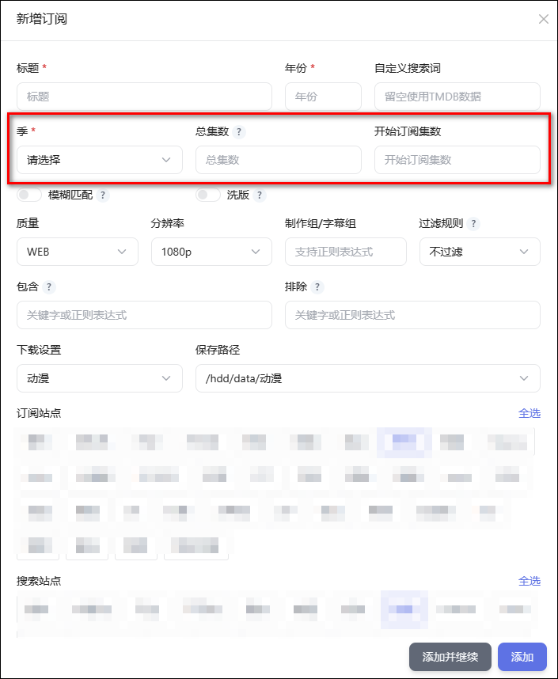
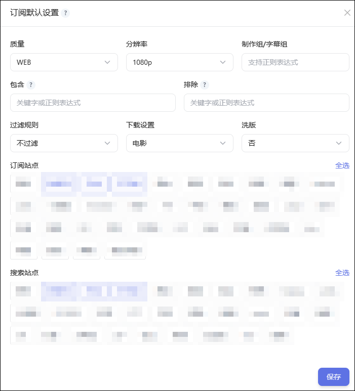
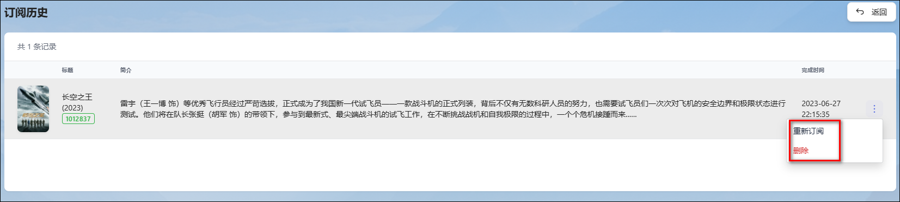
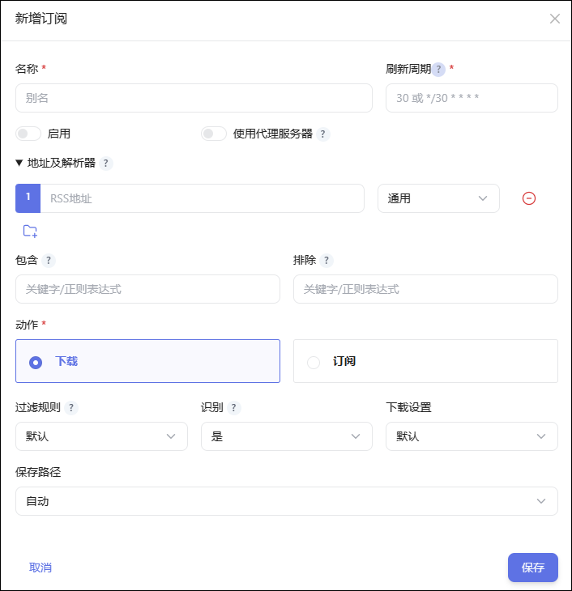
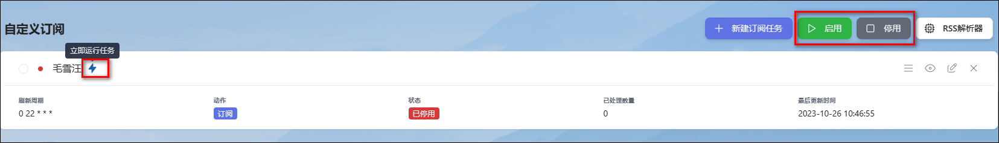

## 1、电影/电视订阅

### 新增电影订阅

新增电影订阅需要填写以下内容，填写完成后点击添加即可：

说明：
- **标题**： 填写 themoviedb 中已维护的名称，否则无法识别媒体信息。
- **年份**：填写 themoviedb 中名称对应的年份。
- **自定义搜索词**：当 themoviedb 中的名称与站点实际发布的资源名称不一致时，可通过`自定义搜索词`指定搜索站点资源时使用的关键字，避免无法搜索到资源。
- **模糊匹配**：开启后不检查TMDB是否有媒体信息，只要种子名称、标题、年份任一匹配关键字即会下载，此时标题可以配置正则表达式实现模糊匹配。
- **洗版**：开启洗版后不会检查本地是否已存在，满足订阅条件即会下载；除非匹配了对应的过滤规则中最高优先级的那条规则否则不会删除订阅（未明确过滤规则时使用默认规则），同一优先级的资源只下载一次；多个资源下载后如命名一致，则只会保留文件体积较大的，如需都保留则需要在文件重命名规则中增加相关要素以做区分。
- **质量**：可选质量：全部、BLURAY、REMUX、DOLBY、WEB、HDTV、UHD、3D。
- **分辨率**：可选分辨率：全部、8k、4k、1080p、720p。
- **制作组/字幕组**：填写制作组/字幕组，支持正则表达式。
- **过滤规则**：指定搜索站点资源时使用的`过滤规则组`，规则组内的所有规则将用于对搜索出的每一个资源的标题和副标题进行匹配，匹配命中的`过滤规则优先级`将做为当前资源的优先级，并在下载时进行排序择优；如过滤规则组内的所有规则都不匹配，则该资源会被过滤。
- **包含和排除**：设置关键字或者正则表达式，对站点资源的标题和副标题进行包含和排除匹配。
- **下载设置**：指定该订阅的资源下载时使用的下载器相关参数。
- **保存路径**：如为`自动`则会根据资源的类型、二级分类匹配[下载器](/docs/media/download/#_4、下载器设置)中设置的下载目录；可手工输入保存路径，此时如为 QB 下载器会自关闭种子自动管理。
- **订阅站点**：在[站点维护](/docs/sites/site/)中选中了`订阅`用途的站点将在此处显示，选中则代表当前订阅会使用该站点的 RSS 进行匹配；**不选默认全选**。
- **搜索站点**：在[索引器](/docs/setting/indexer/)中选中的站点会在此处显示，选中则代表当前订阅会使用这些站点进行资源搜索，资源搜索有三种触发方式：1. 订阅详情中的刷新按钮、2. [基础设置](/docs/setting/base/#订阅搜索周期)中维护的`订阅搜索周期`时间到达时自动搜索、3. 订阅添加后自动执行一次搜索。**不选默认全选**。

> 推荐使用搜索框先搜索词条，然后点击卡片订阅按钮的方式添加订阅，更加直观和方便快捷。

### 新增电视订阅

电视订阅基本上和电影订阅差不多，只多了三个选项：季、总集数、开始订阅集数：

### 默认设置

预先设置好默认的订阅设置，在自动添加订阅的场景默认使用，如：`消息远程订阅`、`Overseerr/Jellyseerr联动订阅`、`豆瓣榜单/豆瓣同步等`具有订阅功能的插件添加订阅。

### 订阅详情

点击订阅的卡片可以对订阅进行编辑、取消、搜索、刷新等操作。其中点击刷新按钮，将立即搜索一次所有搜索站点的资源并添加下载。

### 订阅历史

可查看已完成的订阅历史，可以对历史进行删除（避免无法重复添加订阅）或重新订阅。

## 2、自定义订阅

### RSS 解析器

解析器用于对 RSS 报文进行解析处理，得到资源标题、年份、类型、下载链接等信息。已内置了多个解析器，可符合绝大部分使用需求：
- **通用**：用于订阅 PT 站点的 RSS 以及绝大多数 RSS。
- **蜜柑计划**：用于订阅`https://mikanani.me/`的 RSS。
-  **TMDB 电影片单**：用于订阅 themoviedb 的电影片单。
-  **TMDB 电视剧片单**：用于订阅 themoviedb 的电视剧片单。
-  **Nyaa**：用于订阅`https://nyaa.si/`的 RSS。

可根据 RSS 报文的内容，自定义 Json 格式解析配置： 如类型为`XML`则需要是`XPath`语法，如类型为`JSON`则需要是`JsonPath`语法；

支持的解析内容包括：`list`(获取列表) `title`(标题) `enclosure`(种子下载链接) `description`(种子描述) `size`(种子大小) `type`(类型：movie/tv) `year`(发行年份)，没有或不需要的可不配置或配置为空，具体参考现有示例；

解析器可以尽可能解析更多的信息，由订阅程序将按需使用。

### 新增订阅

需填写以下内容：

说明：
- **地址及解析器**：通过查看 RSS 报文，选择合适的解析器或者自定义解析器，一般情况下选择通用即可；支持添加多个 RSS 地址。
- **包含和排除**：设置关键字或者正则表达式，对 RSS 中的标题进行包含和排除匹配。
- **动作**：支持`下载`和`订阅`两种类型，`下载`为直接根据 RSS 报文中的`enclosure`(种子下载链接)添加下载任务；`订阅`为根据 RSS 报文中的标题和年份添加订阅任务。
- **识别**：可选择是否开启媒体识别功能。`开启识别`后能提示更加友好的下载提示，剧集会显示在订阅日历中，同时可确保下载后的资源能自动整理，**但无法识别的资源会被过滤**；`关闭识别`后不进行媒体识别，无法添加订阅日志，下载完成后可能需要手工识别整理，但对资源命名没有要求。

### 批量启停

- 点击任务的`闪电图标`可以立即运行一次任务。
- 选中任务后可点击`启用`和`停用`来批量启停选中的任务，未选中时默认全部任务。

## 3、订阅日历

- 查看已添加到电影/电视剧订阅的上映日期。
- 订阅日历支持添加到`日历App`中显示，iCal 链接地址：`http(s)://Media Saber外网地址/ical`，加`?remind=1`开启日历提醒功能。

