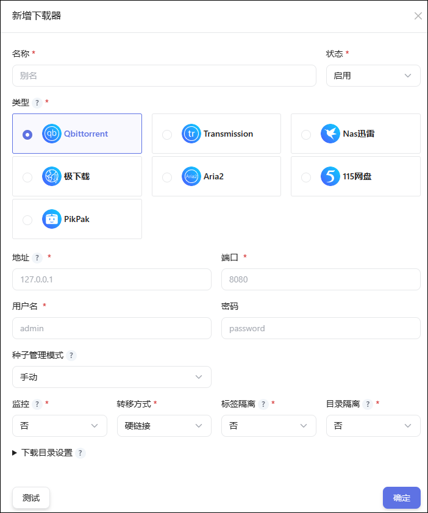

## 1、正在下载

- 只有默认下载器的任务才会在这里显示。右上角可以点击新增下载。

- 如果下载器开启了`标签隔离`，则只有`MEDIA_SABER`标签的任务才会在这里显示。

- 其他情况不能显示下载任务的，请检查下载器对应的版本是否兼容。

> **下载器版本要求**：QB 版本要求>=4.3.9，TR 版本要求>=3.0，其它版本可能存在适配问题。

## 2、近期下载

显示近期添加过下载的任务，不代表对应的文件已入库。

## 3、自动删种

- 定时对满足设置规则的种子进行`暂停`/`删除种子`/`删除种子及文件`操作，支持`Qbittorrent`及`Transmission`下载器。
- 可用于清理`站点已删种`、`种子文件缺失`等场景下的任务自动清理。
  • QB：种子状态 `missingFiles`
  • TR：错误信息 `No data found`

## 4、下载器设置

### 新增下载器

1）支持同一个下载客户端添加为多个下载器，并在不同的场景选择使用。

2）**QB 种子管理模式**：
  - `默认`：使用 Qbittorrent 客户端中的设置，Media Saber 不进行修改。
  - `手动`：强制开启`手动`管理模式，下载目录由 Media Saber 传递的下载目录决定。
  - `自动`：强制开启`自动`管理模式，下载目录由 Media Saber 传递的`分类标签`决定，没有分类标签的将使用下载器中的`默认保存路径`。
  - **注意**：自动管理模式下，Media Saber 将在启动时根据下载目录设置自动为下载器创建相应分类（需设置下载保存目录和分类标签），下载器中已存在该分类且其保存目录与 Media Saber 中设置的不一致时，将会覆盖下载器的设置。

3）**监控**：监控下载器，当任务下载完成后自动将下载文件转移到媒体库目录，与目录同步监控下载目录二选一开启。

4）**转移方式**：参考 [转移方式说明](/docs/other/glossary/#转移方式)。

5）**标签隔离**：`启用`后只有含 MEDIA_SABER 标签的下载任务才会被自动转移和显示，`关闭`则下载软件中所有的任务都会转移和显示。

6）**目录隔离**：`启用`后只有在下载器设置的下载目录范围中的下载任务才会被自动转移和显示。

7）**下载目录**：根据`类型`（电影、电视剧、动漫）及 [二级分类](/docs/setting/base/#二级分类策略) 自动选择下载目录，按优先级·从前往后·依次匹配，直到找到符合条件及空间要求的目录下载。
- 目录设置可以参考：[下载设置](/guide/init/download/)。 
- 二级分类从`基础设置->二级分类策略`的配置中读取，如未配置二级分类则无法配置下载目录二级分类。

> 说明：
> - 新增了下载器后记得点亮下载器右上角的五角星来设置默认的下载器。
> - **下载器版本要求**：QB 版本要求>=4.3.9，TR 版本要求>=3.0，其它版本可能存在适配问题。

### NAS 迅雷

由于 nas 厂商的定制, 不同平台上的 nas 都做了不一样的转发和认证.由于开发者设备问题, 目前只做了极空间和 docker 版本迅雷的测试.

极空间版本: 必须在极空间 docker 内,网络模式为 host, 地址填写 `http://127.0.0.1:5052`

docker 版本: 地址填写

`http://ip:port/webman/3rdparty/pan-xunlei-com/index.cgi/`

其他版本可以尝试以下方式获取地址:

到网页迅雷下载页面地址, 地址拦#号前的就是我们要的地址了

如:`http://192.168.1.28:2345/webman/3rdparty/pan-xunlei-com/index.cgi/#/home`

我们要的地址为`http://192.168.1.28:2345/webman/3rdparty/pan-xunlei-com/index.cgi/`

### 下载设置

- 设定一套预设的下载参数和行为，以便在下载时选择使用，下载设置可以实现`上传下载限速`、`自动删种`以及`添加标签`。
- 所有`下载器`均需要通过`下载设置`来关联使用，`刷流任务`除外。
- 系统`预设`下载设置不可修改和删除，将在未设置`默认下载设置`时使用，添加的下载任务默认包含`MEDIA_SABER`标签。
- 通过点亮下载设置的`五角星`，设置默认下载设置，以便在未选择下载设置以及自动化场景时使用。

