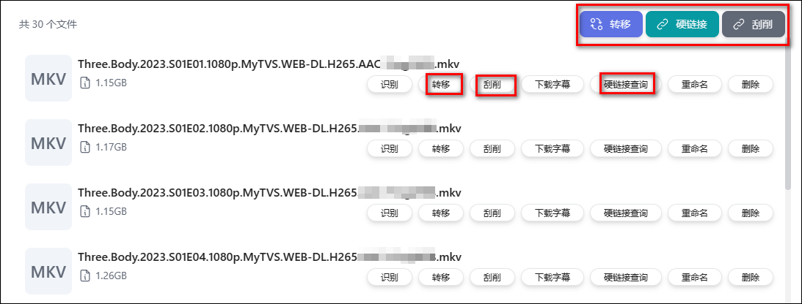
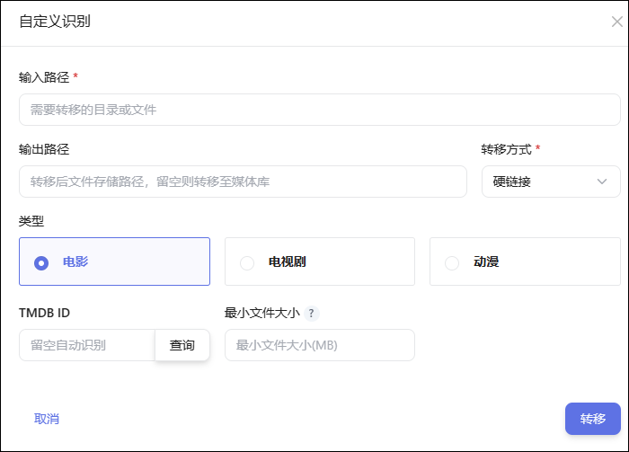
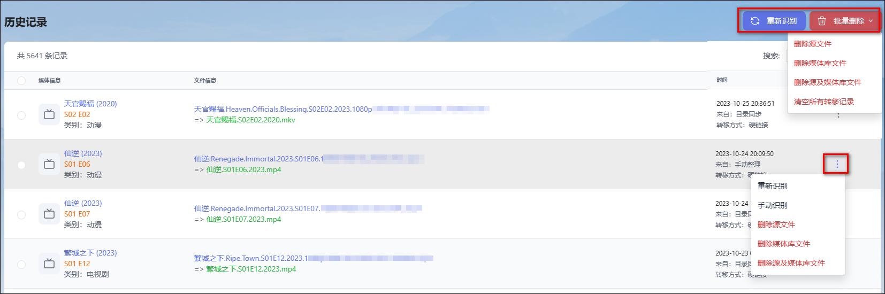

## 1、文件管理

手动管理文件系统中的资源，进行整理、硬链接查询及刮削。

### 手动转移

选择文件下面的`转移`按钮是转移当前文件，选择右上角`转移`按钮是转移当前目录所有文件。

### 查询硬链接

- 选择文件下面的`硬链接查询`按钮，可以查询当前文件在文件系统中有哪些硬链接；选择右上角`硬链接`按钮查询当前目录下所有文件的所有硬链接。
- 查询硬链接需要指定`查询目录范围`，范围越大查询越慢。
- 硬链接查询结果界面可以对硬链接文件进行`删除`操作。

### 目录刮削

- 选择文件下面的`刮削`按钮是刮削当前文件，选择右上角`刮削`按钮是刮削当前目录所有文件。
- 刮削将会覆盖已存在的 nfo 及图片文件。

## 2、手动识别

查询未识别记录并进行手动管理，如出现大批量的正常命名文件无法识别，请优先检查 TMDB 网络连接。自动下场景下极少出现无法识别的情况。

### 重新识别

- 选择`重新识别`可以对未识别记录重新识别一次，有时因为网络连接不稳定的原因导致识别失败的，通过重新识别重新处理。

### 手动识别

选择`手动识别`通过指定 TMDB 媒体信息以及指定命名格式的方式执行文件整理。

- **类型**：根据当前文件的类型选择对应的类型，如为电视剧文件名中需要有集数，`动漫`只指动漫剧集，动漫命名格式必须选择此项。
- **TMDB ID**：点击`查询`按钮，输入`名称`查询 TMDB 媒体信息并选择，也可直接输入 TMDBID。
- **最小文件大小**：`留空`将使用基础设置中的转移最小文件大小设置，如不限制大小需输入`0`。
- **集数指定**：通过指定集数和 Part 解决无法从文件名中识别出集数和 Part 的情况。`指定集数`、`指定Part`都不填，用默认识别。
  -   **指定具体集数**：例如 `1`表示第一集, `1-2`表示第 1-2 集(1,2 合起来当作一集)，此选项优先级最高。
  -   **指定 Part**: 需符合以下正则写法`(PART[0-9ABCI]{0,2}|^CD[0-9]{0,2}|^DVD[0-9]{0,2}|^DISK[0-9]{0,2}|^DISC[0-9]{0,2})`，例如`Part1`, `PartC`, `PartIII`, `Cd1`, `Dvd2`, `Disk10`, `Disc12`。
- **高级集数定位**：`{ep}定位集数`、`起始集,终止集`、`集数偏移`都不填，用默认识别。
  -    **标定集数位置**：使用`{ep}`标字集数位置，例如：`(BD)十二国記 第45話「東の海神 西の滄海 五章」(1440x1080 x264-10bpp flac).mkv`、`(BD)十二国記 第32話「風の万里 黎明の空　九章」(1440x1080 x264-10bpp flac).mkv`，此处可以填`(BD)十二国記 第{ep}話{a}(1440x1080 x264-10bpp flac).mkv` `{ep}`表示集，`{a}`表示随意用一个变量来替代不需要的但又不一致的部分，如果除了集数外没有其余不一样的内容，则只标定`{ep}`就行。
  -    **起始集,终止集**：裁定处理集数过滤范围，例如`2,4`只取第 2 集到第 4 集。
  -    **集数偏移**：例如`{ep}`定位出集数是 11, 实际是第 1 集, 此处填`-10`, 以应付多季合集的场景。

### 自定义识别

选择`自定义识别`通过指定 路径、TMDB 媒体信息以及指定命名格式的方式执行文件整理。

## 3、历史记录

文件整理记录，追踪文件转移关系，并可对文件进行管理。

### 重新识别

- 对于识别出错的进行`重新识别`（比如调整了[自定义识别词](/docs/setting/customwords/)），识别后会产生新的转移记录，需要手工删除原转移记录（选择`删除媒体库文件`）。
- 可以选择记录批量重新识别也可以点击单个记录重新识别。

### 手动识别

- 指定 TMDB 媒体信息以及指定命名格式的方式进行重新识别，操作参考手动识别，识别后会产生新的转移记录，需要手工删除原转移记录（选择`删除媒体库文件`）。

### 删除记录及文件

- **删除源文件**：删除转移记录的同时，会删除`原文件`。
- **删除媒体库文件**：删除转移记录的同时，会删除`转移后的文件`。
- **删除源文件及媒体库文件**：删除转移记录的同时，会删除`原文件`及`转移后的文件`。
- 可以选择记录批量删除记录和文件也可以点击单个记录重新删除记录及文件。

## 4、目录同步

### 工作原理

- 对源目录进行监控，当目录下的文件发生新增时进行转移处理，按设置的转移方式整理至目的目录或媒体库目录。
- 目录监控对环境有要求，部分场景下无法实现监控，参考 [目录同步不自动运行](/guide/start/problem/#目录同步不自动运行)。

### 配置说明

- **源目录**：`源目录`为需要同步的目录，源目录必须配置。
- **目的目录**：`目的目录`为识别和改名后存放的目录，目的目录未配置时将自动识别分类并转移到`媒体库目录`（此时显示为`自动`）。
- **未识别目录**：`未识别目录`为无法识别时转移的目录，未识别目录下产生的文件程序**不会主动清理**，建议不配置，未识别记录可在手动识别功能下处理。
- **同步方式**：参考 [转移方式](/docs/other/glossary/#转移方式)。
- **兼容模式**：开启`兼容模式`后，目录同步可以实时监控挂载网盘、跨系统 SMB 共享等场景，但监控性能会降低，会增加对磁盘的访问量。
- **识别并重命名**：`开启`后会对原文件进行识别并按定义的重命名格式进行重命名；`关闭`后只转移文件不识别和重命名，相当于文件同步。

## 5、TMDB 缓存

这里记录了所有 TMDB 的缓存数据，在进行媒体识别时将优先使得缓存数据，以减少对 themoviedb 的访问，同时也加快识别过程。

- 如 themoviedb 修改了媒体名称，可将对应的记录`修改`或者`删除`，以便重新查询 themoviedb 使用新的名称。
- `清空TMDB 缓存`将删除所有缓存数据，强制从 themoviedb 重新获取，非特别殊情不建议频繁清空 TMDB 缓存。
- 建议打开[TMDB 缓存过期策略](/docs/setting/base/#TMDB 缓存过期策略)，避免占用多过内存。
