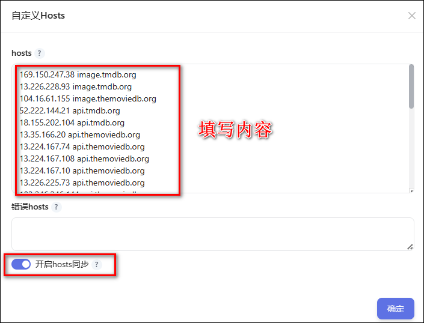

## 插件说明

自定义Hosts 可以修改系统的hosts文件，加速网络访问。

# 插件使用

在hosts 处填写想添加的hosts配置，格式为：`IP地址 域名`。可以根据需求添加多个映射关系，每个映射关系占一行。也可以使用 # 符号添加注释，注释内容将被忽略。

其中，`IP地址`表示需要映射的域名对应的 IP 地址，`域名`是需要解析的目标域名，中间使用空格或制表符分隔。

比如： `127.0.0.1 example.com`。这个例子将域名 example.com 映射到 IP 地址 127.0.0.1。在系统进行域名解析时，会首先查找hosts文件，如果存在匹配的域名，就会使用对应的IP地址进行解析。

填写完成后勾选`开启 Hosts 同步`。

**注意问题：**

- 查看是否生效：进容器执行`cat /etc/hosts`查看是否与 hosts 填写一致。
- 权限不足：更新 docker 容器。
- 只会同步正确的 hosts 到容器的 hosts 文件。
- 如 hosts 格式错误，会在错误 hosts 下列出。
