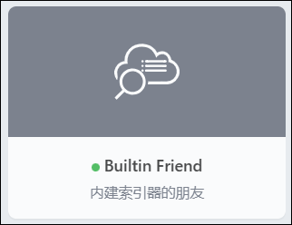
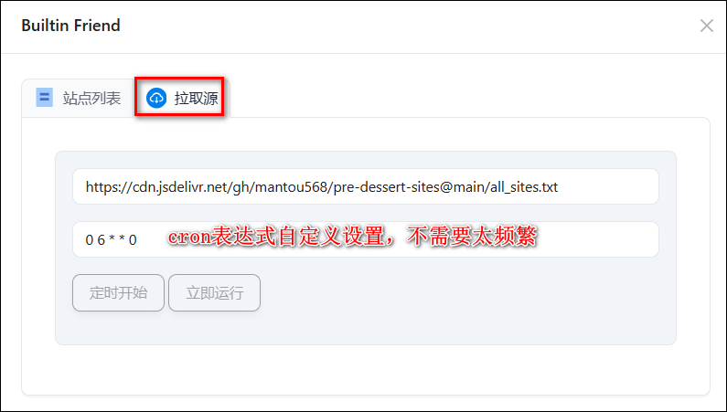

## 插件说明

builtin friend是内建索引器的朋友, 它将实现管理sites文件的拉取和更新等操作。



要求拉取链接的返回数据格式有以下几种。

### 1、site json文件内容
1. 正常json数据
```json
{
  "id": "xxx",
  "name": "yyyy",
  "domain": "https://xx.xxx.xxx/",
  "encoding": "UTF-8",
  "public": false,
  "search": {...},
  ...
}
```
2. json数据的base64
```txt
ewogICJpZCI6ICJ4eHgiLAogICJuYW1lIjogInl5eXkiLAogICJkb21haW4iOiAiaHR0cHM6Ly94eC54eHgueHh4LyIsCiAgImVuY29kaW5nIjogIlVURi04IiwKICAicHVibGljIjogZmFsc2UsCiAgInNlYXJjaCI6IHsuLi59LAogIC4uLgp9
```
### 2、批量链接
1. 文本链接数据
```txt
https://cdn.jsdelivr.net/gh/mantou568/pre-dessert-sites@main/sites/u2_dmhy_org.json
https://cdn.jsdelivr.net/gh/mantou568/pre-dessert-sites@main/sites/ubits_club.json
https://cdn.jsdelivr.net/gh/mantou568/pre-dessert-sites@main/sites/ultrahd_net.json
https://cdn.jsdelivr.net/gh/mantou568/pre-dessert-sites@main/sites/uploads_ltd.json
```
2. base64
```
aHR0cHM6Ly9jZG4uanNkZWxpdnIubmV0L2doL21hbnRvdTU2OC9wcmUtZGVzc2VydC1zaXRlc0BtYWluL3NpdGVzL3UyX2RtaHlfb3JnLmpzb24KaHR0cHM6Ly9jZG4uanNkZWxpdnIubmV0L2doL21hbnRvdTU2OC9wcmUtZGVzc2VydC1zaXRlc0BtYWluL3NpdGVzL3ViaXRzX2NsdWIuanNvbgpodHRwczovL2Nkbi5qc2RlbGl2ci5uZXQvZ2gvbWFudG91NTY4L3ByZS1kZXNzZXJ0LXNpdGVzQG1haW4vc2l0ZXMvdWx0cmFoZF9uZXQuanNvbgpodHRwczovL2Nkbi5qc2RlbGl2ci5uZXQvZ2gvbWFudG91NTY4L3ByZS1kZXNzZXJ0LXNpdGVzQG1haW4vc2l0ZXMvdXBsb2Fkc19sdGQuanNvbg==
```

**需要注意的是, 页面上的删除是真的删除文件, 请按需操作.**


## 插件使用

1、新建/更新站点配置


2、拉取源

来自热心网友提供的源地址：
```
https://cdn.jsdelivr.net/gh/mantou568/pre-dessert-sites@main/all_sites.txt
```



**<p style="color:red">注意：拉取文件需要自行确保数据来源的安全性, 同时造成的任何影响请自行承担。</p>**