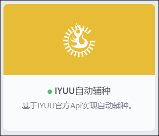

## 插件说明
可以通过此插件实现自动辅种。

## 插件使用
1、打开[IYUU官网](https://iyuu.cn/)，点击开始使用，然后手机扫码关注账号，获取Token 。

2、在插件市场安装`IYUU自动辅种`插件

3、~~左下角点击IYUU站点绑定进行认证，然后填写各项内容。~~
* 问题
不存在合作站点Dptvicomo

* 说明
IYUU插件无法完成站点绑定，辅种是可用的，iyuu的接口文档里没有认证的接口。from @Hervey

* 解决办法： 
搭个iyuu的容器完成认证（参考文档 https://doc.iyuu.cn/）

