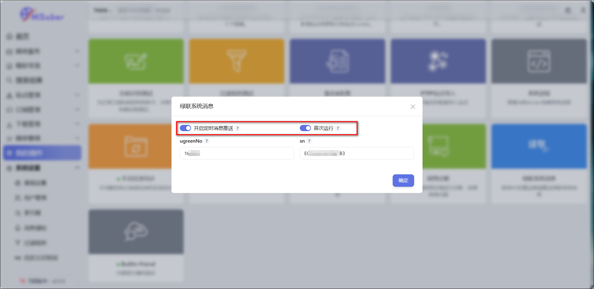

## 插件说明
可以通过此插件实现利用MS的推送渠道推送绿联系统消息，比如绿联的更新通知。

## 插件使用
1、在绿联app-设备信息里获取sn码信息，也就是序列号。

2、打开[绿联论坛官网](https://bbs.ugreengroup.com/forum.php)，获取ugreenNo信息。

3、在插件市场安装`绿联系统消息`插件，填写ugreenNo（只需要填写数字部分）和sn信息，并勾选开启定时消息推送和首次运行。

4、ms会收到首次运行成功的推送信息。

