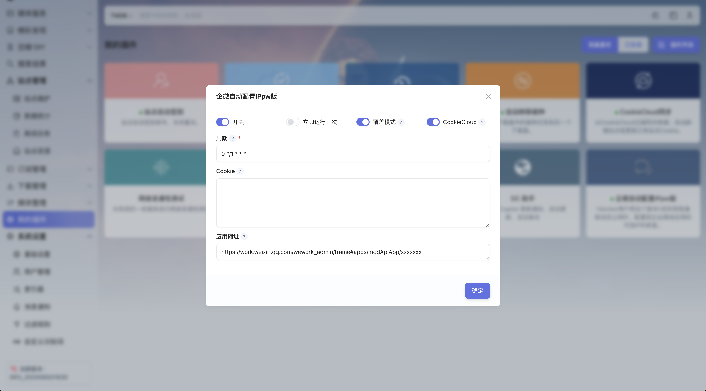
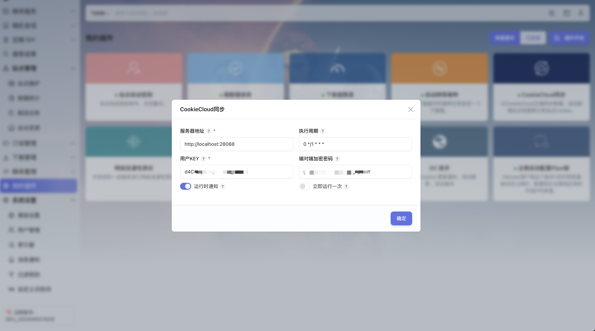
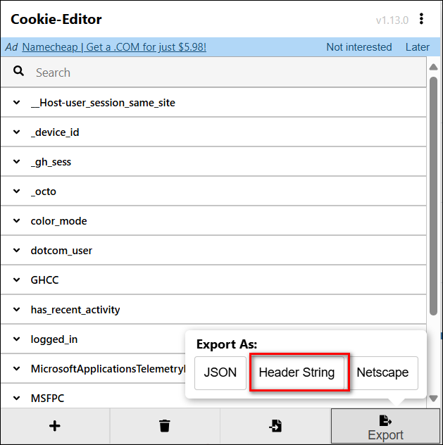
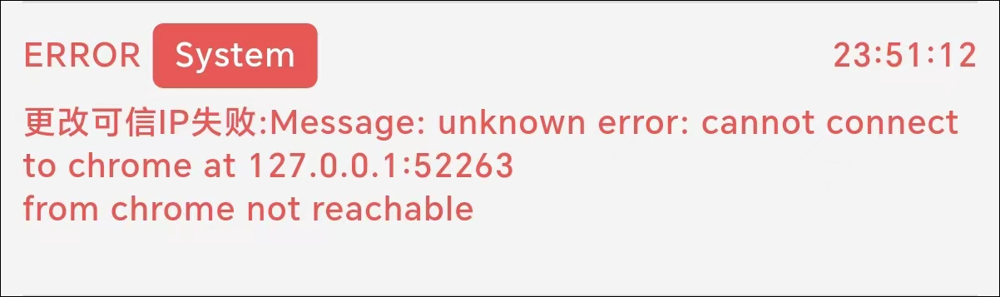
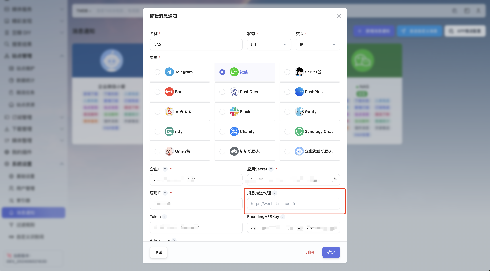

## 插件使用

1、ms 安装 `企微自动配置 IPpw 版` 插件

2、填写相关内容

3、应用网址填企业微信应用首页的网址，类似于：`https://work.weixin.qq.com/wework_admin/frame#apps/modApiApp/xxxxxxxxx`，可分行填写多个地址。

4、cookie 获取方法

- 如果使用 CookieCloud 那么 cookie 可不填，然后 ms 安装 CookieCloud 同步插件，立即运行一次，会自动填入到企微插件的 cookie。

  

- 也可以使用浏览器 [cookie 插件](https://chromewebstore.google.com/detail/cookie-editor/hlkenndednhfkekhgcdicdfddnkalmdm)导出 HeaderString 格式的 cookie。

  

- 实在不行，你自己 F12 手动抓，就是 cookie 容易失效，比如用浏览器扫码登录企业微信后,就需重新抓取

5、问题

如果遇到以下问题，应该是权限问题，可以给个特权模式啥的看看。

## 企业微信消息通知的另外说明

1、企业微信 API 接收消息的 url，不要再使用 vps 了，使用自己的域名，例如：`https://xxx:3000/wechat`

2、ms 系统设置-消息通知，不要再使用代理，消息推送代理置空

