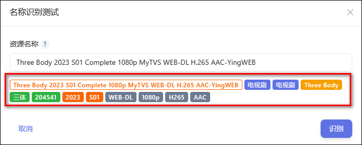
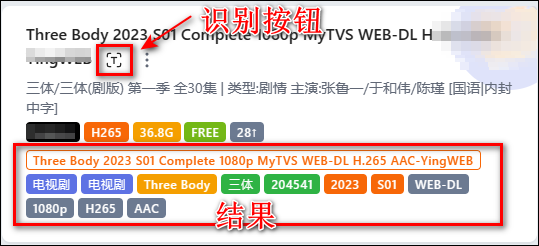

## 名称识别测试

插件：

使用：

点击插件，输入资源名称然后点击识别。

识别成功会出现如下内容：`类型、类别（蓝色）`、`识别名称（黄色）`、`TMDB标题、ID`（绿色，此为识别成功的标志）、`年份和季集（橙色）`、`视频信息：质量、分辨率 、视频编码、音频编码（灰色）`、`制作组/字幕组（青绿色）`。

- 点击`TMDB标题、ID`（绿色）和`季集`（橙色）可跳转相应 tmdb 页面。
- 无法识别时，先检查 TMDB 网络连通性；资源命名不规范的，可以通过[自定义识别词](/docs/setting/customwords/)校正。

在其他页面比如搜索结果里也可以直接使用此插件：

