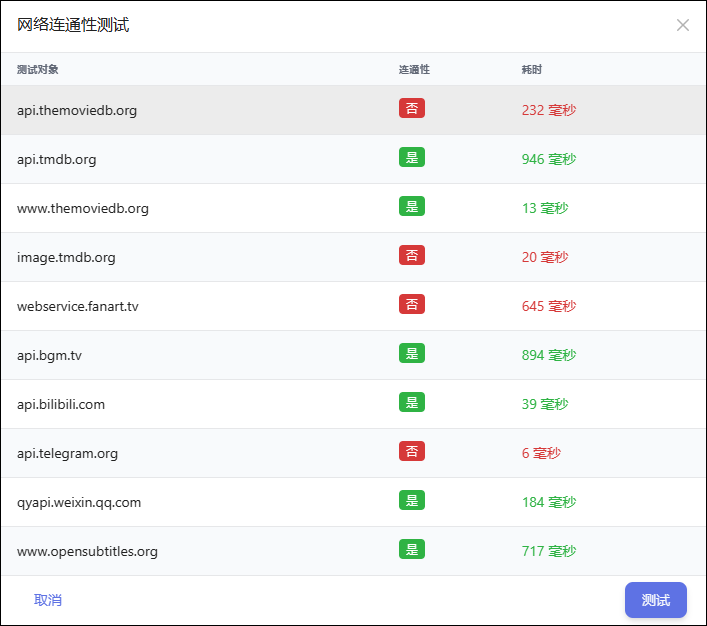

## 1、网络连通性测试

网络连通性测试插件：

可以测试 TMDB、Fanart、Telegram、WeiXin、OpenSubtitles 等系统服务的网络连接性：

## 2、清理转移缓存

清理文件整理缓存后，已转移过的文件允许重新转移（包括识别错误的文件）。

## 3、清理 RSS 缓存

清理 RSS 缓存后，已经通过订阅下载过但没有入库的资源，可能会被重新下载。

## 4、备份&恢复

备份&恢复插件：

使用：

1、点击`备份当前设置`，将当前的配置备份为一个 bk开头的zip 文件，浏览器将会自动下载到本地。

2、点击上传备份文件或将备份的 ZIP 文件拖动至窗口，再点击`恢复配置`，可以将配置恢复为备份的状态。

