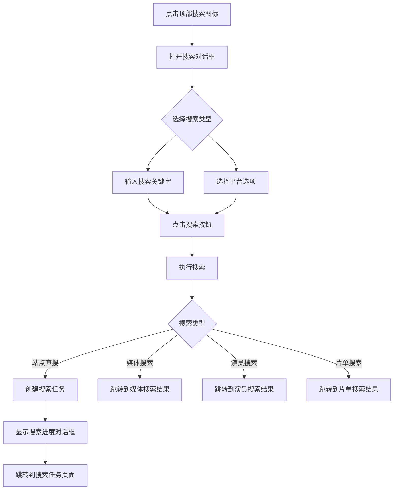

# 🔍 搜索功能详解

MediaSaber 提供了多种搜索方式，帮助您快速找到所需的媒体资源。通过顶部导航栏的搜索入口，您可以访问各种搜索功能。

## 🚀 搜索入口

在系统任何页面的顶部导航栏，点击搜索图标即可打开搜索对话框：

点击后将弹出搜索对话框，您可以在此进行各种类型的搜索。

## 🎯 搜索类型

系统支持多种搜索类型，每种类型针对不同的搜索需求：

### 🎬 媒体搜索 (Media Search)

搜索媒体平台上的电影、电视剧等媒体内容。

**使用场景**：
- 想找特定的电影或电视剧
- 需要在媒体平台上搜索内容
- 想获取媒体的详细信息

**使用方法**：
1. 选择"媒体搜索"类型
2. 输入要搜索的媒体名称
3. 选择媒体平台（如豆瓣、IMDb等）
4. 点击搜索按钮

**特点**：
- 需要选择媒体平台
- 搜索结果为媒体信息而非种子
- 可以获取媒体的详细资料

### 🌐 站点直搜 (Site Search)

直接在配置的种子站点中搜索资源。

**使用场景**：
- 想在所有配置的种子站点中搜索资源
- 需要快速获取种子文件
- 想要比较不同站点的资源

**使用方法**：
1. 选择"站点直搜"类型
2. 输入要搜索的关键字
3. 点击搜索按钮

**特点**：
- 在所有启用的种子站点中搜索
- 搜索结果为种子文件
- 会创建搜索任务，可在[搜索任务](/docs/search/search_tasks/)中查看进度

### 🎭 演员搜索 (Performer Search)

根据演员或人物名称搜索相关作品。

**使用场景**：
- 想找某位演员的全部作品
- 根据演员来发现感兴趣的内容
- 想了解演员的详细信息

**使用方法**：
1. 选择"演员搜索"类型
2. 输入演员或人物名称
3. 点击搜索按钮

### 📋 豆列片单搜索 (Piandan Search)

搜索豆瓣豆列或其他片单中的内容。

**使用场景**：
- 想浏览豆瓣高分电影清单
- 需要查找特定主题的片单
- 想根据推荐列表寻找内容

**使用方法**：
1. 选择"豆列片单搜索"类型
2. 输入片单名称或关键字
3. 点击搜索按钮

## 🔍 搜索对话框功能详解

### 🔤 搜索输入框

搜索对话框的核心部分是搜索输入框，您可以在此输入搜索关键字。

**功能特点**：
- 支持中英文输入
- 实时响应输入内容
- 提供搜索按钮快速执行搜索

### 🏷️ 热门关键字

在搜索对话框底部，系统会显示热门搜索关键字：

**使用方法**：
- 点击任意热门关键字，会自动填入搜索框并执行搜索
- 可以作为搜索灵感来源

### ⚙️ 搜索选项

根据不同搜索类型，可能会显示额外的搜索选项：

#### 媒体平台选择

当选择"媒体搜索"时，会显示媒体平台选择器：

- 豆瓣
- IMDb
- 其他支持的媒体平台

#### 网盘平台选择

当选择"网盘搜索"时，会显示网盘平台选择器（如功能启用）。

## 🔄 搜索流程

## 📋 搜索任务关联

对于某些搜索类型（如站点直搜），系统会创建搜索任务：

- 搜索任务会在[搜索任务](/docs/search/search_tasks/)页面中显示
- 可以在任务页面查看搜索进度和结果
- 搜索完成后可以查看和管理搜索结果

## 💡 使用技巧

### 快速搜索

1. **快捷键**：可以使用快捷键快速打开搜索对话框
2. **热门关键字**：利用热门关键字快速找到热门内容
3. **搜索历史**：系统会记住您的搜索历史（在相关页面中）

### 搜索优化

1. **精确关键字**：使用更精确的关键字可以得到更相关的搜索结果
2. **组合搜索**：结合不同的搜索类型满足不同需求
3. **平台选择**：根据内容类型选择合适的平台

通过以上功能，您可以高效地在 MediaSaber 中搜索各种媒体资源。不同的搜索类型适用于不同的使用场景，选择合适的搜索方式可以让您更快地找到所需内容。