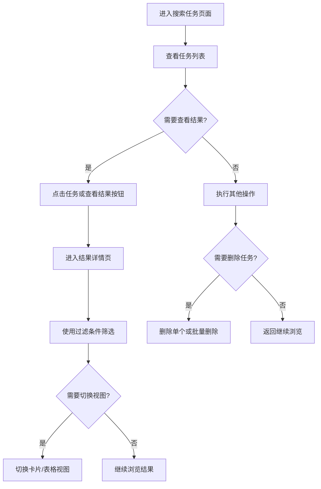

# 🔍 搜索任务

搜索任务是 MediaSaber 系统中的重要功能，用于管理和跟踪用户的搜索历史及结果。通过搜索任务，您可以方便地查看之前的搜索记录、浏览搜索结果以及管理搜索历史。

## 📋 搜索任务列表

在搜索任务列表页面，您可以查看所有已执行的搜索任务。

### 📊 任务信息展示

每个搜索任务卡片包含以下关键信息：

- 🎬 **搜索类型**：标明搜索的资源类型（如电影、电视剧等）
- 🚦 **状态**：显示搜索任务的当前状态（已完成、进行中等）
- 🎥 **媒体信息**：显示搜索的媒体标题、年份和海报
- 📈 **统计数据**：包括搜索的站点数、资源数和总耗时
- 🕐 **搜索时间**：任务执行的时间

### ⚙️ 操作功能

对于每个搜索任务，您可以执行以下操作：

#### 👀 查看搜索结果

点击「查看搜索结果」按钮或直接点击任务卡片，可以进入该任务的搜索结果详情页面。

功能细节：
- 仅当任务状态为「已完成」时此功能可用
- 页面会展示该任务的所有搜索结果
- 支持多种筛选和排序选项

#### 📋 查看任务明细

点击「查看任务明细」按钮，会弹出一个对话框显示任务的详细信息。

功能细节：
- 显示任务的完整执行过程
- 展示各站点的搜索状态和结果统计
- 不受任务状态限制，随时可查看

#### 🗑️ 删除任务

点击「删除任务」按钮，可以删除指定的搜索任务。

功能细节：
- 仅当任务状态为「已完成」时此功能可用
- 删除前会弹出确认对话框，防止误操作
- 删除后任务及其搜索结果将永久移除

### 📦 批量操作

页面支持批量操作功能，提高操作效率：

#### ✅ 批量删除

1. 在任务列表中勾选需要删除的任务
2. 点击顶部工具栏的「一键删除」按钮
3. 确认删除操作

功能细节：
- 可以同时选择多个任务进行删除
- 删除前会弹出确认对话框
- 删除后会自动刷新任务列表

### 🔍 搜索和筛选

页面提供搜索功能，可以根据以下条件进行筛选：

#### 🔤 关键字搜索

在搜索框中输入媒体标题关键字进行搜索。

使用方法：
1. 在搜索框中输入关键字
2. 按回车键或点击搜索按钮
3. 系统会实时筛选匹配的任务

功能细节：
- 支持模糊匹配
- 实时搜索，输入即搜索
- 可以清空搜索条件重置列表

#### 🎯 搜索类型筛选

通过下拉菜单选择搜索类型进行筛选。

使用方法：
1. 点击下拉菜单
2. 选择需要的搜索类型（如电影、电视剧等）
3. 系统会自动筛选匹配的任务

功能细节：
- 包含所有可用的搜索类型
- 可以与其他筛选条件组合使用
- 支持重置筛选条件

## 🎯 搜索结果详情

点击搜索任务或使用「查看搜索结果」功能可以进入搜索结果详情页面，该页面展示了具体的搜索结果。

### 🧹 结果过滤

在结果页面顶部，提供了多种过滤选项：

#### 🎛️ 自定义筛选条件

页面会根据搜索结果动态生成筛选条件，可能包括：
- 站点筛选
- 分辨率筛选
- 视频编码筛选
- 音频编码筛选
- 发布时间筛选

使用方法：
1. 在对应的筛选下拉框中选择条件
2. 点击「开始过滤」按钮应用筛选条件
3. 系统会实时更新结果列表

功能细节：
- 支持多条件组合筛选
- 可以随时重置筛选条件
- 筛选结果会显示统计信息

#### 📝 排序方式选择

可以选择不同的排序方式来展示搜索结果。

可用排序方式：
- 默认排序
- 按发布时间排序
- 按文件大小排序
- 按种子热度排序

使用方法：
1. 在排序下拉框中选择排序方式
2. 点击「开始过滤」按钮应用排序
3. 结果列表会按选定方式排序

#### 🔑 关键字过滤

通过关键字快速过滤结果。

使用方法：
1. 在关键字输入框中输入过滤词
2. 支持多个关键字，用空格分隔
3. 点击「开始过滤」按钮应用过滤

功能细节：
- 支持多关键字过滤
- 关键字间为"与"关系
- 实时显示过滤后的结果数量

### 🔄 重置功能

点击「重置」按钮可以清除所有筛选条件。

功能细节：
- 一键清除所有筛选和排序条件
- 恢复到初始状态
- 保持页面数据不变

### 🖼️ 结果展示

搜索结果支持两种展示方式：

#### 🎴 卡片视图

以卡片形式展示每个种子信息，包含丰富的视觉元素。

展示信息：
- 种子标题
- 站点图标和名称
- 文件大小
- 发布时间
- 种子热度
- 下载操作按钮

优点：
- 视觉效果好
- 信息展示直观
- 适合浏览和选择

#### 📊 表格视图

以表格形式展示种子信息，便于比较和查看详细数据。

展示信息：
- 种子标题
- 站点信息
- 文件大小
- 发布时间
- 种子热度
- 下载操作按钮

优点：
- 信息密度高
- 便于比较数据
- 适合精确筛选

#### 视图切换

您可以通过页面上的「切换表格」/「切换卡片」按钮在两种视图间自由切换。

使用方法：
1. 点击「切换表格」或「切换卡片」按钮
2. 页面会自动切换到对应视图
3. 切换后的视图会保存在本地存储中

功能细节：
- 切换视图不会丢失筛选条件
- 本地存储视图偏好设置
- 页面刷新后保持上次选择的视图

### 📊 数据统计

页面会显示搜索统计信息：

- 📈 **总记录数**：搜索到的有效记录总数
- 🔍 **筛选后记录数**：经过筛选条件过滤后的记录数

这样您可以清楚了解搜索的范围和筛选效果。

## 🔄 交互流程

通过以上功能，您可以高效地管理和查看搜索历史，快速找到所需的媒体资源。