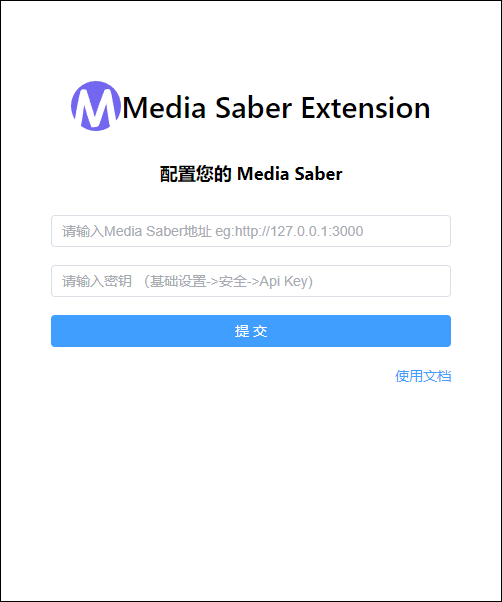
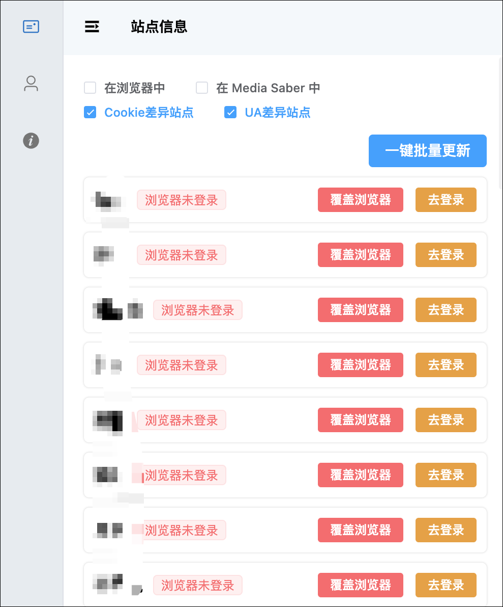
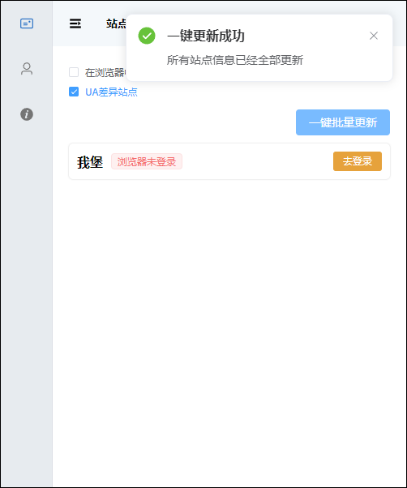
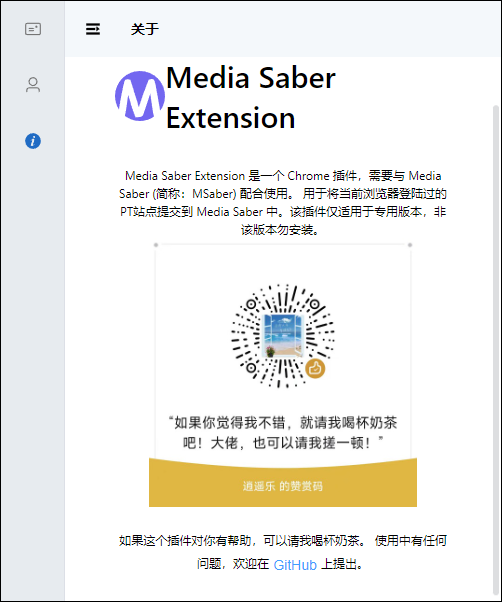

## 介绍

media saber 扩展可以一键批量或者单个维护更新 MS 的 cookie ，也可使用 MS 的cookie回填到浏览器，避免站点cookie失效导致无法访问站点。

## 插件安装

### 浏览器扩展安装

可直接在 谷歌浏览器/Edge浏览器 扩展商店搜索“Media Saber Extension”安装。也可通过链接安装。

edge 链接：https://microsoftedge.microsoft.com/addons/detail/media-saber-extension/bgnafgagclknhllalblccdehbngabjfl

谷歌链接：https://chromewebstore.google.com/detail/hpmjjkhlbafogiajhcfgplfnoajpgdde?hl=zh-CN&utm_source=ext_sidebar

### 手动安装

也可以下载后手动安装，下载地址： 

我用夸克网盘分享了「MediaSaber 浏览器扩展」，点击链接即可保存。打开「夸克 APP」，无需下载在线播放视频，畅享原画 5 倍速，支持电视投屏。 链接：https://pan.quark.cn/s/e50f9881c67d (opens new window)，提取码：fGGH。

手动可以看看 redeme.txt 文件说明，添加浏览器白名单。注意 9999 是白名单 id，不能重复，如果你 ptpp 用了相同 id，就换一个数字 扩展在 Media-Saber-Extension.v1.1.0.crx.zip 文件中。注意不能直接改后缀名，我做了二次压缩的，因此需要先解压。

