## 微信通知

1、注册登录企业微信网页，并下载企业微信手机客户端

企业微信网页：https://work.weixin.qq.com/

2、注册一个企业，进入企业微信网页管理页面，进行配置

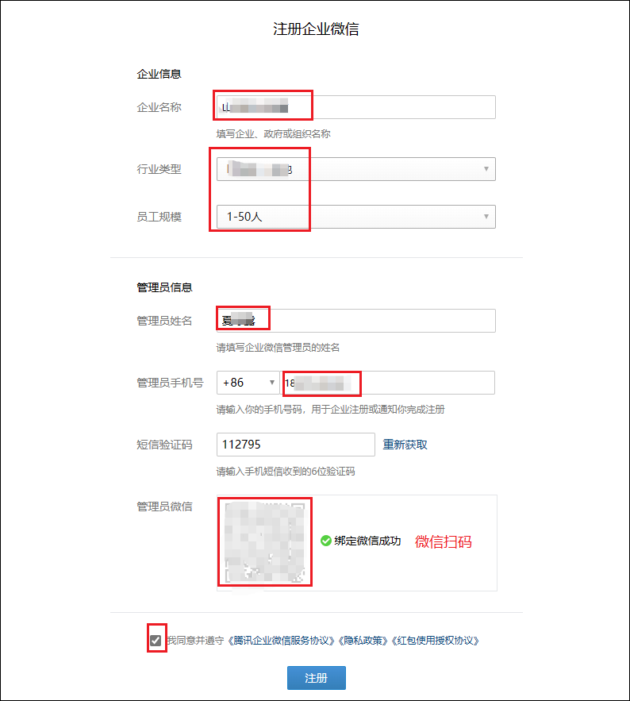

3、进入管理后台


4、打开“应用管理”目录下的创建应用

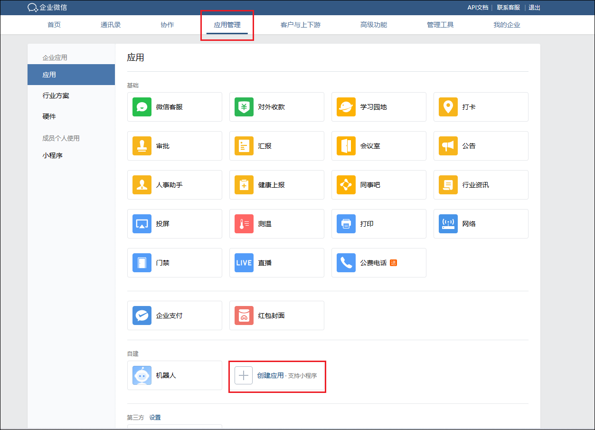

5、填写必要信息，创建应用。

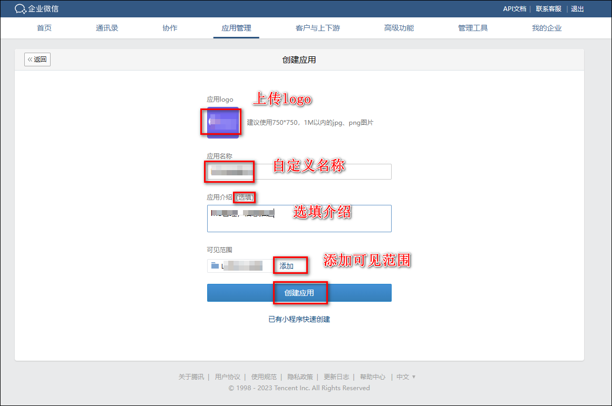

6、应用管理界面获取信息

1）在页面上可以直接看到信息 3

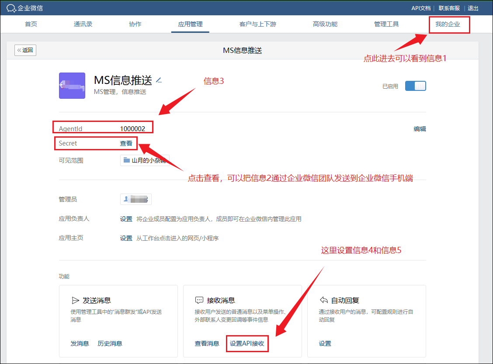

2）点击查看后，手机端企业微信收到的来自企业微信团队的信息 2

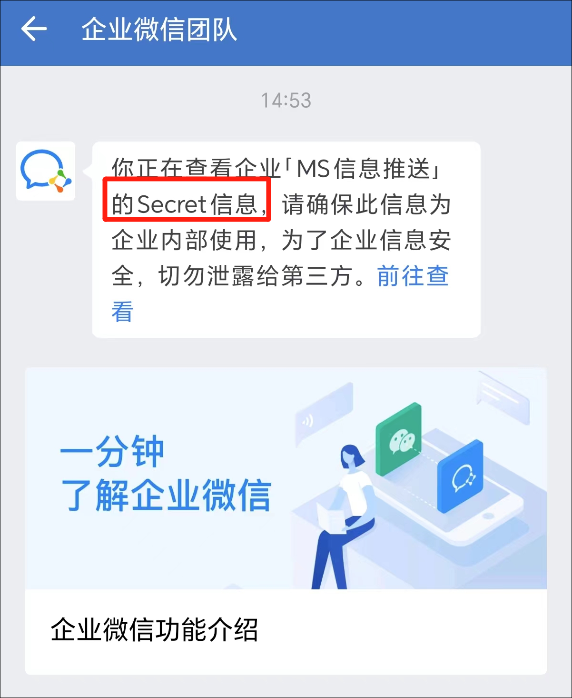

3）在我的企业里查看信息 1

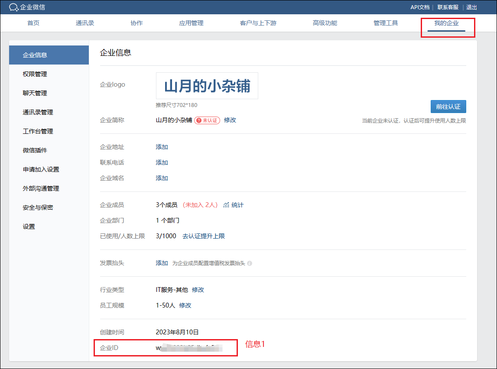

4）点击设置 API 接收，在这个页面先填写好 ms 外网地址，然后点击随机获取了信息 4 和 5，此时先不要着急点保存，否则会出现回调地址请求不通过。

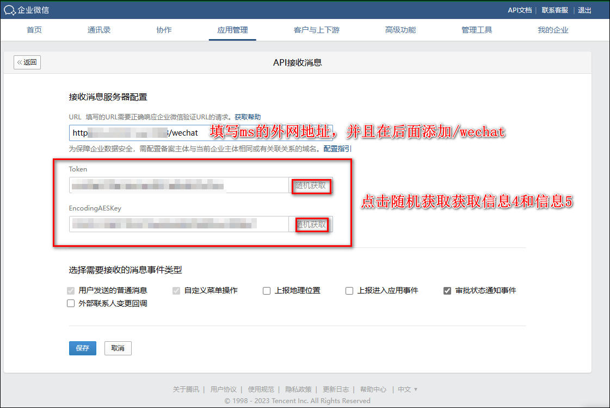

7、我们来到 ms 界面，先把获取到 5 个信息，在 ms 配置界面填好以后，点击确定，保存好。代理服务器的话，如果使用企微可信 IP 插件的话可以不用填写。

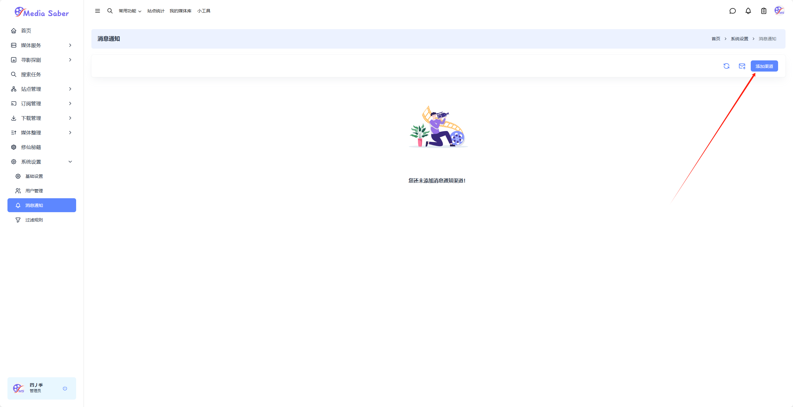

8、然后我们再回到刚刚的企业微信的 API 接收配置页面，点击保存，会出现保存成功的提示，此时我们 API 接收变成已启用状态。

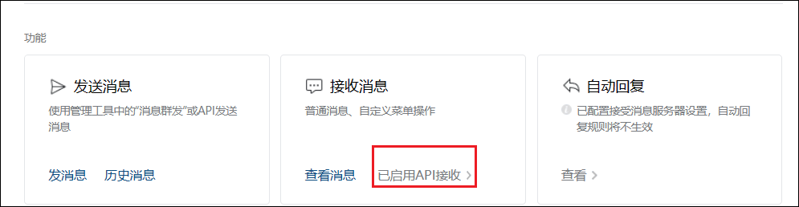

9、最后我们继续往下滑，找到企业可信 IP 并填写你的公网 IP。

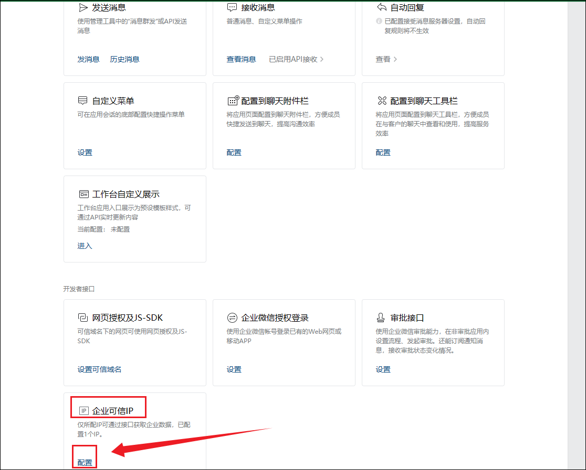

可以使用插件[企微可信 IP](/docs/plugin/qiweiIP)自动获取可信 IP。

10、然后我们在 ms 的界面，点击测试，测试成功后我们会在企业微信接收到一条信息，表示设置成功。

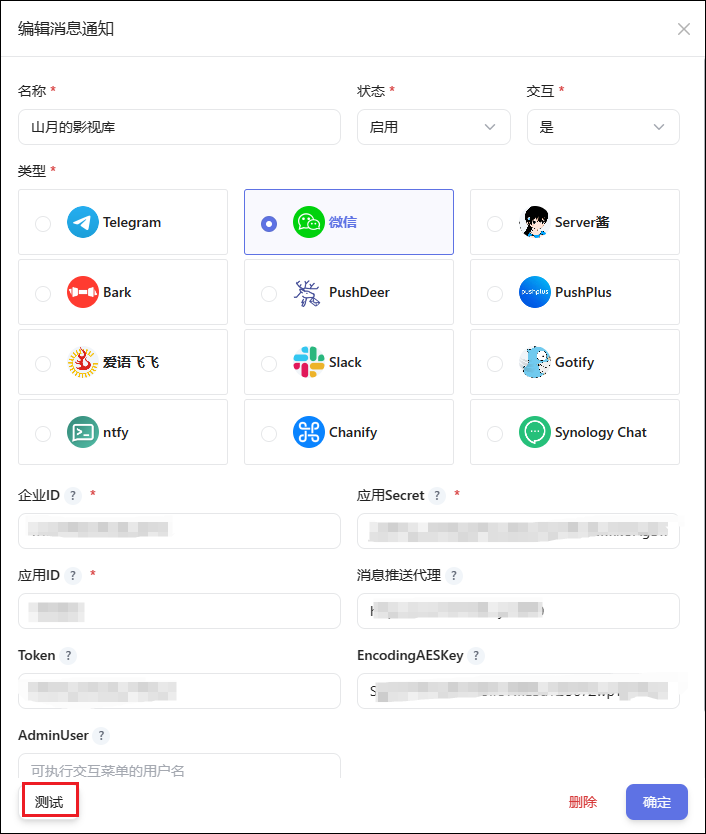

> 在企业微信控制台`我的企业->微信插件`找到邀请关注二维码，使用微信扫码后可直接在微信使用，无需打开企业微信客户端。

## 微信交互菜单配置

1、在应用管理界面找到自定义菜单，点击设置。

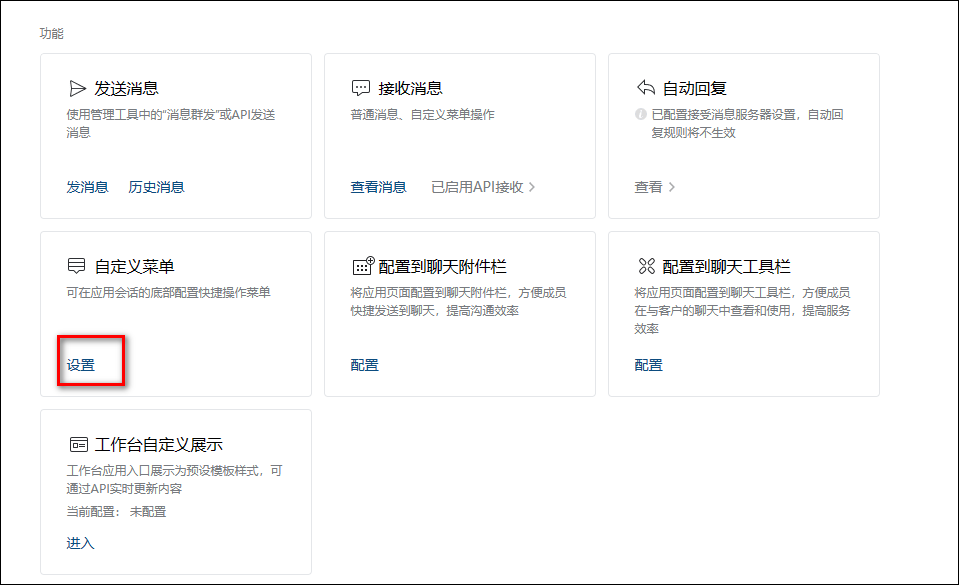

2、微信交互菜单配置

- 菜单对应关系，配置 WeChat 应用中配置的菜单 ID 与执行命令的对应关系，需要手工修改
- 菜单序号在https://work.weixin.qq.com/wework_admin/frame#apps 应用自定义菜单中维护，然后看日志输出的菜单序号是啥（按顺利能猜到的）....
- 命令对应关系：`/ptt` 下载文件转移；`/ptr` 删种；`/pts` 站点签到；`/rst` 目录同步；`/db` 豆瓣同步；`/utf` 重新识别；`/ssa` 订阅搜索；`/tbl` 清理转移缓存；`/trh` 清理 RSS 缓存；`/rss` RSS 下载；`/sta` 数据统计

- 微信菜单必须遵守以下顺序：

```bash
 第1列第1个菜单：  下载->下载文件转移
 第1列第2个菜单：  下载->删种
 第1列第3个菜单：   下载->RSS下载
 第1列第4个菜单：   下载->订阅搜索
 第2列第1个菜单：   同步->目录同步
 第2列第2个菜单：  同步->豆瓣同步
 第2列第3个菜单：   同步->重新识别
 第3列第1个菜单：  管理->站点签到
 第3列第2个菜单：   管理->清理转移缓存
 第3列第3个菜单：  管理->清理RSS缓存
 第3列第4个菜单：   管理->数据统计
```

3、自定义菜单一定要严格按照上面的顺序，比如添加第 1 列的第一个菜单是下载：

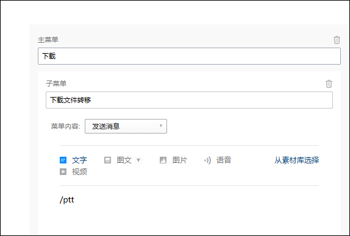

4、全部设置完成后如图所示，然后点击发布。

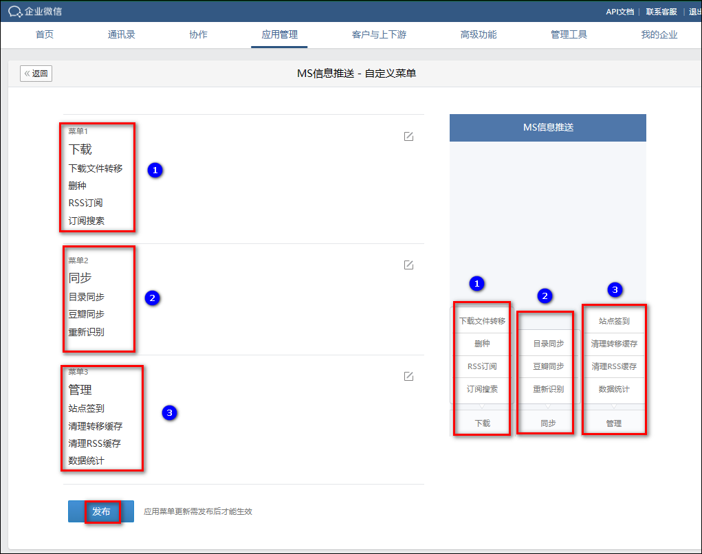

5、此时我们打开 MS 信息推送应用，他下面已经有菜单了，并且点击对应的菜单，比如数据统计，会发送对应的信息。

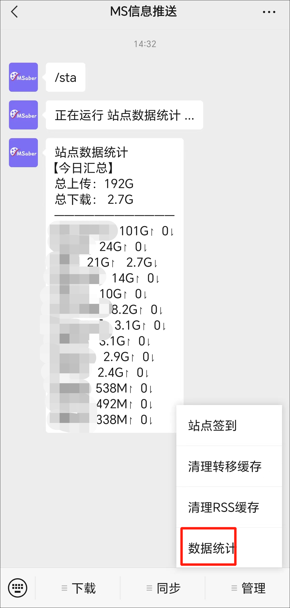

## 微信代理参考

- [搭建微信转发代理.pdf](/files/搭建微信转发代理_.pdf)
- [自己搭建 vps 转发企业微信通知.pdf](/files/自己搭建vps转发企业微信通知.pdf)
- [微信通知搭建 caddy 代理超简单流程.pdf](/files/微信通知搭建caddy代理超简单流程.pdf)
